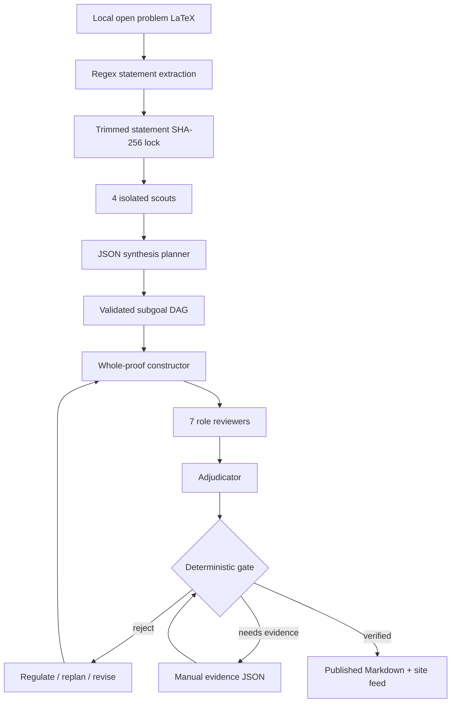

# Architecture Map

## Original committed architecture



The baseline is concentrated in [`proof_pipeline.py`](../proof_pipeline.py), [`verification.py`](../verification.py), [`research_state.py`](../research_state.py), and [`run_verified_pipeline.py`](../run_verified_pipeline.py).

## Implemented foundation and target plane separation

```mermaid
flowchart LR
    subgraph Discovery["Discovery / selection plane"]
        S1["First-party canonical crawler"] --> S2["616 raw pages + section records"]
        S2 --> S3["Exact theorem-only problem cards"]
        S3 --> S4["Cheap deterministic probes"]
        S4 --> S5["Separate weak-prior posteriors"]
        S5 --> S6["Diversified queue + protected exploration"]
    end

    subgraph Control["Control plane"]
        C1["Atomic claim / future lease"] --> C2["Budgeted research run"]
        C2 --> C3["Normalized disposition"]
        C3 --> C4["Append-only attempt/outcome ledger"]
        C4 --> S5
    end

    subgraph Truth["Truth plane — target"]
        T1["Statement contract"] --> T2["Claim / Fact Graph"]
        T2 --> T3["Evidence-tier admission"]
        T3 --> T4["Lean / exact / adversarial checks"]
        T4 --> T5["Cascading revocation"]
    end

    subgraph Communication["Communication plane"]
        P1["Auditable run bundle"] --> P2["Correctness report"]
        P2 --> P3["Intent-fidelity report"]
        P3 --> P4["Novelty + significance report"]
    end

    S6 --> C1
    C2 --> T1
    T5 --> C3
    T5 --> P1
```



Solid implemented pieces are the crawler/snapshot/cards/ranker, normalized dispositions, cache metadata, deterministic final gate, and append-only ledgers. The Fact Graph, executable formal adapters, and independent novelty/significance gates remain designed work, not implemented claims.

## Component ownership

| Component | Current file | Interface | Trust boundary |
| --- | --- | --- | --- |
| First-party ingestion | [`erdos_ingest.py`](../erdos_ingest.py) | `ingest_corpus(root, output_root, ...) -> manifest` | Network bytes are untrusted until hashed, parsed, and source-state checked. |
| Corpus audit and ranking | [`erdos_searcher.py`](../erdos_searcher.py) | `build_searcher(...) -> rankings` | Heuristic probabilities are explicitly uncalibrated. |
| Queue | [`problem_queue.py`](../problem_queue.py) | `load_allocation_plan`, `claim_next` | Validates immutable context—including `allocation_top_k`—ranking content, combined allocation, lane cadence, and per-problem run-contract identities before consuming the in-memory plan; claims are allocation- and run-contract-bound. Lease expiry remains pending. |
| Continuous worker | [`run_continuous.py`](../run_continuous.py) | separate opt-in CLI | Experimental and disabled in release-state flags. |
| Proof orchestration | [`proof_pipeline.py`](../proof_pipeline.py) | `ProofPipeline.solve(number, statement, *, research_directive=...)` | All model text and routing guidance are untrusted; the directive may guide search but cannot replace the exact parent statement lock. |
| Browser/model adapter | [`run_verified_pipeline.py`](../run_verified_pipeline.py) | `run`, `context_id`, `restore_context` | Provider UI and throttling are external mutable state. |
| Run classification | [`run_status.py`](../run_status.py) | `problem_disposition`, `has_verified_result` | Process success is never proof success. |
| Promotion gate | [`verification.py`](../verification.py) | `evaluate_gate` | Fail closed; evidence semantics still need executable adapters. |
| Persistent research state | [`research_state.py`](../research_state.py) | statement lock, DAG, mutable state | Not yet append-only or claim-level. |

## Key interfaces

### Problem card

A card binds the complete canonical first-party snapshot, raw page/source-record/section hashes, exact theorem statement, content-based local pipeline/tool/runtime fingerprint, full budget, probe evidence, routes and subproblem targets, separate posterior targets, and cost placeholders. The pipeline fingerprint covers behavior-defining bytes and runtime and remains stable across unrelated Git commits. Each subproblem retains the complete parent source statement and parent hash while separately hashing its focus question and combined parent/focus/part contract. Ranking fails closed without this provenance. Canonical schemas: [`schemas/problem-card.schema.json`](../schemas/problem-card.schema.json) and [`schemas/subproblem-card.schema.json`](../schemas/subproblem-card.schema.json).

### Ranking card

Every selection exposes probability, interval, uncertainty, pipeline, model-portfolio disclosure, budget, attack mode, positive signals, risks, statement/literature/Lean/computation status, costs, and selection reason. Schema: [`schemas/ranking-card.schema.json`](../schemas/ranking-card.schema.json).

### Stage cache

Cache reuse requires stage-cache schema-v3 agreement on stage, prompt, and response hashes, plus an embedded reusable run-contract schema v2. That contract includes `research_directive_sha256` and the full statement/source/pipeline/model/budget/tool/dependency/runtime identity. All routes and subproblem targets in the bound directive are injected into `ProofPipeline` as guidance while the exact parent statement remains locked. Metadata restores only the matching original context identifier. Legacy or incompatible cache metadata is regenerated rather than silently trusted. Schema: [`schemas/stage-cache-metadata.schema.json`](../schemas/stage-cache-metadata.schema.json).

### Outcome ledger

An outcome is contextual: matching problem ID/number and statement hashes, canonical snapshot, reusable run contract, unique execution/run context, bounded exact pipeline/model/toolset/runtime/full-budget identities, bounded gate/candidate disposition, status, and explicit learning eligibility. Content-addressed event IDs plus sequence/supersession links preserve history. Deterministic gate, intent, and negative-disposition certificates replay a closed privacy-scanned raw-input projection plus the exact required candidate, run-contract, canonical-source-manifest, source-record, and statement support on every read. Negative replay recomputes the outcome with the same classifier used at the raw-manifest boundary; it does not trust a projected ledger status. Because caller-controlled local files do not establish authenticated production provenance, schema and runtime force every record to `learning_eligible=false`; no ledger event affects ranking in this release. Raw run manifests, full gate/review objects, and conversation URLs are not copied into public evidence support. A flock-serialized workflow transaction covers certificate persistence through ledger fsync and removes only newly created files on failure. Deletion or tampering withholds the event. Private raw `proof_runs_sol2` state is never read by the searcher.

External novelty and qualified-human partial-review events are audit-only in this release: the feature flag is off and the closed kind/issuer/adapter-version code registry has no production adapters. They are forced to `learning_eligible=false` and cannot affect pseudo-counts, posteriors, costs, or ranking. This avoids treating an allowed issuer string or arbitrary report digest as verification while preserving append-only correction history. Schema: [`schemas/ledger-record.schema.json`](../schemas/ledger-record.schema.json).

## Required next interface: evidence adapter

The target adapter contract is:

```text
prepare(candidate, statement_contract, toolchain_lock) -> immutable job
execute(job) -> raw verifier transcript + exit status
audit(job, transcript) -> typed certificate or typed rejection
replay(certificate, clean_environment) -> pass/fail
```

Lean adapters must bind the Lean version, Mathlib commit, imports, options, exact theorem expression, trusted-axiom policy, proof text, `#print axioms` output, and clean replay log. Exact-computation adapters must bind program/source hash, input domain, exhaustive-coverage argument, environment, output, and independently replayable certificate.

## Security and privacy boundaries

- Browser profiles, auth cookies, project URLs, and conversation mappings stay ignored.
- Context URLs occur only inside ignored local proof-run caches; committed schemas and examples must use synthetic values.
- Source HTML is public first-party corpus material and is stored with hashes.
- Model output is always untrusted data, including JSON and embedded instructions.
- A compiled Lean theorem establishes the formal expression only; intent, novelty, and significance are separate gates.
