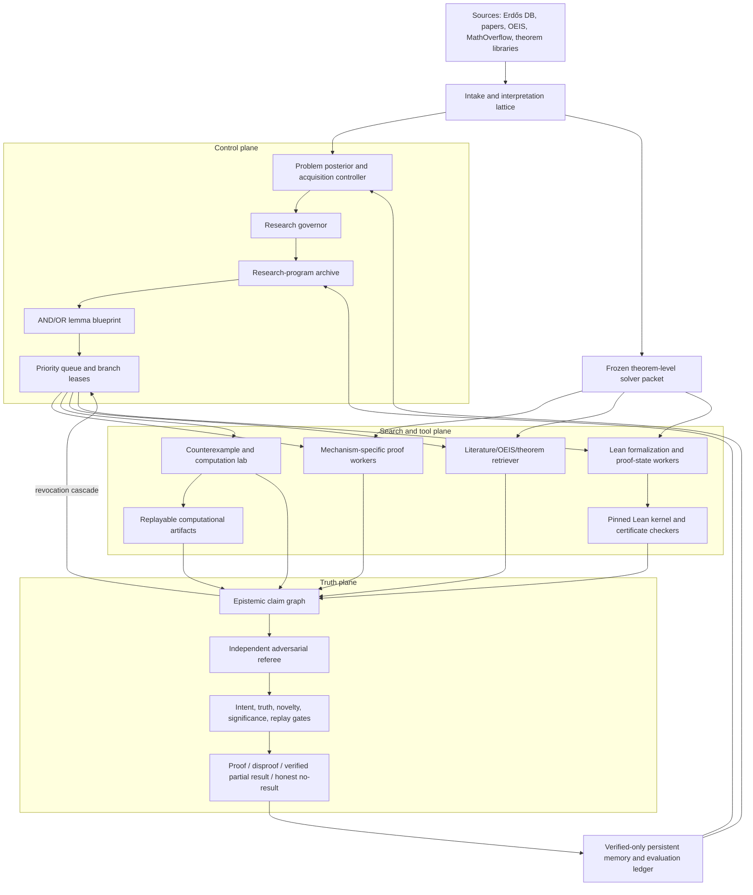

# Evidence-Gated Architecture for Autonomous Mathematical Research

**Primary target:** open-ended Erdős problems and adjacent research conjectures

**Research and code-audit cutoff:** 2026-07-13

**Design objective:** maximize the probability of *rigorous, intended, novel, reproducible* mathematical progress; optimize cost only subject to that objective.

This report distinguishes four kinds of support:

- **Established:** mature mechanism or independently checkable theorem-prover behavior.
- **Demonstrated:** author-reported or artifact-backed result on a defined evaluation.
- **Plausible:** strong engineering hypothesis supported indirectly or on easier tasks.
- **Original proposal:** a new integration or control rule proposed here; it must be tested.

“Lean-verified” always means “the Lean kernel accepted the encoded proposition in a specified environment.” It does **not** by itself mean that the encoding matches the informal problem, that the result was previously unknown, or that it is mathematically significant.

## 1. Executive summary

No public system currently solves the whole autonomous-research problem. The field has separately demonstrated:

1. long natural-language search and revision ([Aletheia](https://arxiv.org/abs/2602.10177), [QED](https://arxiv.org/abs/2604.24021), [AI Co-Mathematician](https://arxiv.org/abs/2605.06651));
2. hard formal verification and large proof-state search ([AlphaProof](https://www.nature.com/articles/s41586-025-09833-y), [Aristotle](https://arxiv.org/abs/2510.01346), [DeepSeek-Prover-V2](https://arxiv.org/abs/2504.21801), [Goedel-Prover-V2](https://arxiv.org/abs/2508.03613));
3. dependency-aware multi-agent memory ([Danus](https://arxiv.org/abs/2607.06447), [LeanMarathon](https://arxiv.org/abs/2606.05400));
4. theorem retrieval and compiler-feedback repair ([LeanDojo/ReProver](https://arxiv.org/abs/2306.15626), [LeanSearch v2](https://arxiv.org/abs/2605.13137), [OProver](https://arxiv.org/abs/2605.17283));
5. executable evolutionary discovery ([FunSearch](https://www.nature.com/articles/s41586-023-06924-6), [AlphaEvolve](https://arxiv.org/abs/2506.13131)).

The best-supported design hypothesis is therefore not a single model, a flat debate, or a larger census of named agents. It is a **hierarchical, event-sourced, neuro-symbolic research operating system** with five independent gates:

1. **statement fidelity:** did the system preserve the intended problem?
2. **truth:** does the argument prove or disprove that statement?
3. **novelty:** is the contribution absent from the prior literature?
4. **significance:** is it responsive and non-vacuous?
5. **reproducibility:** can all formal and computational evidence be replayed?

I call the proposed design the **Evidence-Gated Mathematical Research Architecture (EGMRA)**. Its core is:

- an immutable source record and an explicit **interpretation lattice**, not one silently normalized statement;
- a short, literature-blind falsification pass, followed by **mandatory theorem-level literature/OEIS/formal-library retrieval** before expensive proof search;
- an append-only **epistemic claim graph** with typed evidence, dependencies, contradictions, and cascading revocation;
- three nested search levels: diverse research programs, an AND/OR lemma graph, and Lean proof-state search;
- dynamic branch allocation by posterior expected utility and value of information, with protected exploration;
- early **Lean sentinels** for the target, definitions, boundary cases, and high-centrality/high-risk lemmas;
- executable Python/Sage/CAS/SAT/SMT/ILP experiments with immutable artifacts and independent replay;
- an adversarial referee subsystem that receives no reward for agreement;
- verified-only persistent memory and outcome-calibrated expert iteration.

### Assessment of the current repository

The live repository is a useful conservative proof-attempt substrate, not yet an autonomous mathematical-research system. Its best implemented properties are commit-pinned corpus ingestion, exact statement hashes, content-addressed contracts for a substantial subset of execution inputs, conservative stage caching, a 4:1 exploit/protected-exploration queue, fresh-context reviews, and deterministic rejection logic. Current contracts still omit per-stage runner identity, adjudicator policy, literature-packet identity, and formal-verifier identity; the model name is a caller-supplied label, not an attested provider/UI model.

The current inner loop remains fixed:

```text
four scouts using the same browser runner and recorded model label
  -> one synthesis DAG
  -> one whole-proof candidate
  -> seven reviews using that runner/label
  -> the same runner adjudicates by default
  -> at most two whole-proof revisions
  -> deterministic gate
  -> optional post-hoc Aristotle/Lean sidecar
```

It has no structured semantic intake, OEIS service, theorem-level external retrieval, within-problem search tree, typed claim graph, executable computational-mathematics service, or early Lean-in-the-loop proof development. Two urgent provenance defects are more serious:

- the Aristotle sidecar can currently emit `passed=true` from a vendor-reported `COMPLETE` result when local kernel verification is unavailable, while formal-statement fidelity is `unreviewed`; the generic evidence loader discards those qualifications;
- stage-cache identity does not bind the actual per-stage runner/adjudicator. A resumed campaign can reuse a same-model cached adjudication after switching to DeepSeek, while the manifest reports a distinct adjudicator from current object identity rather than the cached artifact’s provenance.

Both paths must be closed before formal evidence or cross-model independence can affect promotion.

### Highest-priority decisions

1. **Immediately require local kernel replay and statement-fidelity approval for formal promotion.**
2. Disable promotion entry points until every evidence kind has a semantic validator and release flags are enforced.
3. Bind every stage to actual provider/model/runner, adjudicator and literature policy, formal environment, validator version, prompt, tools, and artifacts; reject incompatible cache replay.
4. Preserve and extend the source snapshots, queue, compatible cache machinery, and deterministic rejection invariants.
5. Replace mutable whole-proof/manifests with the typed claim graph and append-only gate/adjudication/promotion events.
6. Replace the fixed inner loop with hierarchical research-program and AND/OR search.
7. Add executable falsification and high-risk Lean sentinels before scaling agent count.
8. Build frozen theorem-level literature packets, including OEIS and formal declarations.
9. Make literature search mandatory before deep proof work, but reserve 5–10% of the initial budget for a blind scratch/falsification pass to reduce anchoring and improve queries.
10. Treat Aristotle and other proprietary provers as candidate workers, never as trust roots.
11. Learn only from authenticated, replayable outcomes; model consensus is not independent evidence.
12. Evaluate against a raw frontier-model baseline at equal cost, with blind expert review and versioned formal replay.

## 2. State-of-the-art literature map

### 2.1 Natural-language autonomous research

#### Aletheia and the Erdős sweep

[Aletheia](https://arxiv.org/abs/2602.10177) uses nested generator, verifier, and reviser loops around Gemini Deep Think with web/tool use. This is the clearest large-scale demonstration that inference-time search can extend from olympiad proofs toward research-like work, but it remains natural-language verification rather than a proof kernel.

The associated [semi-autonomous Erdős study](https://arxiv.org/abs/2601.22401) is unusually informative because it exposes the failure denominator. Roughly 700 then-open problems produced 212 candidates and 200 definitive grades: 137/200 were fundamentally flawed. Of 63 technically correct candidates, only 13 were meaningful responses—two full results, two partial results, four rediscoveries, and five literature identifications. The authors say none of the four full/partial items individually reached research-paper significance. The dominant lesson is not the headline solve count: **technical correctness is not statement fidelity or significance**. A system can optimize its verifier by finding vacuous, misread, or already-known answers.

Evidence: demonstrated at scale with expert review, but closed model/orchestration, incomplete raw trajectories, and natural-language verification.

#### QED

[QED](https://arxiv.org/abs/2604.24021) contributes a particularly implementable control loop: literature survey, proof generation, structural review before local checking, citation tagging, expansion of the allegedly original steps, regulator-directed proof/plan/rewrite repair, failure memory, and exact-stage resume. Its [repository](https://github.com/proofQED/QED) exposes orchestration and prompts. The paper claims five original works from 18 expert-contributed collaboration projects.

The paper reports acceptance by the corresponding collaborators of all 17 verifier-positive candidates among 214 candidates in its GPT runs. This is a selected verifier-positive subset, not a blind external panel or a general false-positive bound; same-lineage model judgments are correlated and false negatives were not established.

Evidence: reproducible orchestration and small expert-reviewed sample; no formal proof kernel.

#### AI Co-Mathematician

The [AI Co-Mathematician](https://arxiv.org/abs/2605.06651) is a strong public preprint for asynchronous, long-horizon workspaces: a coordinator negotiates intent with a human, starts parallel workstreams, persists literature, code, messages, and failed hypotheses, and maintains a living research artifact. It historically scored 23/48 on FrontierMath Tier-4 v1 under a 48-hour wall limit but without a model-call/token cap. [FrontierMath v2](https://epoch.ai/frontiermath/tiers-1-4) later corrected or removed a large fraction of items, so that score is not cleanly comparable to v2. The authors themselves identify reviewer-pleasing consensus, nontermination, and polished-but-unrigorous output as failure modes.

Evidence: demonstrated long-horizon workflow and blind evaluation, but closed system, uncapped compute, informal proofs, and benchmark drift.

#### Gemini Deep Think at IMO 2025

An advanced [Gemini Deep Think IMO 2025 system](https://deepmind.google/blog/advanced-version-of-gemini-with-deep-think-officially-achieves-gold-medal-standard-at-the-international-mathematical-olympiad/) produced natural-language solutions to five of six problems within the 4.5-hour competition limit and received 35/42 from official IMO coordinators. DeepMind describes parallel exploration/combination of candidate solutions, mathematics-specific reinforcement-learning data, a curated solution corpus, and general strategy hints. This is strong evidence for frontier-model test-time portfolios without manual formalization; the official review certified the submitted answers, not the undisclosed model, search process, campaign reproducibility, or research-level novelty.

Evidence: externally graded olympiad output; closed system and natural-language trust path.

#### Danus

[Danus](https://arxiv.org/abs/2607.06447) offers the most directly relevant open dependency memory: coordinator, parallel workers, role-gated claim submission, fresh verifier, content-addressed fact DAG, negative memory, and cascading revocation. Its evidence is six curated case studies; only one reports no mathematical guidance, while other cases used supplied strategies/references or one or two expert interventions/corrections. Its [security documentation](https://github.com/frenzymath/Danus/blob/main/docs/security-and-trust.md) correctly says admitted facts are LLM-verified, not formally verified. Human audit found exactly the kind of errors a fact graph must survive, including a target-domain mismatch and a bad imported definition that required revoking downstream facts.

Evidence: demonstrated open mechanism; truth admission is too weak for high-centrality claims.

#### OpenAI

OpenAI’s [FirstProof submissions](https://openai.com/index/first-proof-submissions/) are valuable mostly for methodological honesty. An internal model attempted all ten research problems; OpenAI later retracted its positive assessment of Problem 2, used human best-of-few selection, expert-feedback expansion, and model-to-model checking, and explicitly described the sprint as uncontrolled. The public record therefore supports general-model candidate generation, not a reproducible autonomous theorem prover.

Earlier formal work, [GPT-f](https://openai.com/index/generative-language-modeling-for-automated-theorem-proving/), demonstrated language-model-guided Metamath search and contributed shortened proofs accepted into `set.mm`. [Formal Mathematics Statement Curriculum Learning](https://openai.com/index/formal-math/) then used iterative Lean proof discovery and retraining to build a statement curriculum, an early verified expert-iteration pattern. OpenAI’s later public IMO/science results are important capability evidence, but the underlying modern formal/research architecture is not public enough to copy.

OpenAI separately reports that a general-purpose reasoning model reached [35/42 on IMO 2025](https://openai.com/index/first-proof-submissions/). This is useful capability context, not an architecture comparison: the full model, inference/search protocol, and independently replayable trace are not public.

Evidence: public attempts and honest error correction; modern system is closed and not a controlled architecture study.

#### Anthropic and Claude-based systems

Anthropic has public general scientific-agent infrastructure—most recently [Claude Science](https://www.anthropic.com/news/claude-science-ai-workbench)—but no Anthropic-authored, purpose-built autonomous mathematics/Lean system with a disclosed architecture comparable to AlphaProof or Aristotle. That absence should not be filled with guesses.

External Claude-based systems are relevant. [Numina-Lean-Agent](https://arxiv.org/abs/2601.14027) uses Claude Code with Lean tooling, theorem retrieval, compilation, and auxiliary models, and releases [code/artifacts](https://github.com/project-numina/numina-lean-agent). [Agentic Proving for Program Verification](https://arxiv.org/abs/2605.23772) further supports tight compiler-in-the-loop code-agent workflows. These show that a strong general coding agent can be an effective formal-proof worker, but not that “Claude consensus” is verification.

[Automatic Textbook Formalization](https://arxiv.org/abs/2604.03071) used a very large Claude-agent workflow with branching, merge queues, reviewers, and CI to produce roughly 130,000 lines of Lean; the [agent code](https://github.com/facebookresearch/repoprover) and formal artifact are public. The authors report roughly $100,000 cost and document duplicate/wrong definitions and risks of proving results from broken encodings. It is compelling long-horizon engineering evidence and equally compelling evidence that scale does not replace semantic audits.

Evidence: artifact-backed external workflows; no first-party autonomous-math architecture to infer.

#### The lightweight pipeline of arXiv:2602.13695

[“Can a Lightweight Automated AI Pipeline Solve Research-Level Mathematical Problems?”](https://arxiv.org/abs/2602.13695) reuses a generation/verification/refinement pipeline, adds domain-specific prompting, requires citations and explanations of their role, and runs Gemini 3 Pro and GPT-5.2 Pro. Its [code and outputs](https://github.com/ml1301215/research-math-assistant) are public.

It is a useful demonstration that a small wrapper can quickly generate promising research-level candidates. It is **not** formal verification: of its ten FirstProof outputs, only Problem 4 was thoroughly checked by the authors; verification took hours while generation took minutes, and confidence in other outputs was inferred rather than established. Citation presence also does not establish theorem applicability. This paper should motivate a cheap candidate-generation baseline and a verification-cost model, not the final architecture.

#### ProofCouncil, RMA, and controlled research-proof evaluation

[ProofCouncil](https://arxiv.org/abs/2607.09474) uses a stateful author–critic loop, a fresh final critic, a multi-model council, a computation/CAS worker, and durable failed-attempt notes. In the independently operated [FirstProof Batch 2 evaluation](https://1stproof.org/assets/docs/report.pdf), it passed six of ten problems at roughly $3,186 and 22.9 hours; full logs and referee reports make this a rare cost-visible result. Its critic still accepted an unsupported claim and rejected a proof later accepted by humans, reinforcing that critics are search/control components rather than truth oracles.

[RMA](https://arxiv.org/abs/2605.22875) reports an 8/10 FirstProof result using multiple proposers/verifiers, literature, structured disk memory, and a large fixed budget. The author-run anonymous-expert evaluation is promising, especially relative to its reported raw-model baseline, but the implementation was not public at the cutoff and the small now-public test is not a sealed independent benchmark. It motivates a controlled ablation, not an architecture conclusion.

Evidence: the Batch 2 harness is one of the best controlled natural-language comparisons; individual system claims still need independent reproduction.

#### Rethlas, Matlas, and Archon

[Rethlas and Archon](https://arxiv.org/abs/2604.03789) combine natural-language generate/verify/decompose/counterexample search, Matlas theorem retrieval, and Lean project development with LeanSearch and compiler feedback. The authors released a buildable, roughly 19,000-line formal development associated with a commutative-algebra research question. This is strong evidence for **retrieval → informal blueprint → long-form Lean project** as a research workflow, while the small number of flagship cases and semantic/novelty review still limit generalization.

Evidence: public formal artifact and open components; recent preprint and selected cases.

#### OpenAI’s unit-distance counterexample

OpenAI’s [unit-distance result](https://openai.com/index/model-disproves-discrete-geometry-conjecture/) is one of the strongest one-off public examples of a general reasoning model producing a mathematically substantial open-problem result: the released [proof](https://cdn.openai.com/pdf/74c24085-19b0-4534-9c90-465b8e29ad73/unit-distance-proof.pdf) gives a construction contradicting a longstanding asymptotic belief, and external mathematicians checked the argument. It is a provider report from a closed model/harness, with a human-edited paper and undisclosed campaign denominator. It establishes possibility, not a reproducible pipeline or solve probability.

The separate [FrontierMath Open Problems](https://epoch.ai/frontiermath/open-problems/about) program is a valuable emerging design: genuine open construction/optimization tasks with programmatic verifiers and significance metadata. At the cutoff, one of 15 had been solved, in the lowest “moderately interesting” significance tier; verifier access was paid and OpenAI was the only purchaser. The first hypergraph success demonstrates verifier-backed discovery and cross-model replication, but the verifier does not automatically supply a self-contained proof, and evaluator-friendly problems are a selected subset of mathematical research.

[HorizonMath](https://arxiv.org/abs/2603.15617) provides more than 100 predominantly unsolved problems across eight computational/applied domains with an open verifier framework. It is another promising scalable discovery test, but its reported two GPT-5.4 Pro improvements were still pending expert review at the cutoff and share the same verifier-friendly selection bias.

### 2.2 Formal and neuro-symbolic theorem proving

#### AlphaProof and AlphaGeometry

[AlphaProof](https://www.nature.com/articles/s41586-025-09833-y) combines a Lean policy/value model, AND/OR search, progressive sampling, and AlphaZero-style reinforcement learning over a very large autoformalized corpus. At IMO 2024, the AlphaProof-centered pipeline—expert manual formalization, Gemini 1.5 Pro answer proposals for applicable find-all tasks, and AlphaProof proof/refutation search—solved three of five nongeometry problems; independent judges awarded full credit. Together with AlphaGeometry 2, it reached silver-medal-equivalent performance. This is unusually strong externally judged evidence for large formal search, but the decisive training stack is closed and reported compute is far beyond a practical default.

[AlphaGeometry](https://www.nature.com/articles/s41586-023-06747-5) and [AlphaGeometry 2](https://www.jmlr.org/papers/v26/25-1654.html) combine model-generated auxiliary constructions with a symbolic geometry engine. The transferable pattern is **learned proposal plus hard symbolic closure and shared derived facts**; the geometry DSL itself does not generalize to arbitrary Erdős problems.

Evidence: peer-reviewed and externally judged, with public statements/selected proof material but no independently rerunnable engine, weights, or full corpus; closed, domain-specific, or extraordinarily expensive.

#### Aristotle

[Aristotle](https://arxiv.org/abs/2510.01346) integrates Lean proof search, informal lemma generation/autoformalization, and a dedicated geometry solver. Its public [IMO 2025 proofs](https://github.com/harmonic-ai/IMO2025) are replayable and establish strong formal performance for manually formalized targets. The core model, training, and service remain proprietary. The [Erdős #728 write-up](https://arxiv.org/abs/2601.07421) is evidence that Aristotle can participate in research-level formal artifacts; it is not evidence that vendor completion status should be trusted without a local build and semantic target audit.

The [Lean artifact leaderboard](https://lean-lang.org/eval/) as viewed on 2026-07-13 is useful as a proof index, not a controlled efficiency comparison: submissions may use different budgets, and acceptance of an encoded theorem does not audit the informal correspondence.

Evidence: public checker-replayable artifacts; proprietary generation and manual statement dependency.

#### AlphaProof Nexus, Axiom/AXLE, and research conjectures

[AlphaProof Nexus](https://arxiv.org/abs/2605.22763) couples stateful Lean editing, optional AlphaProof, exact-goal caching, and evolutionary sketch sharing. It reports formal proofs for 9/353 formal Erdős conjectures and 44/492 OEIS conjectures, with public [result artifacts](https://github.com/google-deepmind/alphaproof-nexus-results). A post-hoc basic independent generate→Lean loop replicated all nine Erdős successes, though at higher cost on harder items, so the study does not establish that evolution or AlphaProof was necessary. Its most useful negative result is architectural: an evolutionary language-model fitness can reward sketches that move the full difficulty into a single `sorry`-shaped helper, and models hallucinate literature lemmas. Therefore fitness must be based on target-relative verified debt reduction, not plausibility or elegance.

[AXLE](https://arxiv.org/abs/2606.26442) exposes hosted Lean verification, extraction, repair, simplification, and disproof tools. It is the hosted tool/verifier layer, not AxiomProver; Axiom’s reported Putnam generation stack is separate and closed. AXLE’s trust caveat is important: arbitrary Lean metaprogramming can enlarge the trusted environment, so untrusted generated artifacts require a clean pinned replay and an independent checker such as `lean4checker`/Comparator/SafeVerify before release.

Evidence: public proof artifacts and APIs; generation stacks partly or wholly closed.

#### Open or partially reproducible formal agents

- [LeanDojo/ReProver](https://arxiv.org/abs/2306.15626) established proof-state extraction, accessible-premise retrieval, best-first tactic search, and reproducible training/evaluation.
- [Pantograph](https://arxiv.org/abs/2410.16429) exposes explicit multi-goal, sketch, and branching control; it is infrastructure, not a proving policy.
- [DeepSeek-Prover-V2](https://arxiv.org/abs/2504.21801) turns informal sketches into recursive Lean `have` subgoals and closes them with compiler feedback and verifier-rewarded training; [weights/artifacts are public](https://github.com/deepseek-ai/DeepSeek-Prover-V2), not the full training stack.
- [Goedel-Prover-V2](https://arxiv.org/abs/2508.03613) adds synthetic curricula, expert iteration, two-round feedback correction, and [public models/code](https://github.com/Goedel-LM/Goedel-Prover-V2).
- [OProver](https://arxiv.org/abs/2605.17283) unifies retrieval, prior proof attempts, Lean feedback, repair, SFT, and RL; [weights](https://huggingface.co/m-a-p/OProver-32B) and the large [OProofs dataset](https://huggingface.co/datasets/m-a-p/OProofs) are public, but a complete training/inference codebase was not located and contamination/independent rerun remain concerns.
- [OpenProver](https://arxiv.org/abs/2607.09217) is a [public planner/parallel-worker/verifier scaffold](https://github.com/kripner/OpenProver) in which only Lean-verified snippets enter the shared repository.
- [Seed-Prover 1.5](https://arxiv.org/abs/2512.17260) combines agentic Lean search and large-scale reinforcement learning. Its [proof artifacts](https://github.com/ByteDance-Seed/Seed-Prover) are public, but the model/training stack is closed; at the 2026-07-13 cutoff it led the submission-based Lean artifact index, which is not a controlled equal-budget benchmark.
- [Pythagoras-Prover](https://arxiv.org/abs/2606.12594) uses curriculum SFT, proof-trace filtering, augmented formal-statement mutations, and restart sampling in 4B/32B autoregressive and experimental diffusion provers. The authors report 86.1% miniF2F at pass@32 for the 4B model and 93/672 PutnamBench problems at pass@2048 for the 32B model, with [public 4B weights](https://huggingface.co/Pythagoras-LM/Pythagoras-Prover-4B). It is promising efficiency evidence, but the enormous and unequal pass@k values, very recent preprint status, and unverified synthetic mutations require matched-budget reruns and contamination audits.
- [LEAP](https://arxiv.org/abs/2606.03303), [Goedel-Architect](https://arxiv.org/abs/2606.06468), and [LeanMarathon](https://arxiv.org/abs/2606.05400) converge on formal blueprints, AND/OR decomposition, dynamic leaves, selective repair, isolated workspaces, and CI merge gates.
- [LeanSearch v2](https://arxiv.org/abs/2605.13137) gives direct evidence that theorem retrieval improves downstream formal search; retrieval remains a proposal source, never proof.

Evidence: mechanisms range from mature open infrastructure to very recent author-reported preprints. Exact benchmark commit, pass@k, token budget, and Mathlib version must accompany every comparison.

### 2.3 Autoformalization and informal-to-formal correspondence

Autoformalization is the central semantic bottleneck, not a solved preprocessing step.

- [Beyond Compilation](https://arxiv.org/abs/2606.31002) reports 89.5% compilation but only 60.5% consensus faithfulness on graduate-level items.
- [LCS-Bench](https://arxiv.org/abs/2606.26525) reports a best result of only 20.1% at theory scale.
- A [robustness audit](https://arxiv.org/abs/2606.14867) finds recent autoformalizers sensitive to meaning-preserving paraphrase and often unresponsive to meaning-changing local edits.
- [Aria](https://arxiv.org/abs/2510.04520) provides complementary positive evidence for dependency-graph construction and Mathlib-grounded autoformalization, while its reported compilation rate still substantially exceeds final semantic accuracy; no code artifact was located.
- [ProofNet](https://arxiv.org/abs/2302.12433) and formal benchmark maintenance have repeatedly exposed misformalized or ambiguous targets.

The correct design response is multiple candidate translations, independent backtranslation, counterexample/vacuity tests, global paraphrase invariance, local mutation covariance, formal equivalence when feasible, and an independently approved target hash before final proof promotion.

Evidence: demonstrated failure gap. The proposed multi-test “translation firewall” is plausible/original and needs ablation.

### 2.4 Executable mathematical discovery

[FunSearch](https://www.nature.com/articles/s41586-023-06924-6) provides peer-reviewed evidence, while the [AlphaEvolve white paper](https://arxiv.org/abs/2506.13131) and [67-problem mathematics study](https://arxiv.org/abs/2511.02864) provide author-reported preprint evidence, that diverse populations, model-generated mutations, island models, and evolutionary selection can yield new constructions when a fast executable evaluator exists. They do not justify evolving unrestricted prose proofs under an LLM judge.

The correct generalization is narrow: evolve constructions, algorithms, decompositions, counterexample generators, and formal proof programs only when:

1. fitness is exact or certificate-backed;
2. an independent checker exists;
3. novelty and complexity are separate objectives;
4. the population preserves mechanism diversity;
5. every winner is replayed outside the search environment.

Evidence: effectiveness under hard evaluators is established/demonstrated in selected executable domains. Restricting evolutionary promotion to such domains is an original safety policy; general proof-strategy evolution remains speculative.

### 2.5 Classical proof systems and ATPs

Modern agents should route suitable leaves to mature symbolic systems rather than reproduce their capabilities in prose:

- [Isabelle/HOL](https://isabelle.in.tum.de/) with Sledgehammer performs premise selection, calls ATPs, and reconstructs proofs in an LCF-style kernel.
- [Rocq/Coq](https://rocq-prover.org/) and MathComp support highly trusted dependent-type proofs and landmark formalizations.
- [HOL Light](https://hol-light.github.io/) provides a small LCF kernel and the Flyspeck lineage.
- [Metamath](https://us.metamath.org/) provides an exceptionally small transparent verifier at the cost of low-level proof search.
- [Vampire](https://vprover.github.io/) and [E](https://www.eprover.org/) are powerful saturation/superposition ATPs for first-order obligations; the official [CASC-30 results](https://tptp.org/CASC/30/WWWFiles/DivisionSummary1.html) provide an external competition anchor, with Vampire leading the divisions and E runner-up in several.
- SAT/SMT solvers should produce proofs, models, or independently replayable certificates where supported.

In a Lean-centered architecture, these are specialized leaf solvers and countermodel engines. Exported obligations must preserve semantics, and successful proofs should be reconstructed in Lean or attached as checked certificates; an external “SAT” label is not enough.

### 2.6 Benchmarks and what they actually measure

- [miniF2F](https://github.com/facebookresearch/miniF2F): 488 cross-system high-school olympiad/competition statements; mature and saturated, useful for regression rather than research autonomy.
- [ProofNet](https://arxiv.org/abs/2302.12433): 371 natural-language/formal/proof triples from undergraduate mathematics. Prefer the corrected [ProofNet#](https://aclanthology.org/2025.emnlp-main.907/) family for Lean 4 evaluation; that audit reported formalization errors in 31.8% of existing ports, which is itself evidence for semantic target gates.
- [Lean Workbook](https://arxiv.org/abs/2406.03847): roughly 57,000 synthetic informal/formal pairs; primarily a training resource, not a gold research evaluation.
- [PutnamBench at commit `a23d8e6…`, 2026-07-02](https://github.com/trishullab/PutnamBench/tree/a23d8e6d4e9e3418fd78f76de7bfcb9414cbfd39): 1,724 manual formalizations (672 Lean, 640 Isabelle, 412 Rocq/Coq) spanning 1962–2025; factored-answer policy, pass@k, and tool budget matter.
- [IMO-Bench](https://arxiv.org/abs/2511.01846): 400 answer problems, 60 proof problems, and grading data. The later 60-problem manual Lean formalization is [IMO-LeanProofBench at `google-deepmind/superhuman` commit `96fa6c4…`, 2026-07-13](https://github.com/google-deepmind/superhuman/tree/96fa6c4cc3a9bb7450ee7b6773b659d3a030dace/imobench), with separate [LEAP solution artifacts](https://github.com/google-deepmind/superhuman/tree/96fa6c4cc3a9bb7450ee7b6773b659d3a030dace/leap/solutions/LEAN-IMO-Bench). Distinguish the peer-reviewed original suite, the later formal statements, and submitted/generated solutions.
- [FirstProof Batch 1](https://arxiv.org/abs/2602.05192): ten fresh research questions released for an uncontrolled one-week challenge; useful candidate artifacts, but no official blinded grading or verified autonomy.
- [FirstProof Batch 2](https://1stproof.org/assets/docs/report.pdf): ten solved-but-unpublished research problems run by the organizers on fresh infrastructure with journal-style blinded expert review, public logs, and costs; unusually relevant but tiny and no longer uncontaminated after release.
- [FrontierMath v2](https://epoch.ai/frontiermath/tiers-1-4): advanced private benchmark whose 2026 revision addressed errors in 42% of problems, demonstrating that the benchmark itself needs versioned provenance.
- [FrontierMath Open Problems](https://epoch.ai/frontiermath/open-problems/about): dynamic, verifier-backed open problems; useful for testing discovery where a hard evaluator exists, but “solved by evaluator” may still need a self-contained proof/significance audit.
- [ArXivLean](https://matharena.ai/arxivlean/): a rotating set of recent paper-derived Lean problems; useful for research-level regression, but selected for Mathlib expressibility and sensitive to exact Lean versions and semantic simplifications.
- historical solved Erdős problems hidden behind dated corpus snapshots: the most relevant internal evaluation for this project.
- currently unsolved Erdős problems: research deployment, not a benchmark with known labels.

No single accuracy number spans statement parsing, retrieval, novelty, proof, and formalization. The evaluation in Section 12 separates them.

## 3. Comparison table of major systems

| System | Core control | Truth mechanism | Long horizon | Public evidence (not necessarily generator rerun) | Strongest transferable idea | Primary limitation |
|---|---|---:|---:|---:|---|---|
| Aletheia | generate–verify–revise with tools | NL verifier + experts | High | Low | intensive revision and broad research sweep | intent/citation failures; closed |
| QED | literature → proof → structural/local checks → regulator | NL verifier + experts | Medium–high | open harness/logs; closed models | structural-first checking and localized regulator | correlated verifier; small sample |
| ProofCouncil | stateful author–critic + model council + CAS | NL critics + experts | Medium–high | open logs/harness; closed models | controlled multi-model criticism and cost-visible evaluation | critic false positives/negatives; informal |
| RMA | multi-round proposers/verifiers + literature/memory | NL verifier + experts | Medium–high | Low at cutoff | structured disk memory and large fixed-budget search | author-run small benchmark; code unavailable |
| AI Co-Mathematician | coordinator + asynchronous workstreams | NL review + humans | High | paper only | intent negotiation, living artifact, failed-hypothesis memory | closed; 48h but no call/token cap; nontermination |
| Danus | coordinator/workers + fact DAG | fresh LLM verifier | High | open harness; closed models | typed dependencies and cascading revocation | LLM fact admission |
| Rethlas + Archon | NL research/retrieval → Lean project | Lean kernel + human correspondence | High | open components/formal artifact; closed models | theorem retrieval feeding long formal development | selected flagship cases; recent |
| OpenAI FirstProof | strong model, tools, human best-of-few | experts/model checks | Medium | attempts only | raw-model research baseline; explicit correction | uncontrolled, closed model |
| Claude/Numina | code agent + Lean/tools/retrieval | Lean kernel | Medium | open agent/artifacts; closed models | general code-agent compiler loop | multi-model, statement fidelity/cost |
| AlphaProof | policy/value + AND/OR + RL | Lean kernel | High formal search | Low | hard evaluator, value-guided search | manual target; extreme compute |
| AlphaGeometry 2 | construction model + symbolic trees | symbolic geometry engine | Medium | Partial | shared checked facts and auxiliary construction search | narrow domain; closed components |
| Aristotle | Lean graph search + informal lemma generation | Lean kernel | High formal search | artifacts, not engine | formal/informal decomposition with proof-state search | proprietary; manual targets |
| AlphaProof Nexus | Lean edit loops + cache + evolution | Lean kernel | High | result artifacts | exact goal cache and formal research artifacts | fitness hacks, hallucinated imports, closed engine |
| DeepSeek-Prover-V2 | sketch → recursive `have` subgoals + repair | Lean kernel | Medium | weights/artifacts, partial stack | recursive decomposition and compiler feedback | huge pass@k; full training unavailable |
| Pythagoras-Prover | curriculum + augmented formalization + restart sampling | Lean kernel | Medium | public weights/artifacts; recent preprint | compute-efficient small prover and mutation robustness | very high pass@k; contamination/protocol sensitivity |
| Goedel-Prover-V2 | curriculum + expert iteration + correction | Lean kernel | Medium | public model/code/data; substantial rerun path | open model/code and feedback repair | contamination/protocol sensitivity |
| OProver | retrieval + attempt + Lean feedback + repair | Lean kernel | Medium | weights + OProofs data; full code not located | shared multi-round retrieval/repair interface | new; rerun/provenance pending |
| OpenProver | planner + parallel workers + compact whiteboard | Lean kernel | Medium | open harness; underlying models vary | verified snippets only in shared state | very new; high token budget |
| LEAP/Goedel-Architect | AND/OR blueprint + selective repair | Lean kernel/formal negation | High | Partial | dynamic leaves and successful-node retention | recent author claims |
| LeanMarathon | blueprint + scoped worktrees + CI | Lean kernel + target review | High | open harness/artifacts; closed models | governance and merge discipline | small expensive sample |
| LeanDojo/ReProver | premise retrieval + best-first tactic search | Lean kernel | Medium | open infrastructure/models/data | accessible-premise extraction and reproducible search | older toolchain/task scale |
| FunSearch/AlphaEvolve | islanded evolutionary program search | executable objective | High | Partial | diversity under a hard evaluator | requires evaluator/skeleton |
| `2602.13695` | lightweight generation/critique/citations | NL team check | Low–medium | code/outputs | cheap candidate baseline | only one FirstProof output thoroughly checked |

### Architecture alternatives

These are evidence-informed architectural judgments, not measured probabilities or scores. “High” may be conditional on receiving a faithful formal target.

| Architecture | Solve potential | Rigor ceiling | False-direction detection | Long-horizon coherence | Formal compatibility | Diversity | Compute efficiency | Reproducibility | Interpretability | Engineering complexity |
|---|---|---|---|---|---|---|---|---|---|---|
| One powerful model + tools | medium, model-dependent | low unless hard tools close claims | low | low–medium | medium | low | high | medium | low | low |
| Flat multi-agent debate | medium | low | medium, correlated | low | low–medium | medium | low | medium | low | medium |
| Hierarchical research organization | medium–high on selected studies | medium | high with independent critics | high | medium | high | medium | medium | medium | high |
| Pure search-tree theorem prover | medium within encoded domains | very high | high | medium | very high | low | low at research scale | very high | high | high |
| Neuro-symbolic Lean-in-the-loop | high within faithful encodings | very high | high | high | very high | medium | medium–low | high | high | high |
| Blackboard/knowledge graph | unmeasured alone | validator-dependent | high if revocable | high | high | high | medium | high | high | high |
| Self-improving expert iteration | high on matched formal distributions | high | medium | high | high | medium | high after amortization | high | medium | very high |
| **EGMRA hybrid (proposed)** | **unmeasured** | **target: very high** | **target: very high** | **target: very high** | **target: very high** | **target: high** | **unmeasured** | **target: high** | **target: high** | **very high** |

The hybrid is the preferred **design hypothesis**, not a measured winner. Open research has two qualitatively different uncertainties: search uncertainty needs diverse generators, experiments, retrieval, and branch control; truth uncertainty needs hard checkers, explicit assumptions, adversarial review, and revocable dependencies. A single architecture optimized only for one side fails on the other, but the proposed integration must earn its performance claims through the ablations in Section 12.

## 4. Critical review of the current pipeline

### 4.1 Two different objects must be audited

The repository contains:

1. a **live implementation**, whose mathematical core is a fixed scout–synthesize–construct–review loop; and
2. the much more ambitious `AGENTS.md` target specification, which proposes four planes, three search levels, a Lean Evidence Fabric, theorem retrieval, fact graphs, program populations, 22 named roles, and corpus-wide selection.

The target specification is directionally close to the recommended architecture. Most of it is not implemented. Treating specification and code as one system would overstate current capability.

At the audit snapshot, 179 unit tests passed, but no verified mathematical result artifact existed. Five legacy manifests—problems 601, 661, 724, 782, and 849—were identity-incomplete gate-rejected/`candidate_unclassified` records with null execution, pipeline, model-portfolio, and run-contract fields; their raw candidate texts mention resource exhaustion, but the manifests do not authenticate that as a normalized outcome. They were not solutions. One worker, not five, was active on problem 312. Tests establish software consistency, not theorem-proving performance.

Implementation anchors: the fixed orchestration is in [`proof_pipeline.py`](../proof_pipeline.py), prompts in [`solver_prompts.py`](../solver_prompts.py), source/ranking in [`erdos_ingest.py`](../erdos_ingest.py) and [`erdos_searcher.py`](../erdos_searcher.py), queue control in [`problem_queue.py`](../problem_queue.py), the deterministic gate in [`verification.py`](../verification.py), and the current formal sidecar in [`aristotle_verifier.py`](../aristotle_verifier.py) and [`lean_verify.py`](../lean_verify.py).

### 4.2 Component-by-component disposition

| Component | Intended role | Present strengths | Theoretical/practical weaknesses | Best comparator | Decision and concrete implementation |
|---|---|---|---|---|---|
| Source intake and statement lock | preserve exact target | commit-pinned corpus, raw/section hashes, fail-closed extraction | regex semantics; `intended` copies raw text; no typed binders, ambiguity lattice, executable boundary tests | Aletheia failure audit; LeanMarathon target review | **Retain provenance; replace semantic intake.** Build Statement IR, two independent parses, reconciliation, mutation tests, explicit interpretations |
| Erdős selector | choose high-value problems | separate weak outcome priors, uncertainty labels, deterministic 4:1 exploration, exact queue contracts | hand-tuned pseudo-probabilities; proxy cost; no verified learning, OEIS, library coverage, or actual telemetry | contextual bandits; FirstProof cost controls | **Retain queue/provenance; replace model.** Standard probes, competing-risk posterior, censored outcomes, value-of-information and reuse |
| Local related-work packet | reduce rediscovery | cheap, hashed, marked untrusted, withheld from reviewers | local Erdős writeups only; TF-IDF/regex snippets; no exact hypotheses, web papers, citation graph, Mathlib, OEIS, or novelty gate | LeanSearch v2; QED literature phase | **Retain as stage-zero recall; merge into theorem retrieval.** Freeze theorem records with source spans and applicability |
| Four scouts | generate diverse approaches | fresh contexts and four mandates | same browser runner and caller-supplied model label, same data/interface, sequential; role names do not create mechanism diversity | AI Co-Mathematician workstreams; OpenProver workers | **Replace fixed census.** Dispatch tool- and information-differentiated program workers dynamically; attest exact model identity |
| Synthesis DAG | expose dependencies | uniqueness/cycle/missing-edge validation | one LLM JSON planner; malformed JSON collapses to a single goal; no AND/OR semantics, evidence or revocation | LEAP, Goedel-Architect, LeanMarathon | **Extend into formal blueprint.** Typed AND/OR claims, dynamic leaves, proof debt, dependency-local repair |
| Whole-proof constructor | produce candidate | complete artifact for reviewers | prematurely collapses branches; hides uncertainty; repeats whole proof; no local lemma admission | QED regulator; population proof refinement | **Demote to compiler.** Assemble only from admitted claims; retain multiple proof blueprints until bottlenecks close |
| Seven reviewers + adjudicator | adversarial error detection | explicit mandates, fresh contexts, conservative role coverage | normally same model family; claim universe self-declared; no executable tools; sequential; model consensus correlated | Aletheia/QED limitations; hard formal checkers | **Retain roles as checks, not evidence.** Tool-backed falsifier, source auditor, formal replay, different-family referee |
| Regulator and two revisions | decide proof vs plan repair | distinguishes revision types | whole-proof granularity; default and live budget is two, configurable only at construction; no value model or branch archive | QED regulator | **Retain and localize.** Controller changes only failed dependency cone, with posterior budget and reopen rules |
| `ResearchState` | durable progress | statement lock, basic DAG, attempts/failures | mutable JSON; only final theorem enters “verified lemmas”; no claim tiers, contradictions, costs, provenance, revocation | Danus fact DAG | **Replace with event-sourced epistemic graph.** Derived views may remain JSON |
| Stage cache/run contracts | resume safely | prompt/response hashes, primary model/budget/tool context, atomic writes | behavior fingerprint omits literature, Aristotle/Lean and adjudication modules; cache does not bind actual per-stage runner/adjudicator, enabling false cross-model provenance on resume; no live proof-state cache | QED resume; AlphaProof Nexus goal cache | **Retain and close identity.** Bind stage runner/model/provider/context, hash import closure and policies, exact Lean context and replay policy |
| Worker queue/rate limiter | persistent execution | atomic new-style claims; detected provider rate limits do not consume the non-rate-limit retry budget; shared backoff capped at 120 seconds | general timeouts/browser failures can consume retries; no lease/heartbeat, `Retry-After`, jitter or provider quotas; stale legacy claims need migration; scouts/reviews are sequential | distributed workflow practice | **Retain; add leases and provider-aware throttling.** Rate limits pause, never terminate a math branch |
| Computational evidence | falsify/conjecture/verify finite cases | evidence label exists | no execution service; arbitrary path plus `passed=true` can satisfy generic loader; prompts forbid actual experiment tools | FunSearch/AlphaEvolve; SAT certificates | **Add.** Sandboxed immutable jobs, exact arithmetic, coverage specification, independent replay and typed certificate |
| Lean/Aristotle sidecar | formal proof evidence | can reject empty output, scans one selected Lean file for placeholders, and may invoke `lake build` | `lake build` permits `sorry`; no pinned project, dependency-cone/axiom audit, or exhaustive source scan; target fidelity unreviewed; **vendor `COMPLETE` may pass without required local kernel** | Aristotle artifacts, AXLE trust guidance | **Retain only as candidate worker; redesign.** Kernel required, target audit required, full source/axiom/import scan, early central lemmas, typed evidence |
| Deterministic promotion gate | prevent direct model publication | hash binding, role coverage, gap/import checks, explicit rejection reasons | all external kinds—formal proof, exact computation, and expert review—reduce to caller-controlled labels/`passed`; same-runner unanimity; correctness conflated with contribution | formal kernel plus independent novelty review | **Retain rejection skeleton; replace evidence acceptance and split five gates.** Truth, intent, novelty, significance and replay produce separate certificates |
| Release flags/policy | keep experimental features off | scheduler flag exists and is explicit | Lean/Aristotle verification and promotion entry points do not enforce disabled Lean/external-evidence flags; live scheduler can be explicitly overridden | feature-gated release engineering | **Enforce centrally.** Every verifier, promoter, scheduler and cache records and checks one signed feature policy |
| Manifest and adjudication history | durable final state | manifest is easy to inspect | promotion/decoupled adjudication overwrite authoritative manifest in place; cross-model cache collision and formal-versus-referee precedence are inconsistent | append-only event sourcing | **Make manifest a derived view.** Append immutable gate/adjudication/promotion events and define explicit precedence |
| Learning/long-term memory | improve future selection and proof search | current quarantine blocks untrusted learning | autonomous learning sets/adapters are empty; schema can represent censoring, but no complete production attempt writer/calibrated cohort exists; failures are unstructured | expert iteration, LeanAgent | **Retain quarantine; add verified-only learning and telemetry.** Temporary problem memory vs replayable persistent memory |
| OEIS | sequence identification and literature bridge | none operational | upstream OEIS data is discarded/not routed into cards or search | OEIS JSON/Superseeker; AlphaProof Nexus OEIS | **Add structured service**, not a prose agent; transform locally, cache, provenance, independent claim checking |

### 4.3 Critique of `AGENTS.md` target architecture

The target document already contains many good ideas: separate truth/search/control/communication planes; exact statement locks; a theorem graph; evidence levels; revocation; nested program/lemma/Lean search; formal disproof; executable evolution; protected exploration; proof hardening; and verified-only publication.

It should nevertheless be revised in seven ways.

1. **Twenty-two standing roles are architecture theater unless dispatch is conditional.** Consolidate them into seven durable services/authorities; instantiate specialist workers only when a branch requires their distinct tool, prior, or information boundary.
2. **The multiplicative branch-priority formula is brittle.** One subjective near-zero factor can kill a high-risk/high-reward branch, and uncalibrated quantities compound. Replace it with posterior expected utility plus value of information under explicit safety constraints.
3. **A statement adversary must block publication, not necessarily all exploration.** Ambiguous but separable interpretations should coexist in an interpretation lattice; cheap tests may resolve them.
4. **The online/offline split is too absolute.** Use a controlled two-pass protocol: blind scratch first, frozen solver packet second, targeted re-entry with provenance when an exact gap appears.
5. **Do not formalize every prose claim early.** Formalize the target, definitions, boundary cases, and claims with high centrality, semantic risk, or downstream consequence. Low-risk glue can wait.
6. **A stateless LLM verifier cannot admit high-centrality facts.** Admission must depend on evidence type; model review can route work but cannot manufacture a truth tier.
7. **Keep truth, intended correspondence, novelty, and significance as orthogonal axes.** No consensus score or Lean build should collapse them.

### 4.4 Invariants to preserve while extending

The following are valuable invariants, but their present implementations still require the corrections above:

- commit-pinned source snapshots and section hashes;
- exact parent-statement lock;
- content-addressed contracts and compatible-only cache reuse after per-stage identity is complete;
- append-only ledger machinery, expanded into live attempt/gate/adjudication/promotion events;
- deterministic queue construction with protected exploration;
- atomic claims, extended with leases, migration, and stale-artifact handling;
- rate-limit waits that do not consume proof attempts, with the user-specified 120-second maximum cooldown;
- deterministic rejection and explicit gate reasons, with generic evidence acceptance disabled;
- regulator distinction between proof failure and plan failure.

The next system should be built on these invariants.

## 5. Proposed architecture

### 5.1 System overview

EGMRA separates four planes and three nested searches.

- **Truth plane:** interpretations, claims, evidence, dependencies, contradictions, revocation, and release gates.
- **Search plane:** literature queries, research programs, lemma blueprints, experiments, and formal proof states.
- **Control plane:** problem selection, branch budgets, leases, model/tool routing, stagnation detection, and checkpoint/resume.
- **Communication plane:** progress reports, proof drafts, uncertainty, novelty/significance decisions, and human steering.

The nested searches are:

1. **research-program search:** genuinely different mechanisms or reformulations;
2. **claim/lemma AND–OR search:** what combination of lemmas would close the target?
3. **formal proof-state search:** which premises, tactic segments, terms, or auxiliary lemmas close an exact Lean goal?



This is a blackboard architecture, but not an unrestricted shared transcript. Agents read a least-privilege slice of the claim graph and frozen source packet. They write structured proposals; only the truth plane changes epistemic status.

### 5.2 End-to-end execution flow

1. **Freeze the source.** Record exact bytes, URL/repository commit, status fields, page sections, retrieval date, licenses, and hashes.
2. **Build the Statement IR.** Two independent parsers extract binders, domains, hypotheses, conclusions, notation, and source spans.
3. **Create an interpretation lattice.** Reconcile equivalent parses; retain materially different readings as separate children of the original statement.
4. **Run integrity probes.** Type/dimension checks, trivial and boundary cases, small exact enumeration, symmetry/metamorphic tests, and fast counterexample search.
5. **Audit current status.** Search exact wording, objects, authors, references, citation graph, later papers, MathOverflow, the Erdős DB history, OEIS, and formal libraries. Classify `known/open/false/misquoted/ambiguous/status-uncertain` with provenance.
6. **Run a short cold pass.** Spend 5–10% of the initial budget on independent scratch proofs and falsification without literature details. The output is hypotheses and search queries, never a publication claim.
7. **Build a frozen solver packet.** Store exact theorem records, hypotheses, applicability checks, formal declarations, negative results, and provenance. Proof workers receive a selected packet; source auditors retain full citations.
8. **Score the problem.** Use uncertainty-aware posterior outcome values, expected verification cost, status freshness, library coverage, computation affordance, reuse, and a protected-exploration policy.
9. **Generate research programs.** Dispatch only mechanism-distinct workers: for example density increment, probabilistic construction, minimal counterexample, algebraic encoding, or finite reduction. Each program declares falsifiers and expected bottlenecks.
10. **Build an AND/OR blueprint.** Attempt direct proof first; if it fails, express alternative sufficient lemma sets, prerequisites, centrality, semantic risk, and formalization targets.
11. **Attack dynamic leaves.** Parallel workers receive disjoint branch capsules, tools, budgets, and information boundaries. Every output is a claim proposal, counterexample, source import, experiment, or formal artifact.
12. **Admit or reject claims.** Evidence-type validators assign a truth tier. Refuted claims trigger dependency-closure revocation. Unverified claims may guide search but cannot silently become premises.
13. **Formalize early and selectively.** Freeze Lean target candidates; prove boundary cases and high-risk/high-centrality lemmas; use compiler feedback to revise the blueprint.
14. **Allocate adaptively.** The controller uses posterior expected utility, information gain, downstream unlock, reuse, diversity, cost, duplication, and semantic risk. Rate limits pause work; they never mark a mathematical branch failed.
15. **Assemble and attack the proof.** Compile an informal proof from admitted claims, build the formal dependency cone when feasible, and run independent hostile verification.
16. **Apply five release gates.** Truth, target correspondence, novelty, significance, and replay are decided separately. A result may be “formally proved but novelty unresolved” or “rigorous informal partial progress” without being called solved.
17. **Distill only verified learning.** Persist proof patterns, tactics, calibrated outcomes, and failure classes after replay under the current toolchain; keep speculative problem memory quarantined.

### 5.3 Design status of the main choices

| Design choice | Support | Status |
|---|---|---|
| kernel/certificate validation before promoting claims in supported formal/executable domains | Lean/Isabelle/Rocq/Metamath, AlphaProof, AlphaGeometry | Established within the encoded domain |
| generator–critic–repair loop | Aletheia, QED, formal compiler-feedback agents | Demonstrated |
| formal blueprint and dynamic leaves | LEAP, Goedel-Architect, LeanMarathon | Demonstrated on formal tasks; recent |
| dependency graph and revocation | Danus; build-system/dataflow practice | Demonstrated mechanism; truth admission needs strengthening |
| theorem retrieval before proof search | LeanSearch v2, ReProver, QED, Rethlas/Matlas | Demonstrated |
| evolutionary search is effective under hard executable fitness; restricting promotion to that regime | FunSearch, AlphaEvolve | Effect demonstrated in selected domains; exclusivity is original policy |
| cold pass followed by mandatory retrieval | anchoring control plus retrieval evidence | Original protocol |
| interpretation lattice instead of one target | motivated by Aletheia/autoformalization failures | Original integration |
| risk-weighted Lean sentinels | formalization-cost and semantic-risk evidence | Original control policy |
| epistemic compiler for every claim | claim graph + typed obligations | Original proposal |
| posterior branch allocation with verified-DAG credit | bandits, value-of-information, dependency search | Plausible/original |
| separate novelty firewall | repeated rediscovery/status failures in Erdős efforts | Original integration |

## 6. Detailed module specifications

### 6.1 A — Problem intake and integrity checking

#### Inputs

- immutable first-party statement bytes and metadata;
- prior versions and edit history;
- definitions and notation from the surrounding source;
- known status labels, clearly marked as claims to verify.

#### Processing contract

1. Parse into a typed Statement IR:

```text
Problem
  source_id, source_hash, source_spans
  binders: [{name, type/domain, quantifier, scope}]
  definitions: [{symbol, arity, semantics, conventions}]
  hypotheses: [Formula]
  conclusion: Formula
  requested_outcome: prove | disprove | determine | estimate | construct
  parameter_regime
  edge_cases
  ambiguity_nodes
  variants: [{relation: stronger|weaker|equivalent|special_case, statement_id}]
```

2. Obtain two parses using different model families, or one deterministic grammar/parser plus a separately implemented semantic model. Different prompts to the same model are labeled correlated, not independent. Reconcile only exact/semantically justified matches.
3. Backtranslate every candidate to plain mathematical prose.
4. Apply global paraphrases that should preserve semantics and local mutations that should change semantics; the formal candidate should exhibit the same covariance.
5. Generate finite/boundary probes and dimensional/type checks.
6. Search for counterexamples in the smallest meaningful domains.
7. Record every unresolved ambiguity as an interpretation node. Exploration may proceed per node, but release against “the intended problem” is blocked.

#### Outputs

- `ProblemContract` with exact hashes;
- interpretation lattice;
- probe artifacts;
- status-audit request;
- target-fidelity risk score and unresolved decisions.

This improves on the current byte-level lock without discarding it. It directly addresses the wrong-intent/vacuity failure mode quantified in the Aletheia Erdős sweep and the compile/faithfulness gap in autoformalization studies.

### 6.2 B — Erdős problem selection and prioritization

The selector is a calibrated decision system, not a “difficulty oracle.”

#### Feature families

- **status:** open-state source count, last status review, source independence, database conflicts;
- **statement:** ambiguity count, formal clarity, number of parts, parameter regimes;
- **literature:** exact/related theorem density, partial-result ladder, last active authors, citation depth, specialized prerequisites;
- **formal:** existing Lean statement, Mathlib coverage, theorem-retrieval recall, missing definitions, expected formal debt;
- **computational:** finite reductions, falsifiability/verifiability, enumeration growth, certificate availability;
- **mathematical:** domain embedding, proof-style priors, expected conceptual depth, dependency on deep machinery;
- **operational:** prior attempts, censoring reason, verified lemma yield, token/tool/wall cost;
- **reuse:** probability that a lemma, definition, enumeration engine, or formal library benefits other problems;
- **fit:** locally measured performance of available models/tools by domain and task, not vendor benchmark reputation.

#### Outcome posterior

Model competing outcomes separately:

```text
full novel resolution
independent rediscovery / known result identification
correct disproof or counterexample
verified partial theorem / finite reduction
reusable formal or computational infrastructure
status/statement correction
no progress within budget
invalid result / false promotion
```

Use hierarchical Bayesian or calibrated ensemble models with domain priors, credible intervals, and survival/censoring-aware likelihoods. A timeout or rate limit is censored operational data, not mathematical failure. Until sufficient verified outcomes exist, publish wide intervals and use weak priors.

#### Selection behavior

- hard-exclude only malformed, unauthorized, or provably duplicate tasks;
- allocate a standard cheap probe before deep search;
- reserve 15–25% for protected exploration across domains, low-attempt items, and high epistemic uncertainty;
- separate “most likely full solve,” “most likely useful partial,” “best formalization,” “best finite computation,” and “highest reuse” lists;
- never use prize value, popularity, or a formal statement alone as solvability.

The score and allocation rule are specified in Section 7.

### 6.3 C — OEIS query service

OEIS is implemented as a deterministic service plus a source-auditing worker, not as a free-form proof agent. It is invoked when an experiment produces an integer sequence; the target mentions extremal counts, recurrences, coefficients, partitions, graph invariants, or finite minima/maxima; or the Erdős record contains an OEIS link/“possible” marker.

The full interface and safeguards appear in Section 8.

### 6.4 D — Literature and theorem retrieval

Retrieval operates over four linked indexes:

1. **bibliographic:** title/abstract/full text, authors, dates, references, citation graph;
2. **mathematical:** objects, normalized formulas, equivalent formulations, named and unnamed techniques;
3. **formal:** Lean/Mathlib declarations, types, dependency graph, comments, source theorem links;
4. **experimental:** OEIS entries, code repositories, tables, datasets, counterexample databases.

Each research question generates a query bundle:

- exact normalized statement and distinctive substrings;
- object/type signature and parameter regime;
- equivalent/contrapositive/dual/special-case formulations;
- likely techniques and obstructions;
- authors/citation neighborhoods;
- formal goal signature and candidate premises;
- OEIS sequences/references.

Retrieved facts are converted into `TheoremRecord` objects:

```text
theorem_id
canonical_statement
hypotheses[]
conclusion
notation_map
source_uri, source_version, source_content_hash, source_span, retrieved_at
verbatim_theorem_and_hypothesis_extract
extraction_method, parser_or_ocr_version, extraction_confidence
authors, date, publication_status
proof_status and corrections
formal_declarations[]
applicability_conditions[]
applicability_checks[]
citation_edges[]
independent_verification_status
license/access constraints
```

Rank records by semantic/formula match, hypothesis compatibility, source authority, date/freshness, independent corroboration, formal linkage, citation proximity, and query diversity. Never rank citation count as truth.

Two independent functions are required:

- **retriever:** maximizes relevant recall and may propose uncertain matches;
- **import auditor:** checks the exact source, hypotheses, scope, version, and whether the desired consequence follows.

Only audited imports enter the claim graph as usable facts. Novelty review uses a separate query log and has no incentive to support the proof.

### 6.5 E — Multi-agent mathematical exploration

EGMRA has seven durable authorities. “Direct proof,” “minimal counterexample,” “probabilistic method,” and similar labels are **dispatchable method profiles**, not permanent agents.

| Authority | Unique objective and information boundary | Required output |
|---|---|---|
| Research governor | maximize verified progress under budget; cannot change truth status | branch decisions, budgets, rationale, stop/reopen triggers |
| Intake/retrieval authority | establish target/status/source packet; cannot write candidate proof into truth | contracts, theorem records, uncertainty and novelty reports |
| Program workers | pursue one declared mechanism with specific tools/priors; see only relevant graph slice | branch capsule updates, claim proposals, falsifiers, next experiments |
| Computational falsifier | seek counterexamples and exact finite evidence; initially withheld from candidate proof | immutable jobs, witnesses/certificates, coverage statements |
| Formalization authority | create/audit Lean targets and close exact goals; cannot decide novelty | formal declarations, proof states, build/axiom reports |
| Adversarial referee | rewarded for finding a valid defect or completing a documented checklist/replay with residual uncertainty, never for agreement | defect graph, independent recalculation, verification profile |
| Release auditor | decides five release gates from evidence; cannot generate repair text in the same pass | signed intent/truth/novelty/significance/replay certificates |

#### How genuine diversity is produced

Workers differ in at least two of:

- method prior and explicit prohibited methods;
- tool access (Lean, Sage, SAT, literature graph, OEIS);
- source packet or withheld information;
- objective (construct versus falsify versus simplify);
- model family or training lineage;
- target representation (informal, combinatorial program, formal goal);
- branch-specific counterfactual assumption.

Two same-model chats with identical context and “be creative” prompts count as one correlated method, not two independent agents.

#### Compact role specifications

**Research governor**

```text
Objective: maximize expected verified mathematical progress, not prose or consensus.
Inputs: problem contract, admitted claim graph, branch posteriors, costs, leases.
Actions: open/pause/reopen/merge branches; allocate tools/models; request human decision.
Forbidden: changing claim evidence, interpreting a timeout as mathematical failure,
publishing a theorem, or using self-reported confidence as truth.
```

**Program worker**

```text
Pursue only MECHANISM on TARGET under ASSUMPTIONS.
Return: (1) normalized claims, (2) explicit dependencies, (3) proof or experiment,
(4) strongest falsifier, (5) remaining bottleneck, (6) compute spent.
Do not import uncited theorems, silently strengthen assumptions, or label evidence.
If the mechanism fails, produce a minimal reusable failure certificate.
```

**Computational falsifier**

```text
Assume the target or current key lemma may be false.
Search smallest cases, boundary regimes, alternate models, and random/adversarial cases.
Every result must include code, exact inputs, environment, seed, arithmetic mode,
coverage, output hash, and whether it is evidence, a finite proof, or a counterexample.
```

**Formalization authority**

```text
First audit the target; proving the wrong Lean theorem is failure.
Maintain source-to-Lean links and semantic invariants.
Use exact proof states, retrieve premises, create the smallest justified helper lemmas,
compile continuously, and report every axiom/import/placeholder.
Do not treat a vendor status or a successful build as informal correspondence.
```

**Adversarial referee**

```text
You are not a collaborator. Reconstruct the argument from the locked statement,
claim graph, raw sources, and replayable artifacts.
Search for quantifier/domain errors, circularity, hidden assumptions, false imports,
counterexamples, computation mismatch, and formal/informal divergence.
Return the first invalid dependency and all affected conclusions.
```

**Release auditor**

```text
Issue five independent verdicts: target fidelity, mathematical truth, novelty,
significance/responsiveness, and reproducibility. “Unknown” is allowed.
No single positive verdict may substitute for another.
```

### 6.6 F — Shared research state

The shared state is an append-only epistemic graph plus materialized views. Its schema, evidence hierarchy, event log, and resume mechanism are specified in Section 10. The key invariant is:

> A claim can guide search at a weak tier, but every downstream use retains its tier; no model summary upgrades evidence.

### 6.7 G — Search and branch management

The controller uses a hybrid, because each algorithm matches a different topology:

- **contextual Thompson/UCB allocation** across research programs and tools;
- **diversity-preserving best-first/MAP-Elites archive** for top-level mechanisms;
- **AO*/best-first search on the AND/OR claim graph** for proof blueprints;
- **PUCT/MCTS plus beam/best-first search** for exact Lean proof states;
- **evolutionary islands** only for executable candidates;
- **debate/critique** only to propose defects, experiments, or branch revisions—not as a truth oracle.

Detailed formulas and pseudocode appear in Section 7.

### 6.8 H — Computational mathematics

The computation plane exposes immutable jobs:

```text
submit_experiment(ExperimentSpec) -> job_id
poll(job_id) -> status
artifact(job_id) -> ComputationalArtifact
replay(artifact_id, independent_environment) -> ReplayReport
verify_certificate(artifact_id, checker_id) -> CertificateReport
```

`ExperimentSpec` contains:

- claim/branch IDs and mathematical purpose;
- code repository/commit and entry point;
- exact inputs/domain/coverage;
- Python/Sage/Mathematica/CAS/SAT/SMT/ILP/graph tool versions;
- exact versus floating-point arithmetic and precision/error bounds;
- random seed and resource limits;
- expected output schema and certificate/checker;
- network and sandbox policy.

`ComputationalArtifact` must classify itself as exactly one of:

1. heuristic/numerical evidence;
2. candidate counterexample awaiting exact validation;
3. exact counterexample;
4. exhaustive proof of a finite subcase;
5. certificate-checked lemma;
6. complete proof by a justified finite reduction.

The classification is checked, not trusted. Floating-point output never proves an exact statement without a validated interval/error argument. CAS simplification is replayed or translated into a certificate. SAT/SMT `unsat` is accepted only through proof reconstruction or a checked proof trace where available.

### 6.9 I — Formalization and Lean

Lean is an active evidence plane beginning during intake, not a final formatting step. The staged workflow, current Aristotle repair, proof-state interface, and policy for expensive claims are in Section 9.

### 6.10 J — Adversarial verification

Verification is organizationally separate from proof generation and has its own models, tools, caches, and success metric. The verifier’s positive result is not a scalar confidence score; it is a set of discharged obligations. Section 11 defines the full protocol and release tiers.

### 6.11 K — Learning and improvement

Memory is separated into:

- **problem-local working memory:** hypotheses, weak claims, raw branches, and failures; expires or remains quarantined;
- **mechanically verified semantic memory:** kernel/certificate-replayable theorem/counterexample records and exact dependencies;
- **audited external-import memory:** sourced literature theorems with verbatim statement/hypotheses, publication/correction status, and provenance; applicability is rechecked at each use;
- **procedural memory:** successful tactic segments, proof blueprints, tool-routing patterns, and versioned formalization templates;
- **negative memory:** falsified lemmas, failed mechanisms, first-error classes, and explicit reopen conditions;
- **calibration memory:** authenticated outcomes, censored runs, costs, and external reviews.

Persistent memory never conflates those stores: an audited external theorem is a usable sourced import, not a locally verified fact. Value/policy learning uses frozen evaluation periods, exact pipeline fingerprints, and different evaluators from the models being trained. A later toolchain/source correction triggers revalidation or applicability review, not blind reuse.

### 6.12 Service interfaces

| Service | Minimal request | Minimal trusted response |
|---|---|---|
| literature | statement, equivalents, objects, techniques, date cutoff | versioned `SourcePacket[]`; no truth upgrade |
| theorem DB | natural claim, formal signature, context/imports | candidate premises with exact declarations and dependency provenance |
| OEIS | exact terms, index/offset, construction, transforms/budget | ranked matches, fields, references, transform path and hashes |
| computation | immutable experiment specification | replayable artifact plus classification/checker report |
| Lean | environment hash, declaration/goal/local context, action budget | proof term/state/diagnostics with clean replay report |
| ATP/SMT/SAT | source-claim hash, serialized supported fragment, premises, translator/encoding version and semantic-translation obligations | proof/model/certificate plus checked reconstruction status |
| claim graph | proposed node/edge/evidence event | admission/rejection with validator IDs and affected closure |
| controller | branch state/posterior/resources | lease, action budget, model/tool route and selection rationale |

An ATP/SMT/SAT `proved` or `unsat` response without a checked proof trace/reconstruction remains solver testimony. Promotion also requires that the source-to-solver translation obligations are discharged; a correct certificate for a mistranslated formula proves the wrong claim.

## 7. Mathematical search and compute-allocation strategy

### 7.1 Why no single search algorithm is enough

Best-first search is strong when heuristic values are informative but can collapse onto one fashionable method. Beam search gives bounded diversity but permanently drops branches. MCTS/PUCT is useful when local actions and rollouts produce feedback, as in Lean, but weak for month-long semantic programs with sparse rewards. Evolution works when candidates have executable fitness. Debate improves defect discovery but does not create independent truth. Learned value functions become useful only after enough authenticated, pipeline-matched outcomes exist.

EGMRA therefore uses different algorithms at different levels and connects them through the claim graph.

### 7.2 Problem acquisition

Let outcomes be

```text
O = {novel_full, refutation, verified_partial, status_fix,
     reusable_infrastructure, rediscovery, no_progress, invalid}
```

For problem `p` with features `x_p`, maintain a posterior distribution `π_o(p)` for each competing outcome and a posterior cost `C_p` including generation, retrieval, computation, formalization, verification, and expert review.

Define mathematical values `V_o` by project policy, not by the model. The main acquisition score is:

\[
A_p =
\frac{
  \sum_{o\in O}\mathbb E[\pi_o(p)]V_o
  + \lambda\,\mathrm{SD}\!\left(\sum_o\pi_o(p)V_o\right)
  + \eta\,\mathrm{EIG}(p)
  + \rho\,R_{\mathrm{reuse}}(p)
  + \delta\,D_{\mathrm{portfolio}}(p)
  + \phi\,F_{\mathrm{freshness}}(p)
}{
  \mathbb E[C_p]^\alpha
}
- P_{\mathrm{ambiguity}}-P_{\mathrm{stale}}-P_{\mathrm{library\ gap}} .
\]

- `SD` is an uncertainty bonus only in the protected-exploration lane.
- `EIG` is expected information gain from the next standardized probe.
- `R_reuse` values cross-problem lemmas/tools/formal infrastructure.
- `D_portfolio` prevents all compute flowing into one domain.
- `F_freshness` rewards resolving stale status uncertainty, not assuming it is open.
- `α∈[0.7,1]` controls how aggressively cost penalizes long projects.

In the main exploitation lane, sample outcome/cost parameters from their posteriors (Thompson sampling) instead of optimizing posterior means forever. Reserve 15–25% for protected exploration and report both point estimates and intervals.

Hard constraints are separate: unsupported source access, malformed statement, incompatible license, or unacceptable false-promotion risk block allocation. A low score does not mean “mathematically impossible.”

### 7.3 Branch/action score

For branch `b` and action `a`:

\[
\begin{aligned}
U(b,a) ={}&
\sum_o P(o\mid x_b,a)V_o
+ \lambda I(b,a)
+ \rho\,\mathrm{Unlock}(b,a)
+ \chi\,\mathrm{Reuse}(b,a)\\
&+ \delta\,\mathrm{Diversity}(b,a)
+ \zeta\,\mathrm{FalsificationValue}(b,a)
- \mathbb E[C(b,a)]
- \kappa\,\mathrm{Duplicate}(b,a)
- \xi\,\mathrm{SemanticRisk}(b,a).
\end{aligned}
\]

Where:

- `I` is expected information gain, including learning that a central lemma is false;
- `Unlock` is the centrality-weighted probability of closing dependent goals;
- `Reuse` is expected value across other active problems;
- `Diversity` rewards a mechanism absent from the archive;
- `FalsificationValue` rewards cheap decisive counterexample tests;
- `Duplicate` combines exact and semantic overlap;
- `SemanticRisk` measures target ambiguity, unaudited imports, and formalization mismatch.

The controller selects by posterior sampling/UCB under global budget and concurrency constraints. It does **not** multiply subjective factors: multiplicative scores are unstable and make one near-zero estimate veto a potentially valuable branch.

For Lean states, a PUCT-style child score is appropriate:

\[
\mathrm{PUCT}(s,a)=Q(s,a)+c_{\mathrm{puct}}P(a\mid s)
\frac{\sqrt{N(s)}}{1+N(s,a)}
+ \beta\,\Delta\mathrm{verifiedDebt}
- \gamma\,\mathrm{cost}(a),
\]

with exact state transpositions keyed by Lean version, Mathlib commit, imports/options, elaborated local context, target expression, and trust policy.

`verifiedDebt` is target-relative: it is the risk/cost-weighted frontier of **all** unclosed obligations reachable from the locked target, including every newly introduced helper plus semantic-correspondence and import debt. `ΔverifiedDebt = D_before - D_after`. Replacing one hard goal with an unproved helper that restates or implies the target receives zero (or negative, if it adds obligations) credit. The debt definition and weights are frozen for an evaluation run to prevent the AlphaProof Nexus “move difficulty into one helper” failure.

### 7.4 Branch generation and diversity

Every top-level program supplies a **mechanism fingerprint**:

```text
target interpretation
reformulation
main method family
central proposed lemma
objects/invariants introduced
external theorems required
computational signature
expected falsifiers
formalization route
```

The archive uses quality-diversity bins such as method family, proof/disproof, analytic/combinatorial/algebraic/computational, finite/infinite, and literature dependence. New branches can be:

- direct attempts;
- contrapositive/minimal-counterexample routes;
- equivalent representations;
- strengthened/weakened variants with an explicit relation;
- sufficient-lemma decompositions;
- counterexample twins of every conjectural lemma;
- retrieved-theorem applications;
- computationally discovered invariants;
- formal proof-state decompositions;
- crossovers of **verified** subgraphs only.

### 7.5 Duplicate detection

Use a cascade:

1. exact target/assumption/formal-context hash;
2. normalized formula and dependency-cone isomorphism;
3. premise-set and mechanism fingerprint Jaccard/MinHash;
4. proof-plan embedding similarity;
5. behavior vector over generated test cases/countermodels;
6. human/model comparison only for borderline cases.

Exact duplicates merge their evidence/cost histories. Semantic near-duplicates receive a penalty but remain separate when their assumptions, falsifiers, or proof obligations differ.

### 7.6 Failure compression

A failed branch produces a structured certificate:

```text
branch_id, mechanism_fingerprint
exact failed obligation
first invalid claim or missing premise
evidence and counterexample
attempted actions and costs
what was learned
scope of failure
reopen_condition
related branches
```

“The model could not finish” is not a mathematical failure certificate. Resource exhaustion is censored. A branch is killed only by a valid counterexample, logical impossibility, dominated identical state, or a policy constraint. Otherwise it is paused.

### 7.7 Pause, stop, and reopen

Pause a branch when all are true for `K` controller reviews:

- posterior marginal value of the next action is below expected cost;
- no verified-debt reduction or information gain occurred;
- actions repeat known state/failure signatures;
- no protected-exploration obligation remains.

Terminate only when falsified, subsumed by a strictly stronger verified branch, semantically invalid, or prohibited. Reopen when:

- a new admitted lemma closes a dependency;
- a new counterexample changes the interpretation/variant lattice;
- literature or OEIS exposes a relevant theorem/object;
- Mathlib/tool/model capabilities change;
- an exact cost/value posterior changes materially;
- a human resolves a blocked ambiguity.

### 7.8 Depth versus breadth and compute bands

All percentages, branch counts, and reserve sizes below are initial engineering defaults, not evidence-backed optima; Section 12 requires ablations before they become policy.

Use progressive budgets:

| Band | Purpose | Typical actions | Expansion condition |
|---|---|---|---|
| 0 | integrity | dual parse, status check, tiny cases | target/status coherent |
| 1 | cheap probes | cold scratch, local enumeration, retrieval sketch | nontrivial route or falsifier found |
| 2 | portfolio | 4–8 mechanism-distinct programs, solver packet | at least one branch has positive posterior value |
| 3 | lemma research | dynamic leaves, serious computation, Lean sentinels | verified debt decreases or information gain remains high |
| 4 | deep campaign | days-long branches, specialist models, full formalization | central path credible and verification capacity available |
| 5 | release | independent replay, novelty/expert review, hardening | all required gates can plausibly close |

Compute scales because evidence warrants expansion, not because a fixed tab count must stay busy. Maintain a 10–20% reserve for surprise branches, independent verification, and recovery.

### 7.9 Main research loop

```python
def research(problem_source, global_budget):
    contract = intake.freeze_and_parse(problem_source)
    interpretations = intake.build_interpretation_lattice(contract)
    probes = falsifier.run_integrity_probes(interpretations)
    status = retrieval.audit_status(contract, interpretations)

    cold_hypotheses = programs.cold_pass(
        interpretations, budget=0.05 * global_budget
    )
    packet = retrieval.build_frozen_solver_packet(
        contract, interpretations, status, cold_hypotheses
    )

    if not selector.acquire(contract, probes, packet, global_budget):
        return release.honest_triage_report()

    graph = EpistemicGraph.from_contract(contract, interpretations)
    working_archive = ProblemWorkingArchive.seed(cold_hypotheses, packet)
    verified_store = VerifiedPersistentPatternStore.open()
    blueprint = architect.direct_then_decompose(graph, working_archive)
    controller = Controller(global_budget, protected_fraction=0.20)

    while controller.has_budget() and not release.terminal(graph):
        frontier = build_frontier(working_archive, blueprint, graph)
        frontier = deduplicate_and_price(frontier, graph)
        actions = controller.select_posterior_actions(frontier)

        results = parallel_execute(actions, with_leases=True)

        for result in results:
            artifacts = artifact_store.freeze(result)
            verdict = evidence_router.validate(artifacts, graph)
            graph.append(verdict.events)

            if verdict.refutes_claims:
                affected = graph.refute_and_propagate(
                    verdict.refutes_claims
                )
                controller.reopen(affected, reason="dependency_revocation")

            blueprint.update_from(graph, verdict)
            working_archive.record_all_labeled_results(verdict)
            verified_store.admit_only_authenticated_patterns(verdict)
            controller.update_costs_and_posteriors(verdict)

        if controller.detects_stagnation():
            controller.run_stagnation_protocol(
                retrieve_again=True,
                generate_counterfactuals=True,
                formalize_central_risks=True,
            )

        checkpoint.append_event_snapshot(
            contract, graph, working_archive, blueprint, controller
        )

    candidate = proof_compiler.assemble_from_admitted_graph(graph, blueprint)
    referee_report = independent_referee.attack(candidate, contract, graph)
    certificates = release.run_five_gates(
        candidate, contract, graph, referee_report
    )
    learning.distill_only_authenticated(certificates, graph)
    return release.render(candidate, certificates, graph)
```

### 7.10 Compute-allocation safeguards

- Verification capacity is reserved before opening too many proof branches; otherwise the system creates an unverifiable backlog.
- Fast/cheap models generate broad candidates; strong models handle central bottlenecks; formal/open models attack Lean states; deterministic tools do arithmetic and enumeration.
- Model routing is benchmarked locally by task/domain and re-estimated after version changes.
- No branch receives more than a configured fraction of the budget without a governor event explaining verified debt reduction or expected information gain.
- Costs include expert-review time and formalization debt, not only tokens.
- Rate limiting uses provider-specific state, `Retry-After` when present, exponential backoff with jitter and a 120-second per-attempt cap; it pauses leases and never consumes a mathematical retry.

## 8. OEIS and external-database integration

### 8.1 Erdős corpus and status hygiene

The repository should pin a specific upstream snapshot, not quote a drifting homepage. At upstream commit [`8b46f270…` dated 2026-07-09](https://github.com/teorth/erdosproblems/commit/8b46f270eeef01ac6904f2d8053a4ea1df2c7c0c), the community database reported 1,217 problems, 616 completely open, 496 statements formalized in Lean, and hundreds of OEIS links. Exact categories and counts change as corrections land.

The [Erdős Problems FAQ](https://www.erdosproblems.com/faq) explicitly warns that the site is not guaranteed complete or current and sometimes reformulates original statements. Accordingly:

- `data/problems.yaml`, the website, original Erdős sources, later papers, and expert commentary are separate evidence records;
- “open” is a status claim with a source and review date, not a fact baked into a filename;
- the system records when a status changed and distinguishes that date from the mathematical solution date;
- every deep run refreshes status or uses a recent signed snapshot;
- a conflict produces `status_uncertain` and a literature task, not an automatic proof campaign.

MathOverflow, papers, author pages, and formal libraries are discovery sources. None alone proves current openness or novelty. The novelty auditor must search backward and forward citations, synonyms, equivalent formulations, and the original references named in the problem record.

### 8.2 OEIS service contract

The [OEIS JSON API](https://oeis.org/wiki/JSON_Format) supports exact sequence and A-number queries. The service must cache responses with retrieval time and content hash, respect OEIS usage/rate limits, and follow the [OEIS AI-submission policy](https://oeis.org/wiki/Use_of_AI_for_OEIS_Submissions_is_Forbidden). EGMRA may use OEIS for research; it must not generate Pink Box/editorial responses or bulk submissions. Any permitted submission requires an identified human author who understands, verifies, and takes responsibility for the terms, names, formulas, programs, references, and correspondence.

#### Request

```json
{
  "query_id": "oq_...",
  "problem_id": "erdos_...",
  "claim_id": "claim_...",
  "terms": ["1", "2", "5", "14", "42"],
  "value_type": "integer",
  "index": {"symbol": "n", "first_index": 0, "known_offset": null},
  "construction": "number of ...",
  "term_generator_artifact": "sha256:...",
  "transforms": [
    "identity", "shift_index", "drop_prefix", "negate", "absolute",
    "complement", "normalize_gcd", "first_difference",
    "higher_differences", "partial_sums", "ratios_if_exact",
    "even_subsequence", "odd_subsequence", "arithmetic_subsequence",
    "interleave_split", "binomial_transform", "inverse_binomial",
    "euler_transform", "mobius_transform", "dirichlet_inverse"
  ],
  "max_queries": 20
}
```

Transforms are generated locally and deduplicated before remote queries. Every transformed match stores the exact transform path so the agent cannot forget an offset, sign, normalization, or subsequence choice.

The transform registry is typed. Each transform declares input/output domains, parameters, preconditions, and—where relevant—an inverse. For example, exact ratios map integers to rationals and reject zero denominators; Dirichlet inversion requires an invertible first term in the stated coefficient ring; complements require an explicit universe/baseline; normalization requires a defined nonzero scale; and subsequences require an index map. Undefined transforms fail visibly rather than silently emitting a query.

#### Response

```json
{
  "matches": [{
    "a_number": "A123456",
    "score": 0.91,
    "matched_transform": ["first_difference", "drop_prefix:1"],
    "offset": "1,2",
    "prefix_overlap": {"count": 17, "exact": true},
    "name": "...",
    "comments": ["..."],
    "formulas": ["..."],
    "recurrences": ["..."],
    "generating_functions": ["..."],
    "programs": ["..."],
    "crossrefs": ["A...", "A..."],
    "references": [{"citation": "...", "url": "..."}],
    "keywords": ["..."],
    "entry_version": "...",
    "retrieved_at": "...",
    "content_hash": "sha256:..."
  }],
  "no_match_transforms": ["..."],
  "rate_limit_state": {"retry_after_seconds": 0}
}
```

### 8.3 Match ranking and verification

A match score uses:

- exact prefix length and rarity;
- agreement under independently generated additional terms;
- offset/index consistency;
- construction/name/object similarity;
- formula or recurrence compatibility;
- linked-source relevance;
- transform complexity penalty;
- collision risk for short/common prefixes.

The workflow is:

1. compute at least 5–10 exact terms when feasible, more for common prefixes;
2. query exact and transformed variants;
3. recompute additional terms not sent in the query;
4. test candidate formulas/recurrences against those held-out terms;
5. retrieve linked papers and theorem statements;
6. create conjectural claim nodes with `NUMERICAL_EVIDENCE`;
7. independently prove/import-audit any formula used in reasoning.

An OEIS match is a conjecture generator and literature pointer. It is never a proof, and “sequence not found” is not evidence of novelty.

### 8.4 Literature service interface

```typescript
type LiteratureQuery = {
  problemContractHash: string;
  interpretationId: string;
  exactStatements: string[];
  normalizedFormulas: string[];
  objects: string[];
  techniques: string[];
  equivalentFormulations: string[];
  authors?: string[];
  seedSources?: SourceId[];
  dateCutoff?: string;
  includeCitationExpansion: boolean;
  includeFormalLibraries: boolean;
};

type SourcePacket = {
  packetId: string;
  queryLog: QueryEvent[];
  theoremRecords: TheoremRecord[];
  negativeSearchResults: SearchCoverage[];
  unresolvedConflicts: Conflict[];
  snapshotTime: string;
  corpusVersions: Record<string, string>;
  packetHash: string;
};
```

The packet is immutable. Targeted re-entry creates a new version linked to the old packet and states the exact missing theorem/query. This preserves provenance while avoiding a rigid “literature once at the beginning” policy.

### 8.5 Theorem-library retrieval

Formal retrieval accepts both informal and typed queries:

```typescript
retrievePremises({
  naturalClaim,
  leanGoal,
  localContext,
  imports,
  mathlibCommit,
  maxPremises,
  modes: ["dense", "lexical", "type-shape", "dependency-graph", "sketch-reflect"]
}) -> PremiseCandidate[]
```

Every `PremiseCandidate` includes the exact declaration name/type, imports, source file/commit, dependencies, retrieval scores, and whether it compiled in the current context. A proof worker may use a candidate only after elaboration; the source auditor separately checks that an informal paper theorem was not silently strengthened during formal linkage.

### 8.6 Claim-specific source priority

There is no sound total ordering of “paper versus formal declaration versus database.” Use a claim-specific matrix:

| Claim being assessed | Primary evidence | Corroboration | Critical caveat |
|---|---|---|---|
| historical provenance/original wording | exact original source bytes and version history | later scholarly transcription | the original may contain an error later corrected |
| current mathematical truth | latest corrected author/publisher version and explicit errata | independent later proof/counterexample | an erratum supersedes the original for truth |
| encoded formal truth | pinned formal declaration, proof artifact, axiom/trust report | independent checker/formalization | proves only the exact encoding |
| intended interpretation | original context, definitions, revisions, expert intent review | examples and equivalent formulations | formal compilation cannot decide intent |
| current open/solved status | fresh multi-database literature search plus dated curated records | author/expert confirmation | databases and websites lag |
| novelty | original and later literature, backward/forward citations, synonyms/equivalents | domain-expert review | absence after search means “not found,” never proof of novelty |

Search snippets and model summaries are query leads only. A curated database record is a versioned status/source claim, not a substitute for the underlying theorem.

## 9. Lean and Aristotle formal-verification workflow

### 9.1 Immediate repair to the current repository

Before enabling Lean evidence in production:

1. make `require_kernel=true` the non-overridable default for promotion;
2. reject `verification_method="aristotle_reported"` as proof evidence;
3. preserve and validate `verification_method`, intent/formal-correspondence certificate IDs, provider-returned model/build/request IDs, toolchain, imports, axiom audit, and replay hashes in the evidence schema;
4. require an approved intent certificate and, for formal promotion, an approved formal-correspondence certificate;
5. pin Lean, Lake, Mathlib commit, Aristotle client/API version, and all dependencies while explicitly marking an unattested mutable server model as non-reproducible;
6. gate standalone verification scripts behind the same feature/run contract as the proof pipeline;
7. fingerprint the complete behavior/import closure, including literature, adjudication, Aristotle, Lean, and evidence adapters;
8. run a clean offline rebuild plus placeholder/`sorry`/unsafe-axiom scan before promotion.

Aristotle remains useful as a formalization/proof **candidate generator**. It is never the trusted checker.

### 9.2 Staged formalization

#### L0 — Semantic target package

- create 2–3 Lean statement candidates from the approved interpretation;
- define mathematical objects explicitly and reuse Mathlib definitions when semantically correct;
- backtranslate candidates;
- test example and anti-example lemmas;
- prove equivalence between candidates when feasible;
- apply paraphrase-invariance and local-mutation-covariance tests;
- freeze the approved declaration hash.

#### L1 — Lean sentinels

Formalize early:

- type/domain sanity;
- boundary and degenerate cases;
- monotonicity/symmetry/invariance assumptions;
- finite cases used to guide conjectures;
- the central lemma with the highest calibrated combination of dependency centrality, semantic risk, and false-branch cost.

Sentinels expose hidden regularity, finiteness, choice, decidability, or nonzero-denominator assumptions before an informal proof becomes entrenched.

#### L2 — Formal blueprint

Represent the proof as Lean declarations with `sorry` only inside a quarantined development branch; each hole is a graph node with source claim, exact goal state, expected premises, semantic invariants, and dependency edges. Production evidence never imports this branch.

Attempt the target directly before decomposing. If direct search fails, create the smallest mathematically motivated helpers; reject helpers that simply restate the target or hide all difficulty.

#### L3 — Proof-state search

Portfolio:

- direct whole-proof code agent with compiler feedback;
- LeanDojo/ReProver-style premise retrieval and best-first tactics;
- Pantograph multi-goal/tree interaction;
- OProver/Goedel/DeepSeek-style proof generation and repair;
- Aristotle as an optional high-budget candidate worker;
- simplification, `aesop`, `linarith`, `nlinarith`, `ring`, `omega` and domain tactics;
- Sledgehammer-style export to E/Vampire/cvc5/SAT for supported leaves, followed by Lean reconstruction/certificate checking;
- formal negation/counterexample search for suspicious lemmas.

Search operates on tactic segments and auxiliary-lemma proposals as well as single tactics. Diagnostics route syntax, missing premise, false target, library gap, and decomposition failure to different repair policies.

#### L4 — Assembly and synchronization

The informal and formal artifacts share claim IDs. Every informal sentence that does real logical work points to:

- a Lean declaration;
- a rigorous informal claim with an explicit formalization-debt marker; or
- a source theorem with audited hypotheses.

Changes propagate both ways. A formal counterexample/revised hypothesis invalidates the prose dependency cone; an informal clarification invalidates affected formal statements until correspondence is reapproved.

#### L5 — Hardening and release

- eliminate `sorry`, `admit`, placeholders, generated axioms, and unauthorized `unsafe` mechanisms;
- minimize imports; compute the transitive axiom closure and enforce the explicit whitelist for every released theorem;
- build from a clean pinned checkout with network disabled;
- for untrusted generated Lean, require a second checker/trust path in addition to the ordinary build;
- archive source, `lake-manifest.json`, toolchain, build log, environment/container hash, and theorem hashes;
- produce a human-readable proof linked to the same graph.

### 9.3 Lean service API

```typescript
createEnvironment({
  leanVersion, mathlibCommit, projectHash, trustPolicy
}) -> EnvironmentId

elaborate({
  environmentId, source, declarationName
}) -> {astHash, diagnostics, goals}

goalState({
  environmentId, fileHash, position
}) -> GoalCapsule

searchPremises({
  environmentId, goalCapsule, modes, limit
}) -> PremiseCandidate[]

tryActions({
  environmentId, goalCapsule, actions, resourceBudget
}) -> ActionResult[]

verifyDeclaration({
  environmentId, immutableTargetModuleHash, expectedTypeHash,
  candidateModuleHash, declarationName, cleanReplay: true,
  rejectPlaceholders: true, axiomPolicy, independentChecker: true
}) -> FormalCertificate

compareStatements({
  environmentId, declarationA, declarationB, relation
}) -> EquivalenceAttempt
```

A `FormalCertificate` contains the elaborated expected-statement/type hash, candidate declaration and proof-term hashes, immutable target-module hash, full source-tree/import hash, transitive axiom set and whitelist decision, placeholder/`unsafe` findings, trust-policy hash, checker binary/version, independent-checker identity, and checker-log hashes. The approved target lives in a separate immutable module; candidate code cannot redefine its imports, namespaces, options, macros, or declaration. Verification checks the candidate theorem’s elaborated type against the locked expected expression, not merely a declaration name.

`compareStatements` may report `equivalent` only when it returns a checked `A ↔ B` or pair of implication proof artifacts. A model judgment/backtranslation returns `plausibly_corresponding`, never formal equivalence.

The release axiom policy is explicit. A typical classical project may allow exactly `propext`, `Quot.sound`, and `Classical.choice`; it rejects `sorryAx` and unapproved user axioms and stores the transitive axiom closure. Kernel-bypassing native mechanisms such as `native_decide` are either forbidden for release or treated as external computation requiring a separately checked certificate.

A `GoalCapsule` is keyed by:

```text
Lean version + Mathlib commit + project/import/options hash
+ elaborated local context + exact target expression + trust policy
```

Textual pretty-printed goals are insufficient cache keys.

### 9.4 Missing library results

When Mathlib lacks a needed theorem:

1. verify that it is truly absent under equivalent names/types;
2. import-audit the informal result;
3. create a local namespace with statement, source, assumptions, and claim ID;
4. decompose it into reusable library-quality lemmas;
5. prove and test it independently of the final target;
6. assign reuse value across the Erdős corpus;
7. upstream only after human review and project licensing checks.

This turns formalization debt into reusable infrastructure rather than repeatedly reproving ad hoc facts.

### 9.5 Risk-weighted formal coverage

For claim `c`, prioritize formalization by:

\[
F(c)=
\frac{
w_1\mathrm{centrality}(c)+
w_2\mathrm{semanticRisk}(c)+
w_3\mathrm{disputeProbability}(c)+
w_4\mathrm{downstreamLoss}(c)+
w_5\mathrm{reuse}(c)
}{
\mathbb E[\mathrm{formalizationCost}(c)]
}.
\]

This is a queue priority, not a truth score.

If a claim is mathematically convincing but prohibitively expensive to formalize:

- retain it with `informal_review: SINGLE` or `DOUBLE_INDEPENDENT`, exact assumptions, and reviewer reports;
- formally verify surrounding sentinels and the highest-risk reductions;
- seek independent expert review or a second proof;
- publish the remaining formalization debt explicitly;
- do **not** label the full result “formally verified.”

For a claimed novel resolution, a complete formal proof is ideal but not always necessary for mathematical publication; two genuinely independent rigorous reviews may justify “rigorous informal proof.” The system must never imply a stronger evidence profile than it has.

### 9.6 Aristotle and other external prover routing

External services receive:

- the locked formal target, not a mutable paraphrase;
- exact toolchain/project files;
- a bounded goal or blueprint leaf when possible;
- source theorem packets with provenance;
- a request for full source artifacts, not only status.

Before sending any source packet to a hosted service, enforce licensing, confidentiality, and data-residency policy. Record provider-returned request/model/build IDs, timestamp, raw input/output, and client version; if the provider does not attest an immutable server revision, mark generation as non-reproducible rather than pretending the client version pins the model.

Returned Lean is executable metaprogram/tactic code. It enters quarantine and is built only in a disposable unprivileged sandbox with no network or credentials, read-only source/dependency mounts, bounded CPU/RAM/time/processes, and captured outputs—never directly on the host. It is then source-scanned, axiom/import-audited, correspondence-reviewed, checked against the isolated target type, and independently checked before admission. Provider identity may diversify search; it does not diversify the trusted verifier if the same Lean trust base checks both.

## 10. Shared-state and provenance design

### 10.1 Core graph entities

#### Problem and interpretation

```yaml
Problem:
  problem_id: erdos_...
  source_versions: [...]
  original_bytes_hash: sha256:...
  statement_ir_hash: sha256:...
  status_claims: [...]
  interpretations: [interpretation_id]
  active_interpretation: null

Interpretation:
  interpretation_id: int_...
  parent_problem_id: erdos_...
  normalized_statement: ...
  binders: [...]
  hypotheses: [...]
  conclusion: ...
  relation_to_parent: exact | plausible | stronger | weaker | special_case
  ambiguities_resolved: [...]
  ambiguities_open: [...]
  formal_candidates: [...]
  intent_verdict: pending | approved | rejected
```

#### Claim

```yaml
Claim:
  claim_id: clm_...
  interpretation_id: int_...
  canonical_formula: ...
  canonical_hash: sha256:...
  informal_text: ...
  quantifiers: [...]
  assumptions: [...]
  scope: general | parameter_range | finite_domain | conditional
  lifecycle_status: ACTIVE | SUPERSEDED | RETRACTED
  truth_status: UNKNOWN | SUPPORTED | REFUTED | CONFLICTED
  evidence_profile:
    numerical: NONE | REPRODUCIBLE
    exact_computation: NONE | SCOPED_EXACT | CERTIFICATE_CHECKED
    informal_review: NONE | SINGLE | DOUBLE_INDEPENDENT
    formal_verification: NONE | KERNEL_CHECKED | INDEPENDENT_CHECKER
    external_import: NONE | AUDITED_SOURCE | INDEPENDENTLY_CORROBORATED
    intent_certificate_id: null
    formal_correspondence_certificate_id: null
  evidence_ids: [...]
  dependencies: [...]
  contradicts: [...]
  equivalent_to: [...]
  generalizes: [...]
  special_cases: [...]
  formal_declarations: [...]
  source_records: [...]
  branch_ids: [...]
  verification_attempts: [...]
  semantic_risk: 0.0
  centrality: 0.0
  compute_spend: {...}
  status_version: 7
  created_by: ...
  created_at: ...
  supersedes: null
```

Evidence is deliberately multidimensional: an exact computation may prove one finite scope while saying nothing about the general claim, and an audited paper import is not thereby locally kernel-verified. Scope, lifecycle, truth status, formal status, informal-review status, external-import status, and target-fidelity certificate travel separately.

#### Branch

```yaml
Branch:
  branch_id: br_...
  goal_claim_ids: [...]
  interpretation_id: int_...
  mechanism_fingerprint: {...}
  assumptions: [...]
  dependency_cone_hash: sha256:...
  parent_branches: [...]
  children: [...]
  status: proposed | active | paused | killed | closed
  value_posterior: {...}
  cost_posterior: {...}
  budget_spent: {...}
  verified_debt: {...}
  failure_certificates: [...]
  pause_reason: null
  reopen_conditions: [...]
  lease: {...}
```

#### Evidence/artifact

```yaml
Evidence:
  evidence_id: ev_...
  claim_ids: [...]
  kind: source_import | numerical | exact_computation | counterexample |
    informal_review | lean_proof | atp_proof | sat_certificate | expert_review
  assertion_scope: ...
  artifact_hashes: [...]
  generator_identity: {...}
  verifier_identities: [...]
  diversity_profile:
    generator_lineages: [...]
    checker_trust_bases: [...]
    replay_environments: [...]
    human_reviewers_and_conflicts: [...]
  environment_hash: sha256:...
  replay_command: ...
  replay_result: pass | fail | not_applicable | pending
  intent_certificate_id: null
  formal_correspondence_certificate_id: null
  trust_assumptions: [...]
  created_at: ...
```

```yaml
IntentCertificate:
  certificate_id: ic_...
  source_bytes_hash: sha256:...
  interpretation_hash: sha256:...
  informal_claim_hash: sha256:...
  methods: [independent_parse, notation_audit, examples, anti_examples, paraphrase, local_mutation]
  reviewer_ids: [...]
  reviewer_independence_and_conflicts: [...]
  verdict: APPROVED | REJECTED | UNRESOLVED
  version: ...
  created_at: ...

FormalCorrespondenceCertificate:
  certificate_id: fcc_...
  intent_certificate_id: ic_...
  informal_claim_hash: sha256:...
  lean_declaration_name: ...
  elaborated_type_hash: sha256:...
  notation_and_definition_map_hash: sha256:...
  methods: [backtranslation, examples, anti_examples, paraphrase, local_mutation]
  reviewer_ids: [...]
  reviewer_independence_and_conflicts: [...]
  verdict: APPROVED | REJECTED | UNRESOLVED
  version: ...
  created_at: ...
```

Graph relations include `DEPENDS_ON`, `IMPLIES`, `EQUIVALENT_TO`, `REFUTES`, `SPECIAL_CASE_OF`, `GENERALIZES`, `FORMALIZES`, `IMPORTED_FROM`, `TESTED_BY`, and `SUPERSEDES`. Semantic relations such as implication, equivalence, generalization, and refutation are themselves mathematical claims: each relation has an edge ID, formula and scope, evidence profile, provenance, lifecycle status, and revocation behavior. They are not trusted bare arrows.

### 10.2 Admission and revocation

Claim proposals enter with `truth_status: UNKNOWN` and an empty evidence profile. An evidence router dispatches by type:

- source import → exact-source/hypothesis auditor;
- computation → independent replay and coverage checker;
- informal proof → two-pass logical referee;
- Lean proof → clean kernel/axiom/target-fidelity validator;
- counterexample → exact witness checker and domain validator;
- expert review → authenticated identity/scope record.

Promotion requires validator-specific obligations. A general `passed=true` field is invalid.

If strong evidence conflicts—for example, an exact counterexample and a purported kernel proof—the claim becomes `CONFLICTED` and both paths are quarantined while scope, encoding, and trusted-computing-base assumptions are audited. Conflicting evidence never resolves by overwriting whichever event arrived first, and it blocks every dependent promotion.

Evidence invalidation and mathematical refutation are different operations. Losing support downgrades a claim; it does not make the claim false. Both changes propagate transactionally. Because `EQUIVALENT_TO` and mutual-reduction edges can form cycles, propagation operates on the strongly connected component (SCC) condensation graph:

```python
def invalidate_evidence(evidence_id, reason):
    begin_transaction()
    mark_evidence_invalid(evidence_id, reason)
    roots = claims_supported_by(evidence_id)
    for claim in roots:
        recompute_evidence_profile_and_truth_status(claim)
    affected = reverse_dependency_closure_via_scc(roots)
    for component in reverse_topological_order(condensation(affected)):
        for dependent in component:
            recompute_evidence_profile_and_truth_status(dependent)
            pause_publication_if_needed(dependent)
            reopen_relevant_branches(dependent)
    append_events_and_commit()
    return affected

def refute_claim(claim_id, counterevidence):
    assert validate_exact_counterexample_or_checked_negation(
        claim_id, counterevidence
    )
    begin_transaction()
    if surviving_strong_support_same_scope_and_encoding(claim_id):
        mark_claim(claim_id, CONFLICTED, counterevidence)
    else:
        mark_claim(claim_id, REFUTED, counterevidence)
    affected = reverse_dependency_closure_via_scc([claim_id])
    propagate_dependency_downgrades(affected, reason=claim_id)
    append_events_and_commit()
    return affected
```

An imported-theorem correction, formal-statement change, or failed computation replay normally calls `invalidate_evidence`. Only an exact counterexample or checked proof of the negation calls `refute_claim`. A statement replacement also creates a superseding claim rather than rewriting the old claim in place.

### 10.3 Append-only audit log

Every state change is an event:

```json
{
  "event_id": "evt_...",
  "sequence": 18442,
  "run_id": "run_...",
  "timestamp": "2026-07-13T...",
  "actor": {
    "type": "agent|tool|human",
    "id": "...",
    "model": "...",
    "version": "...",
    "prompt_hash": "sha256:..."
  },
  "action": "CLAIM_PROPOSED|EVIDENCE_ATTACHED|CLAIM_PROMOTED|CLAIM_REVOKED|BRANCH_PAUSED|...",
  "object_ids": ["clm_...", "ev_..."],
  "prior_versions": {"clm_...": 6},
  "new_versions": {"clm_...": 7},
  "input_hashes": ["sha256:..."],
  "output_hashes": ["sha256:..."],
  "run_contract_hash": "sha256:...",
  "budget_delta": {"tokens": 0, "wall_seconds": 3.2, "tool_cost_usd": 0.01},
  "reason_code": "KERNEL_REPLAY_PASSED",
  "human_readable_reason": "...",
  "signature": "..."
}
```

Derived dashboards are disposable projections. The event log and artifact store are authoritative.

### 10.4 Checkpoint and resume

A checkpoint contains:

- last committed event sequence and Merkle root;
- problem/source/interpretation hashes;
- graph materialized view and schema version;
- program archive and AND/OR blueprint;
- controller posteriors, budgets, and random seeds;
- active leases/heartbeats;
- exact model, prompt, tool, environment, dependency, and external-service versions;
- actual per-stage runner/provider/model/context identity, including adjudicator and retrieval policy;
- stage/goal caches and replay policies;
- outstanding rate-limit state and provider quota metadata.

Resume procedure:

1. verify event-chain integrity;
2. reconstruct state from events or verify the snapshot hash;
3. compare the current full behavior/import closure with the run contract;
4. invalidate only incompatible caches;
5. recheck expired leases and atomically transfer ownership;
6. replay high-trust artifacts if the formal/tool environment changed;
7. mark interrupted calls as censored; do not consume math retries;
8. continue from the highest compatible durable stage.

Workers renew leases with host/PID, branch ID, stage, and heartbeat. A crashed worker loses the lease after a grace period; another worker reuses only compatible immutable artifacts.

### 10.5 Provenance rules

- Every imported mathematical claim has immutable source bytes/content hash, verbatim theorem and hypothesis extracts, source/version/span, publication/correction status, and extraction/parser/OCR provenance.
- Every generated artifact has content hash, producing code/prompt/model/tool, inputs, seed, and environment.
- Every formal artifact has theorem hash, source tree hash, imports, toolchain, axiom report, and replay result.
- Every novelty claim has query log, databases, date cutoff, synonyms/equivalents searched, and unresolved access gaps.
- Every human review states scope and conflicts of interest.
- Model-hidden reasoning is not provenance; only durable artifacts and explicit events are auditable.

### 10.6 Temporary versus persistent memory

| Memory | May contain false claims? | Cross-problem use | Promotion rule |
|---|---:|---:|---|
| raw scratch/transcripts | yes | no | never |
| problem-local episodic | yes, labeled | only as negative/search hint | expires or stays quarantined |
| mechanically verified semantic | no known false claims within recorded trust assumptions | yes | kernel/certificate replay and dependency audit |
| audited external imports | sources may still be wrong/corrected | yes as sourced premises | exact source audit; recheck applicability and corrections at every use |
| procedural/tactic | may be incomplete | yes as proposal prior | rechecked on each exact goal |
| negative/failure | falsified scope must be explicit | yes | counterexample/first-error evidence |
| calibration ledger | no unauthenticated labels | yes | exact pipeline/outcome provenance |

## 11. Adversarial verification protocol

### 11.1 Organizational independence

The referee subsystem:

- does not share the generator’s hidden scratchpad;
- uses fresh contexts and, for high-value claims, a different model family/tool path;
- is paid/rewarded for finding valid defects and calibrated abstention, not acceptance;
- can demand source text, rerun computation, alter examples, and formalize suspicious steps;
- cannot repair the proof in the same adjudication pass;
- reports to the release auditor, not the research governor.

Fresh conversation IDs alone are insufficient independence. Record generator/model diversity, checker/trusted-computing-base diversity, replay-environment diversity, and human-review independence as separate evidenced fields. A second environment establishes reproducibility, not independent mathematical judgment; different model families may still share training data.

### 11.2 Required attacks

1. **Target diff:** compare original bytes, Statement IR, active interpretation, informal theorem, and Lean declaration.
2. **Quantifier/domain audit:** reorder quantifiers, inspect empty/degenerate domains, constants, asymptotic regimes, regularity, finiteness, and choice assumptions.
3. **Dependency trace:** rebuild the proof DAG independently; every nontrivial step points to an admitted claim/source.
4. **Circularity:** detect a path from the conclusion or an equivalent reformulation back into its premises, including imported results whose proof depends on the target.
5. **Import challenge:** open every cited theorem, compare exact hypotheses, version, parameter regime, and notation.
6. **Countermodel search:** smallest exact cases, boundary cases, random/adversarial generation, alternate models, formal negation.
7. **Independent computation:** reimplement or replay with separate code/environment; compare hashes and coverage.
8. **Formal audit:** clean build, placeholders, axioms, unsafe metaprograms, imports, theorem hash, semantic correspondence.
9. **Proof reconstruction:** a referee writes a concise independent skeleton without copying rhetorical transitions.
10. **Novelty/significance firewall:** a separate auditor searches prior art and asks whether the result answers the actual question non-vacuously.

The dependency graph is taint-aware: circular, unreviewed-import, numerical-only, or semantic-risk labels propagate to every dependent conclusion until discharged.

### 11.3 Verification standards

Truth evidence has its own hierarchy:

| Truth level | Label allowed | Requirements |
|---|---|---|
| T0 | speculation | clearly marked hypothesis; no evidential claim |
| T1 | supported conjecture | reproducible tests/numerics with scope and counterexample search |
| T2 | verified finite/conditional result | exact witness, exhaustive finite coverage, or checked certificate; scope explicit |
| T3 | rigorous informal result | complete dependency/source audit plus two genuinely independent hostile reconstructions for any high-value claim |
| T4 | kernel-checked encoded theorem | clean pinned kernel replay, exact expected-type check, transitive axiom/import audit, no holes; encoded statement only |
| T5 | hardened formal theorem | T4 plus isolated immutable target module and an independent checker/trust path for untrusted generated Lean |

The other release dimensions remain independent:

| Dimension | States |
|---|---|
| intent/interpretation fidelity | I0 unresolved; I1 reviewed with caveats; I2 approved certificate binding source bytes, interpretation and informal claim |
| formal correspondence | F0 unresolved; F1 reviewed with caveats; F2 approved certificate binding an I2 claim to the exact formal type; N/A for an informal-only result |
| novelty/status | N0 unresolved; N1 logged search found no prior result; N2 independently audited by domain expert |
| significance | S0 unresolved; S1 responsive partial/non-vacuous; S2 full responsive contribution with expert review |
| reproducibility | R0 unreplayed; R1 same-environment replay; R2 independent-environment/artifact replay |
| autonomy | phase-by-phase intervention taxonomy and counts, not a scalar score |

“Lean-verified” is available at T4 for the exact encoded theorem. Publication of untrusted generated Lean requires T5. An informal proof establishes the intended statement only with T3 plus I2; a formal proof does so only with T5 plus I2 and F2. Both also need a current status decision. “Novel autonomous resolution” additionally requires N2, S2, R2, and explicit autonomy metadata. These dimensions are reported as a profile, never collapsed into one V-level.

### 11.4 Pessimistic aggregation

Do not average reviewer scores. A single valid central defect blocks promotion. Conflicting reviews trigger:

1. exact issue normalization;
2. evidence collection targeted to the disagreement;
3. a new adjudicator without access to reviewer identities/status;
4. formal or executable resolution where possible;
5. `unknown` if the conflict remains.

Consensus among correlated models raises search priority; it does not raise truth tier.

### 11.5 Final release certificate

```yaml
ReleaseCertificate:
  problem_contract_hash: ...
  active_interpretation_id: ...
  active_interpretation_hash: ...
  result_claim_id: ...
  result_claim_hash: ...
  formal_target_elaborated_type_hash: ...
  proof_bundle_hash: ...
  truth:
    informal_level: T3
    formal_level: T5
    certificate_ids: [...]
    trust_policy_hash: ...
    transitive_axiom_report_hash: ...
    checker_ids: [...]
  intent_fidelity:
    verdict: I2
    certificate_id: ic_...
  formal_correspondence:
    verdict: F2
    certificate_id: fcc_...
  novelty:
    verdict: N0 | N1 | N2 | known
    search_packet_hash: ...
  significance:
    verdict: S0 | S1 | S2
  reproducibility:
    verdict: R0 | R1 | R2
    environments: [...]
  autonomy:
    pre_run:
      target_selection_formalization_library_work: [...]
    in_run:
      hints_branch_budget_restart_best_of_n_proof_edits: [...]
    post_run:
      repair_verification_exposition: [...]
    intervention_counts_and_time: {...}
    phase_boundaries: [...]
    model_tool_trace_hash: ...
  unresolved_risks: [...]
  signature:
    canonical_serialization: ...
    algorithm: ...
    signer_id: ...
    key_fingerprint: ...
    value: ...
  signed_at: ...
```

The communication layer renders these fields separately; it never compresses them into a self-reported “confidence 95%.”

## 12. Evaluation plan

### 12.1 Seven difficulty levels

| Level | Evaluation set | Primary capability | Ground truth |
|---:|---|---|---|
| 1 | elementary algebra, number theory, logic; false/ambiguous variants | parsing, edge cases, basic formal proof | exact answer and kernel proof |
| 2 | miniF2F, verified ProofNet#, pinned IMO-LeanProofBench Basic | olympiad reasoning, autoformalization, premise retrieval | versioned formal statements/proofs |
| 3 | pinned PutnamBench and IMO-LeanProofBench Advanced | longer proof plans and formal search | kernel replay plus human statement audit |
| 4 | fresh problems requiring cited literature | theorem retrieval and hypothesis application | hidden source packet and expert grading |
| 5 | construction/enumeration/finite-reduction tasks | computation plus proof/certificate | independent executable verifier and proof |
| 6 | previously solved Erdős problems hidden behind a historical cutoff | full research workflow, status and novelty | dated source snapshot and held-out solution |
| 7 | currently unsolved Erdős problems | genuine research progress | no answer key; blind experts, formal artifacts, later literature |

For Levels 2–3, report three separate tracks: **A)** proof search with an audited Lean statement supplied, **B)** natural-language-to-Lean autoformalization with independent semantic grading before proof search, and **C)** end-to-end work from the raw source. A supplied Lean theorem is a versioned test target, not uniquely privileged semantic ground truth.

Training/retrieval corpora such as Lean Workbook are not treated as held-out gold evaluation. ArXivLean/RLM-style rotating sets are useful for research formalization but need exact toolchain and semantic audits. FrontierMath v2 is a useful capability tracker, not a substitute for proof evaluation; its large 2026 correction demonstrates why benchmark versions themselves belong in provenance.

### 12.2 Protocol

For every level:

1. freeze problem bytes, status, toolchain, library commit, models, prompts, tools, budgets, network policy, and evaluation rubric;
2. de-duplicate against training/retrieval sources as far as auditable;
3. run at least:
   - raw strongest-model baseline with tools;
   - raw open/local model baseline;
   - current repository pipeline;
   - EGMRA full system;
4. equalize either total cost or report a Pareto curve over verified progress versus cost;
5. preserve all successes, failures, rate limits, timeouts, human interventions, and discarded branches;
6. grade formal artifacts by clean replay and informal artifacts by blinded domain experts;
7. keep novelty/status graders separate from proof graders;
8. run calibration and false-success analysis before publishing aggregate performance.

For **causal orchestration ablations**, hold model versions, prompts, tool entitlements, retrieval snapshots, network access, wall-time/cost ceilings, seeds where available, and evaluator policy fixed. Change only the architectural component under test. Report a separate **best-available-system comparison** when EGMRA is allowed stronger models, larger budgets, or additional tools; that comparison measures deployment capability, not the causal value of orchestration.

For Level 6, construct time-capsule snapshots:

- choose Erdős problems known open as of cutoff `t` but solved later;
- hide all post-`t` sources and the solution;
- audit model-training contamination separately rather than pretending it is knowable;
- score rediscovery, alternative proof, useful lemmas, and status mistakes;
- compare the produced proof to the later literature for novelty leakage.

For Level 7, never score “accuracy.” Record externally verified contributions, open subgoal movement, counterexamples, finite reductions, formal libraries, and well-supported no-result reports. A result is not counted from the system’s own declaration.

### 12.3 Metrics

#### Final outcomes

- exact full proofs/disproofs meeting T3+I2 or T5+I2+F2 and the required novelty/significance/replay profile;
- false-statement, ambiguity, misquotation, and already-solved detection;
- correct abstention/no-result classification on labeled Levels 1–6; Level 7 can only report calibrated current belief and evidence;
- incorrect “solved” declarations—reported prominently, not averaged away.

#### Intermediate mathematical progress

- number and centrality of newly verified lemmas;
- useful counterexamples and killed false conjectures;
- verified reductions in the target’s proof debt;
- reusable formal definitions/lemmas or computational infrastructure;
- independently confirmed literature/status corrections;
- percentage of open subgoals closed and dependent paths unlocked.

#### Rigor and dependency integrity

Risk-weighted formal coverage:

\[
\mathrm{RFC} =
\frac{\sum_{c\in\mathrm{proof}}w_c\,\mathbf{1}[c\text{ adequately verified}]}
{\sum_{c\in\mathrm{proof}}w_c},
\quad
w_c=\mathrm{centrality}\times\mathrm{semanticRisk}\times\mathrm{downstreamLoss}.
\]

Freeze an independently audited proof blueprint and weights before scoring RFC or subgoal closure. Otherwise a system can game the metric by replacing one hard target with many easy nodes or moving the core difficulty into a new helper.

Also measure:

- raw percentage of claims along each evidence-profile dimension;
- dependency-edge correctness under independent audit;
- citation-hypothesis applicability;
- revocation precision/recall on injected false lemmas;
- formal/informal statement correspondence;
- clean replay rate across independent environments.

#### Search quality

- unique mechanism-family coverage, not agent count;
- pairwise mechanism-fingerprint and behavioral diversity;
- semantic duplicate rate;
- repeated-error rate and time-to-stop repeating;
- counterexample discovery rate;
- fraction of budget on eventually useful branches;
- branch-reopen success after a new fact/tool;
- verification backlog and congestion.

#### Efficiency

- cost, tokens, wall time, deterministic compute, and expert-review hours per verified lemma;
- cost per central proof-debt unit removed;
- time to first counterexample, first admitted lemma, and final certificate;
- cache hit rate with compatible replay;
- orchestration gain over the raw-model baseline;
- verified-progress Pareto frontier, not one cost-blind solve rate.

#### Calibration

For problem and branch posteriors:

- Brier/log score for outcome distributions;
- expected calibration error and reliability diagrams;
- credible-interval coverage;
- calibration under censoring;
- abstention/selective-risk curve;
- false-promotion probability with confidence bounds.

### 12.4 Distinguishing progress from verbose output

An output counts as research progress only if it creates at least one durable object:

- an admitted claim with new evidence;
- an exact counterexample;
- a verified reduction/equivalence;
- a reproducible experiment that crosses a preregistered evidentiary/update threshold or kills a branch;
- an audited prior-art/status correction;
- a reusable formal/computational component;
- a failure certificate that prevents a defined repeated error.

Token count, number of agents, number of candidate lemmas, self-rated completeness, reviewer consensus, and polished exposition have zero direct progress value. A long manuscript assembled from `UNVERIFIED` nodes scores below a one-line exact counterexample.

### 12.5 Required ablations

Run factorial or staged ablations for:

- no literature versus cold-pass-only versus two-pass retrieval;
- no OEIS versus structured OEIS service;
- transcript memory versus claim graph versus claim graph with revocation;
- fixed four scouts versus tool-differentiated program archive;
- fixed revisions versus dynamic branch controller;
- late formalization versus risk-weighted Lean sentinels;
- same-model review versus different-family/tool-backed referee;
- no computation versus executable falsification;
- no protected exploration versus 10%, 20%, and adaptive fractions;
- multiplicative heuristic versus posterior expected utility;
- no expert iteration versus verified-only expert iteration;
- single model versus routed model portfolio;
- full orchestration versus equal-cost raw model.

Pre-register primary metrics and stop conditions. Otherwise architecture complexity can overfit a tiny problem set.

### 12.6 Statistical policy

- Report exact denominators, intervals, budgets, and censored runs.
- Use paired problems/seeds where possible.
- Never compare pass@1 with pass@32/1024 or unmatched token/tool budgets.
- Keep development and sealed evaluation source packets separate.
- Version every benchmark; re-run after statement/toolchain corrections.
- Publish failure-complete logs subject to licensing/privacy.
- Use blind expert review with at least two referees for high-value informal claims; resolve disagreements explicitly.
- Treat very recent preprint claims as hypotheses until independent rerun or artifact replay.

## 13. Minimal viable implementation

The implementation should pass through three deliberately different milestones. **M0** repairs unsafe evidence and provenance paths in the current code. **M1** is the smallest end-to-end scientific vertical slice. **M2** is a scalable MVP suitable for controlled research runs. Calling all three simply “the MVP” would hide the critical path and make safety depend on infrastructure that is not yet needed.

### 13.1 Reuse from the current repository

Keep:

- `erdos_ingest.py` source snapshots and hashes;
- `erdos_searcher.py` cards/ranking families as transparent weak priors;
- content-addressed partial run contracts and schema-v3 stage caches, extended to complete per-stage identities;
- append-only ledger machinery, extended so production records every attempt as well as terminal outcomes;
- atomic queue claims and 4:1 protected-exploration structure;
- normalized terminal dispositions;
- adaptive shared rate limiting capped at 120 seconds;
- the deterministic rejection semantics and regulator distinction as conservative shells, not the current generic evidence-acceptance path.

### 13.2 M0 — Safety and provenance patch

M0 changes no mathematical search strategy. It makes the existing pipeline honest and replayable:

1. enforce one signed feature policy at every scheduler, verifier, evidence-loader, cache-replay, gate, promotion, and standalone-script entry point;
2. disable promotion until formal, computational, expert, and source-import evidence each have closed, kind-specific schemas and validators;
3. require local pinned-kernel replay, an approved intent certificate, and a checked formal-correspondence certificate before formal evidence can support release;
4. bind every cached stage to the runner actually used—provider, immutable model/version when available, UI/API surface, account/tool-entitlement class, context ID, prompt, adjudicator policy, and response hash—and mark caller-supplied names as **unattested labels** rather than model identity;
5. make gate, adjudication, evidence, and promotion records append-only; derive `manifest.json` as a materialized view instead of overwriting history;
6. quarantine identity-incomplete legacy manifests and stale root claim files, including the records for 601/661/724/782/849, until an explicit migration can prove their bindings;
7. define and test evidence precedence: a model referee may block intent, applicability, novelty, or significance, but it cannot overrule a clean kernel proof of the exact locked proposition; a checked same-scope counterexample or proof of the negation creates `CONFLICTED` and triggers encoding/axiom/trusted-computing-base audit;
8. instrument tokens, calls, wall time, rate limits, deterministic compute, reviewer time, cache provenance, and terminal disposition so the later baseline comparison is possible.

M0 is complete only when the stop-ship defects have regression tests and the old generic `passed=true` route is unreachable from every production entry point.

### 13.3 M1 — Small end-to-end vertical slice

M1 proves the architecture on a controlled set without requiring distributed infrastructure:

- SQLite plus append-only JSONL events, with a materialized claim/dependency/evidence view and transactional invalidation;
- one dual-parser Statement IR, explicit interpretations, source/status record, and exact boundary/counterexample probes;
- one frozen literature-packet path containing verbatim theorem/hypothesis records, one Mathlib declaration retriever, and a read-only OEIS client with typed local transforms;
- one sandboxed exact Python backend, immutable inputs/outputs, and independent replay; its first jobs are enumeration and witness checking, not unrestricted CAS automation;
- one pinned Lean/Mathlib project, target-sentinel tests, goal capsules, and one Lean proof worker; Aristotle may generate candidates but is not required;
- two or three genuinely method-distinct branches, a simple best-first/UCB controller, an AND/OR blueprint, semantic duplicate checks, and failure certificates;
- one independent falsifier/referee and the five-axis release-certificate bundle;
- a compact suite of ambiguous/false statements, formal olympiad tasks, computation-plus-proof tasks, and historically solved Erdős problems under frozen cutoffs.

This is the minimum useful research loop: intake → falsification/retrieval → branching → computation/formalization → adversarial review → replayable release or honest no-result.

### 13.4 M2 — Scalable MVP

After M1 passes its safety and baseline tests, add:

- PostgreSQL event sourcing, leases/heartbeats, object storage, and transactional SCC-aware revocation;
- containerized SageMath plus selected CAS, SAT/SMT, ILP, and graph-enumeration backends with proof/certificate adapters;
- production OEIS transformation/query caching, citation-graph retrieval, broader theorem indexing, and frozen solver/referee packets;
- three to five concurrent method-distinct programs, posterior Thompson/UCB allocation, protected exploration, pause/reopen rules, and verification-congestion pricing;
- a portfolio of open Lean provers/code agents, proof-state caching, and a separate model/tool family for high-value refereeing;
- authenticated telemetry sufficient for calibration and verified-only expert iteration, without yet training a learned value model.

### 13.5 Runtime role layout

Only four concurrent roles are normally needed in M1; M2 scales workers only when the queue contains independent bottlenecks:

1. governor/intake process;
2. one or two method-specific program workers;
3. compute/formal worker selected by the current bottleneck;
4. adversarial verifier.

Retrieval, OEIS, computation, Lean, and the graph are services, not idle chat tabs.

### 13.6 Acceptance tests

- every disabled feature remains unreachable through direct scripts as well as the scheduler;
- a cached adjudication cannot be replayed under a different runner/model identity;
- changing the literature packet, adjudicator policy, feature policy, Lean/import closure, evidence adapter, or validator invalidates every affected contract/cache;
- caller-supplied model labels are either attested to provider/UI state or carried explicitly as unattested labels and never counted as independent-model evidence;
- gate/adjudication/promotion history is append-only and deterministic manifest projection is reproducible;
- identity-incomplete legacy records are quarantined rather than silently upgraded;
- injected ambiguous statements create multiple interpretations and block intended-target release;
- injected false central lemma is detected, revoked, and all dependents downgraded;
- rate limits resume without consuming proof attempts or killing claims;
- a crashed worker lease is recovered without duplicate non-idempotent actions;
- every exact computation replays in an independent container;
- every Lean certificate builds cleanly under the pinned environment with no placeholders;
- a vendor-only `COMPLETE` result is rejected;
- changing the adjudicator/model invalidates incompatible stage caches and cannot create a false “independent model” manifest;
- model-referee dissent versus a kernel proof follows the explicit truth/intent/novelty/significance precedence policy;
- an OEIS match remains heuristic until independent proof;
- a known solved Erdős problem is classified as rediscovery, not novel;
- the system beats no baseline claim unless paired evaluation supports it.

### 13.7 Evaluation set

Use roughly:

- 20 false/ambiguous elementary statements;
- miniF2F/ProofNet# regression subset;
- 20 Putnam/IMO-style formal tasks;
- 10 literature-retrieval problems;
- 10 computation-plus-proof tasks;
- 20 historically solved Erdős problems from multiple domains and cutoffs;
- a small unsolved deployment set with no solve-rate claim.

The goal is safe, measurable verified progress—not an immediate open-problem headline.

## 14. Full-scale implementation

### 14.1 Service topology

| Layer | Practical implementation |
|---|---|
| event/transaction store | PostgreSQL append-only events, optimistic object versions, transactional revocation |
| artifact store | content-addressed object storage for sources, code, proof trees, builds, logs, containers |
| graph views | PostgreSQL adjacency/materialized closure initially; dedicated graph engine only if profiling justifies it |
| retrieval | hybrid lexical + vector + formula/type index; citation and theorem-dependency graphs |
| scheduler | durable priority queue with idempotency keys, leases, heartbeats, provider quotas, preemption |
| compute lab | isolated OCI containers/VMs for Python, Sage, CAS, SAT/SMT, enumeration; network off by default |
| Lean farm | pinned multi-version build workers, live proof-state service, clean replay workers, independent checker |
| model gateway | exact model/version registry, prompt hashes, cost/token telemetry, deterministic structured-output validation |
| observability | event-derived dashboard: evidence tiers, proof debt, active branches, costs, rate limits, verification backlog |
| release | reproducible bundle builder, five-gate certificates, human review portal |

### 14.2 Suggested model assignments

Model names change faster than the architecture. Select exact versions through a monthly frozen local bake-off, then pin them for a campaign.

| Task | Model/tool class | Candidate starting points | Selection criterion |
|---|---|---|---|
| intake reconciliation | two different frontier reasoning families + symbolic parser | strong general reasoning models from different providers | semantic mutation/faithfulness accuracy |
| broad program generation | fast, low-cost reasoning models, mixed families | provider “flash/mini” tiers and one open model | verified novel-branch yield per cost |
| central mathematical bottleneck | strongest long-context reasoning model | current frontier research/“pro” model | blind historical-Erdős verified progress |
| literature extraction | retrieval model + strong reranker + source auditor | domain embeddings, formula/type search, smaller structured LLM | theorem/hypothesis recall and precision |
| code/experiments | strong coding agent in sandbox | frontier code agent; deterministic tools | exact artifact validity and repair rate |
| Lean proof search | specialized open Lean prover + general code agent | Goedel-Prover-V2/OProver/DeepSeek-class baseline; LeanDojo/Pantograph | clean proof rate at matched cost/toolchain |
| high-budget formal candidate | optional proprietary service | Aristotle/AXLE-like services | additional clean locally replayed proofs |
| informal referee | different frontier family from main generator | cross-provider model plus explicit tools | first-error recall, low false acceptance |
| final truth | kernels/certificate checkers | Lean, SAT/SMT proof checker, independent replay | deterministic acceptance only |
| novelty/significance | retrieval system + human domain experts | no model-only substitute | audited search coverage and expert agreement |

Never route by vendor benchmark score alone. The same model may be excellent at Lean editing and poor at statement fidelity, or vice versa. Persist the exact model identity; “ChatGPT,” “Claude,” or “Gemini” is not a reproducible version.

### 14.3 Parallelization strategy

Parallelize:

- independent interpretations and status queries;
- genuinely different research programs;
- independent leaves of an AND node;
- proof and counterexample twins;
- theorem retrieval modes and citation expansion;
- finite experiments with disjoint parameters/seeds;
- Lean tactic branches from immutable goal snapshots;
- independent verification/replay.

Serialize or transactionally coordinate:

- interpretation approval and target hash changes;
- claim promotion/revocation;
- graph schema migrations;
- final proof assembly;
- release certificates;
- shared provider quota/backoff state.

Use work stealing only among compatible workers. A worker lease binds problem, interpretation, branch, exact run contract, and budget. Verification workers have a reserved pool so proof generation cannot starve truth admission.

### 14.4 Full-scale research programs

At scale, maintain a quality-diversity archive rather than a fixed “20 agents” organization:

- direct/structural;
- contradiction/minimal counterexample;
- extremal/invariant;
- probabilistic/analytic;
- additive/combinatorial;
- algebraic/spectral;
- geometric/topological;
- ergodic/dynamical;
- computational finite reduction;
- formal-library-first;
- literature-derived transfer;
- counterexample/model construction.

The governor instantiates only profiles compatible with the domain and current bottleneck. Cross-domain profiles may receive protected exploration. Each active program has a falsifier, budget, and kill/pause criterion.

### 14.5 Failure recovery

| Failure | Automatic response | Truth effect |
|---|---|---|
| rate limit/quota | honor `Retry-After`, jittered backoff ≤120s, pause lease, reroute provider if contract allows | none; censored operational event |
| timeout/process crash | checkpoint, expire/transfer lease, resume compatible stage | none unless artifact incomplete |
| malformed model output | schema repair/retry; preserve raw output; bounded attempts | no claim admitted |
| source unavailable/conflict | cache known version, mark provenance gap, alternate source/human task | novelty/import remains unresolved |
| wrong interpretation | create/reselect lattice node; revoke dependent correspondence | dependent claims downgraded |
| false lemma | attach counterexample, transactionally revoke closure, reopen alternatives | explicit graph update |
| Lean statement mismatch | reject certificate for intended target, repair target candidates | formal proof remains only for old encoded theorem |
| formal library gap | create scoped local-library project and estimate cost | branch paused/redirected |
| computation mismatch | quarantine artifact, independent reimplementation, revoke dependents | relevant evidence removed |
| evaluator reward hack | invalidate fitness run, strengthen multi-objective checker, replay population | no winner admitted |
| model/provider version drift | new run contract, invalidate incompatible caches, re-benchmark | old verified artifacts remain versioned |
| verification backlog | congestion price, throttle generators, reserve verifier workers | no truth downgrade |
| repeated stagnation | retrieve targeted sources, counterfactual variants, new method family, human escalation | branch paused, not falsely killed |

### 14.6 Compute bottlenecks

1. **Semantic verification and expert review:** likely the binding bottleneck for novel informal results.
2. **Formalization/library engineering:** translating one research proof can cost far more than generating it.
3. **Lean search:** large pass@k and target-specific search can dominate compute.
4. **Theorem retrieval/index maintenance:** formula/type/citation indexes and source licensing are nontrivial.
5. **Exact enumeration:** combinatorial state spaces grow explosively; certificates and symmetry reduction matter.
6. **Branch explosion:** without deduplication and value calibration, orchestration spends more while proving less.
7. **Model inference:** frontier long-context calls are expensive, but are not always the main end-to-end cost.
8. **Reproducibility storage:** complete proof states, containers, source snapshots, and logs require aggressive content-addressed deduplication.

Mitigate with direct-first proof attempts, risk-weighted formalization, exact caches, live Lean snapshots where safe, premise retrieval, branch caps, verification-congestion pricing, and verified-progress-per-cost routing.

### 14.7 Human role in the scaled system

Humans remain required for:

- resolving genuinely ambiguous intent;
- accessing/understanding specialized or unavailable literature;
- adjudicating significance and publication novelty;
- reviewing mathematically convincing but incompletely formalized central claims;
- authorizing public submissions and OEIS interactions;
- setting value weights and acceptable risk;
- responding to a potential major result.

The architecture minimizes routine human labor but does not hide it inside an “autonomous” label. Every intervention is recorded.

## 15. Major unresolved engineering and research risks

| Risk | Likelihood / impact | Mitigation | Residual uncertainty |
|---|---|---|---|
| wrong formalization proves convenient theorem | high / critical | interpretation lattice, multi-translation, mutation tests, human target review | semantic equivalence can itself be hard |
| LLM verifier admits false central fact | high / critical | evidence-specific validators, kernel/exact replay, revocation | many research claims lack hard checkers |
| hidden circularity/import dependency | medium–high / critical | source/dependency graph, proof reconstruction, taint analysis | literature proofs may have opaque dependencies |
| rediscovery marketed as novelty | high / high | frozen broad retrieval, citation graph, separate novelty audit, experts | absence of prior art cannot be proved |
| evaluator/reward hacking | high in evolution / high | independent checker, multi-objective fitness, adversarial tests | subtle specification loopholes remain |
| correlated multi-agent consensus | high / high | tool/model/information independence; no consensus promotion | frontier families may share training data |
| branch explosion/nontermination | high / high | posterior budgets, dedup, pause rules, verification congestion | value estimates are initially weak |
| problem selector self-reinforces easy domains | medium–high / medium | protected exploration, hierarchical calibration, domain quotas | verified outcomes sparse |
| benchmark contamination/saturation | high / high | rotating/sealed sets, dated snapshots, mutation suites | model training data opaque |
| benchmark itself wrong | medium / high | source/statement versioning, semantic audit, corrections | expert benchmarks still contain errors |
| formal proof uses unsafe trust path | medium / critical | clean environment, axiom/unsafe scan, independent checker | proof-assistant/toolchain bugs are possible |
| proprietary service drift/outage | high / medium | provider abstraction, open baseline, exact version contracts | strongest capabilities may remain closed |
| computation irreproducible or numerically unsound | medium / high | exact arithmetic, containers, seeds, coverage, certificates | huge computations strain independent replay |
| literature access/licensing gaps | medium / high | source provenance, human access, “unknown” novelty | no universal full-text corpus |
| malicious source/code/Lean metaprogram | medium / critical | sandbox, network off, allowlisted imports/tools, minimal TCB | supply-chain security remains ongoing |
| persistent memory contamination | medium / critical | verified-only semantic memory, quarantine, revocation | validators can still be wrong |
| communication overstates evidence | high / high | machine-generated five-gate certificate and fixed vocabulary | external summaries may strip caveats |
| human verification bottleneck | high / high | prioritize central risks, proof assistants, reviewer tooling | major proofs still need scarce experts |

### Research risks specific to the proposed innovations

- **Interpretation lattice:** may multiply search unnecessarily; test whether it prevents enough false target work to justify cost.
- **Cold pass:** may waste budget or still anchor on pretrained literature; ablate 0%, 5%, and 10%.
- **Posterior branch controller:** sparse, nonstationary outcomes may make learned values worse than simple best-first search.
- **Risk-weighted Lean sentinels:** centrality/risk estimates may miss the true subtle step.
- **Verified-DAG credit assignment:** a verified lemma may be useless for the final target; measure downstream unlock, not node count.
- **Cross-problem reuse reward:** may bias toward library work and away from decisive problem-specific insight.
- **Different-provider verification:** shared web corpora/training data mean provider diversity is not proof independence.

These are explicit experimental hypotheses, not established advantages.

## 16. Prioritized recommendations

### P0 — Stop false promotion and make execution identity complete

1. Enforce one signed feature policy at **every** scheduler, verifier, evidence-loader, cache, gate, promotion, and standalone entry point; keep promotion disabled until the validators below exist.
2. Remove generic evidence acceptance; define closed, kind-specific schemas and semantic validators for formal proofs, computations, expert review, and imported sources.
3. Require clean local Lean kernel replay, independent statement-intent approval, and a checked formal-correspondence certificate before formal evidence can support promotion.
4. Preserve Aristotle request/model/build metadata instead of collapsing it to `passed`; pin the local client/protocol and mark an unattested mutable hosted service as non-reproducible.
5. Bind every cached stage to its actual runner/provider/model/surface/context and derive independence only from recorded artifact provenance; a caller-supplied UI label is not model attestation.
6. Fingerprint the full import/executable/service closure, adjudicator, feature policy, validator, formal environment, and literature policy.
7. Replace manifest overwrites with append-only gate, adjudication, evidence, and promotion events plus a deterministic materialized view.
8. Specify precedence: kernel acceptance establishes only the exact encoded theorem under audited axioms; model review cannot overrule it, but intent/applicability/novelty/significance review can still block release, and incompatible hard evidence creates `CONFLICTED`.
9. Quarantine identity-incomplete legacy manifests and stale claim files—including 601/661/724/782/849—rather than treating them as migrated evidence.
10. Add leases/heartbeats and provider-aware backoff while retaining the 120-second cap; rate limits pause work and never spend a mathematical retry.
11. Record complete cost, call, rate-limit, cache, deterministic-compute, intervention, and terminal-outcome telemetry so equal-cost baselines are possible.

### P1 — Build the truth and experiment planes

1. Implement the append-only claim/evidence graph and transactional revocation.
2. Add Statement IR, explicit interpretations, and mutation/boundary probes.
3. Add the sandboxed exact-computation service and independent replay.
4. Add the pinned Lean project, target review, goal capsules, and central sentinels.
5. Build frozen theorem-level literature packets, formal-declaration retrieval, and the import/applicability auditor before deep proof search.
6. Add typed OEIS transforms/query/cache with complete provenance and independent verification of every imported claim.
7. Split release into intent, truth, novelty, significance, and reproducibility certificates.

### P2 — Replace the fixed proof loop with research search

1. Convert the current DAG into a typed AND/OR blueprint with dynamic leaves.
2. Introduce mechanism fingerprints, semantic deduplication, failure certificates, and pause/reopen rules.
3. Dispatch tool-differentiated workers in parallel; retire idle standing tabs.
4. Implement posterior branch allocation with protected exploration, initially using wide priors.
5. Localize the existing regulator to failed dependency cones.

### P3 — Calibrate, learn, and scale

1. Run the seven-level evaluation with equal-cost raw-model baselines.
2. Collect authenticated outcomes, costs, censoring, and expert reviews.
3. Calibrate problem/branch models only after enough comparable data exists.
4. Add verified-only expert iteration for tactics, proof plans, retrieval, and routing.
5. Introduce executable evolutionary search only for branches with hard evaluators.
6. Build cross-problem local formal libraries and measure actual downstream reuse.
7. Scale worker count only when verification throughput and ablations justify it.

### Final architectural judgment

The best realistic pipeline is a **hierarchical blackboard system whose blackboard is an epistemic graph, whose inner loops are search algorithms matched to the level of abstraction, and whose trust comes from formal/executable evidence plus independent semantic review**.

The current repository already has unusually useful operational foundations: source provenance, exact contracts, resumable caches, protected exploration, conservative outcome semantics, and a fail-closed gate. The right next move is not more browser tabs or more role names. It is to close the formal-evidence trust hole, make claims and computations first-class, and then let a dynamic search controller allocate diverse workers against explicit mathematical bottlenecks.

If implemented and evaluated as specified, EGMRA would be more rigorous and more scientifically defensible than any one reviewed public architecture. That is an **original integration claim**, not yet a performance result. Its success must be established by verified progress per cost, false-success rate, calibration, and blind expert/formal evaluation—not by the amount of generated mathematics.
