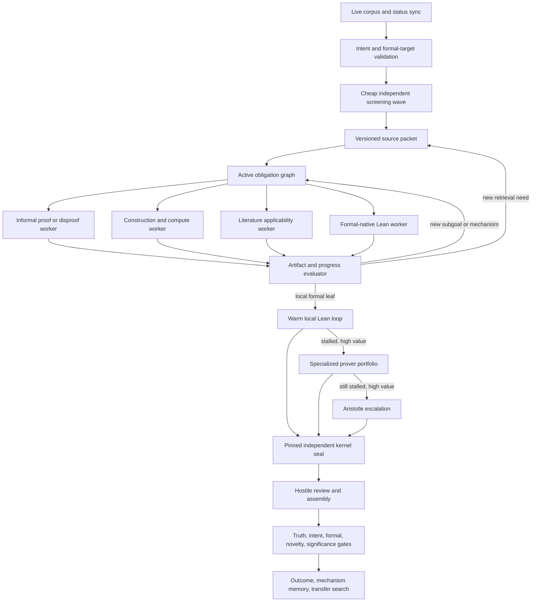

# EGMRA Effectiveness and Efficiency Research Report

**Date:** 2026-07-15  
**Repository:** `erdos_problems/`  
**Primary architecture reference:** [`../ARCHITECTURE.md`](../ARCHITECTURE.md)  
**Purpose:** identify changes that can genuinely increase mathematical progress
per unit of model, formalizer, kernel, and human-review cost.

---

## 1. Executive decision

EGMRA has a strong trust architecture and a weak research engine. Its most
important properties are already correct:

- model claims are not treated as evidence;
- the informal statement and interpretation are locked;
- Aristotle output is quarantined and independently checked;
- the local Lean kernel is the formal trust anchor;
- certificates bind the intended claim to the formal declaration;
- failures, retries, leases, caches, and outcomes are durably recorded;
- release labels remain honest when interpretation, novelty, or significance is
  unresolved.

The system should preserve those properties. The central redesign should be on
the search side:

> Replace the current small, preselected set of whole-problem branches with an
> active queue of explicit mathematical obligations. Use cheap independent
> screening first, concentrate expensive reasoning on the best surviving
> obligations, develop formal proofs interactively in a warm Lean environment,
> and invoke Aristotle only for valuable unresolved leaves. Keep the existing
> pinned kernel and release gates as the final authority.

The recommended order is:

1. remove model calls whose results are duplicated or ignored;
2. correct the mechanism-family selection bias;
3. make the claim graph drive new work dynamically;
4. add a formal-native AND/OR proof lane for existing Lean targets;
5. add a warm local Lean development loop;
6. put Aristotle behind value-aware escalation;
7. allow auditable retrieval re-entry for newly discovered subgoals;
8. learn reusable mechanisms, not only terminal outcomes;
9. add reconstructed SAT/SMT/CAS backends for suitable leaves;
10. measure every change against a frozen cost-performance benchmark.

This report does **not** recommend replacing Lean, weakening the trust model, or
adding more static reviewers. Those changes would either discard the repository's
largest compounding asset or spend more resources after the actual bottleneck.

### 1.1 Exact coverage of the requested summary

Yes: every item in the requested "Bottom Line / Highest-Leverage Changes / Do
Not Do / Implementation Order" summary is included in this report. The table
below makes that coverage explicit and points to both the detailed report section
and the controlling implementation or primary external source.

The `vscode-file://.../workbench.html` links in the pasted summary are **not**
valid file references: they point to VS Code's application shell rather than the
referenced source. This report replaces them with portable repository-relative
line links and ordinary HTTPS links.

| Requested item | Detailed coverage | Direct code or primary-source links |
|---|---|---|
| Bottom line: trust machinery is stronger than mathematical search | [Current architecture assessment](#3-current-architecture-assessment), [telemetry](#32-what-the-current-telemetry-says), and [final recommendation](#16-final-recommendation) | [`ARCHITECTURE.md`](../ARCHITECTURE.md) and persisted `egmra_runs/*.jsonl` / `egmra_outcomes/*.jsonl` |
| 235 frozen runs, 390 branches, 171 claims, 2 evidence attachments/promotions, 97 two-event runs, and five outcomes | [Outcome and event tables](#32-what-the-current-telemetry-says) include every count and the reproducible census commands | [`egmra_outcomes/`](../egmra_outcomes/) and [`egmra_runs/`](../egmra_runs/) |
| Duplicate cold pass | [Duplicate cold pass](#351-duplicate-cold-pass) and [R1](#r1-remove-duplicate-and-ignored-model-calls) | first call at [`loop.py:1106`](../egmra/orchestrator/loop.py#L1106), second call at [`loop.py:1115`](../egmra/orchestrator/loop.py#L1115) |
| Ignored model branch-selection response | [Ignored branch selector](#352-ignored-branch-selector) and [R1](#r1-remove-duplicate-and-ignored-model-calls) | selector call at [`loop.py:1326`](../egmra/orchestrator/loop.py#L1326) |
| First-three-family selection bias | [Mechanism-family selection bias](#34-mechanism-family-selection-bias) and [R2](#r2-correct-mechanism-family-selection) | cap at [`loop.py:1191`](../egmra/orchestrator/loop.py#L1191), registry order in [`programs.py:59`](../egmra/search/programs.py#L59) |
| Make the claim graph an active work queue | [Target architecture](#6-proposed-target-architecture), [obligation model](#61-core-change-an-active-obligation-graph), and [R3](#r3-make-the-claim-graph-drive-dynamic-work-waves) | coarse goal-level update at [`loop.py:1793`](../egmra/orchestrator/loop.py#L1793), current controller in [`controller.py`](../egmra/search/controller.py) |
| Dynamic independent waves instead of a fixed 64-agent allocation | [Staged search policy](#64-staged-search-policy), [adaptive inference](#r8-use-adaptive-inference-time-compute), and the GPT-5.6 analysis | [published GPT-5.6 CDC prompt](https://cdn.openai.com/pdf/04d1d1e4-bc75-476a-97cf-49055cd98d31/cdc_prompt.pdf) |
| Add a formal-native lane before whole-proof formalization | [LEAP evidence](#43-leap), [formal-native target design](#r4-add-a-formal-native-andor-proof-lane) | runtime correspondence lookup at [`loop.py:1702`](../egmra/orchestrator/loop.py#L1702), [LEAP](https://arxiv.org/abs/2606.03303), [AlphaProof Nexus](https://arxiv.org/abs/2605.22763), [DeepSeek-Prover-V2](https://arxiv.org/abs/2504.21801) |
| Separate fast proof development from final certification | [R5](#r5-add-a-warm-local-lean-development-service) and [Lean/local Lean decision](#8-lean-local-lean-and-alternatives) | local `lake env lean` runner at [`kernel_checker.py:74`](../egmra/lean/kernel_checker.py#L74), final check at [`kernel_checker.py:155`](../egmra/lean/kernel_checker.py#L155), passing-verdict cache at [`verdict_cache.py:139`](../egmra/lean/verdict_cache.py#L139), [Pantograph](https://github.com/leanprover/Pantograph), [LeanInteract](https://github.com/augustepoiroux/LeanInteract) |
| AxProverBase cost and iterative-feedback evidence | [AxProverBase review](#44-axproverbase) and [R5](#r5-add-a-warm-local-lean-development-service) | [paper](https://arxiv.org/abs/2602.24273), [AGPL repository](https://github.com/Axiomatic-AI/ax-prover-base) |
| Stage Aristotle after local and specialized proving | [Aristotle review](#47-aristotle), [R6](#r6-put-aristotle-behind-value-aware-escalation), and [alternatives table](#83-aristotle-alternatives-and-complements) | [`formalizer.py`](../egmra/lean/formalizer.py), [Aristotle paper](https://arxiv.org/abs/2510.01346) |
| Refactor prompts around one mathematical action | [Worker-prompt diagnosis](#36-the-worker-prompt-is-too-broad), [R7](#r7-narrow-the-frontier-model-prompt-contract), and [GPT-5.6-specific policy](#gpt-56-specific-use) | broad schema at [`runner_worker.py:63`](../egmra/orchestrator/runner_worker.py#L63), branch loop at [`runner_worker.py:678`](../egmra/orchestrator/runner_worker.py#L678) |
| Permit immutable, versioned retrieval re-entry | [Retrieval diagnosis](#38-retrieval-is-frozen-too-early) and [R9](#r9-permit-auditable-retrieval-re-entry) | existing unused capability at [`packet.py:138`](../egmra/retrieval/packet.py#L138) |
| Replace token overlap and host-count corroboration | [Literature applicability diagnosis](#39-literature-applicability-is-too-weak) and [R9](#r9-permit-auditable-retrieval-re-entry) | production import path at [`loop.py:601`](../egmra/orchestrator/loop.py#L601), stricter unused auditor at [`service.py:104`](../egmra/retrieval/service.py#L104) |
| Build a mechanism library, not only a lemma library | [Successful Erdős transfer pattern](#55-one-mechanism-can-unlock-several-neighboring-problems) and [R10](#r10-build-a-mechanism-library) | [Erdős 728 writeup](https://arxiv.org/abs/2601.07421), including subsequent routes to 729 and 401 |
| Add SAT/SMT/CAS/graph/ILP/interval leaf solvers | [R11](#r11-add-reconstructed-symbolic-backends) | protocol surface at [`backends.py:33`](../egmra/compute/backends.py#L33); R11 specifies LRAT/DRAT, cvc5/Z3, SageMath/PARI, nauty/Traces, CP-SAT/ILP, and interval evidence |
| Do not replace Lean | [Lean decision](#81-do-not-replace-lean) and [rejected alternative](#131-replace-lean) | current final checker in [`kernel_checker.py`](../egmra/lean/kernel_checker.py) and formalizer portfolio in [`formalizer.py`](../egmra/lean/formalizer.py) |
| Do not use 64 browser tabs, add static reviewers, optimize confidence, or evolve every proof | [Alternatives rejected](#13-alternatives-considered-and-rejected) | supporting comparisons in [AlphaProof Nexus](https://arxiv.org/abs/2605.22763), [AxProverBase](https://arxiv.org/abs/2602.24273), and [FirstProof batch 2](https://arxiv.org/abs/2606.18119) |
| Six-step implementation order | Exact list immediately below, expanded into [four implementation waves](#10-implementation-roadmap) | each wave has deliverables and exit criteria |
| Requested evaluation metrics | [Required mathematical-yield metrics](#required-mathematical-yield-metrics) and [primary evaluation metrics](#114-primary-metrics) | includes verified sublemmas per 100 calls, time to first verified lemma, non-circular decomposition, cost per kernel-passed obligation, and meaningful progress per wall-clock hour |

#### Exact six-step implementation order

This is the requested order, preserved verbatim in substance and expanded by the
roadmap later in the report:

1. Remove duplicate and ignored calls, fix family selection, and record
  per-stage calls, wall-clock time, cache hits, costs, and artifacts.
2. Add an obligation-driven scheduler and immutable versioned retrieval re-entry.
3. Build the warm Lean development loop with formal sketch decomposition.
4. Move Aristotle behind value-aware escalation.
5. Add mechanism transfer and one concrete reconstructed SAT or SMT backend.
6. Introduce evolutionary sketch populations only for the empirically measured
  hard tail.

Evaluate every wave on a frozen set of historical, correctly formalized Erdős
problems. The minimum scorecard is:

- verified sublemmas per 100 model calls;
- time to first verified lemma;
- non-circular decomposition rate;
- cost per kernel-passed obligation;
- meaningful progress per wall-clock hour.

---

## 2. Scope and standards of evidence

### 2.1 Questions investigated

This review asks two separate questions.

**Effectiveness:** What changes increase the probability that EGMRA discovers a
correct and mathematically meaningful proof, disproof, construction, reduction,
or reusable lemma?

**Efficiency:** What changes increase verified mathematical progress per unit of:

- frontier-model inference;
- browser wall-clock time;
- Aristotle task time;
- local Lean compilation time;
- scholarly retrieval;
- human interpretation, novelty, and significance review?

The report intentionally excludes changes that merely make the architecture look
more elaborate. A proposed feature must do at least one of the following:

1. change the next mathematical action based on new evidence;
2. eliminate an expensive call without losing useful information;
3. reuse a verified artifact that would otherwise be rediscovered;
4. expose a failure earlier or more precisely;
5. route a leaf to a tool better suited to it;
6. improve the probability that a candidate reaches admissible evidence.

### 2.2 Evidence classes

Recommendations are based on four evidence classes.

| Class | Meaning |
|---|---|
| Local code evidence | A behavior was traced to the current implementation. |
| Local run evidence | A behavior was observed in persisted outcomes or event logs. |
| External controlled evidence | A paper reports benchmarks, ablations, costs, or expert grading. |
| External case evidence | A public mathematical result or project illustrates a workflow, but does not establish a general effect size. |

External benchmark percentages are not treated as direct predictions for open
Erdős problems. Most formal theorem-proving benchmarks begin with a
human-validated Lean statement and often contain competition or textbook
mathematics. Open-problem research additionally requires interpretation,
literature synthesis, conjecture reformulation, construction discovery, and
novelty review.

### 2.3 Confidence labels

Each major recommendation is labeled:

- **High confidence:** directly supported by local code or telemetry and by
  external evidence.
- **Medium confidence:** strongly motivated, but its gain in EGMRA must be
  measured.
- **Experimental:** plausible only for a restricted problem class or after
  prerequisite telemetry exists.

---

## 3. Current architecture assessment

### 3.1 What should be preserved

The following subsystems are not the primary bottleneck and should remain the
foundation of the system.

#### 3.1.1 Statement and interpretation integrity

The intake layer builds an interpretation lattice, records parser disagreement,
and requires a signed intent certificate before treating an ambiguous reading as
settled. This directly addresses the dominant failure in Aletheia's Erdős sweep:
many technically valid outputs answered an easy or vacuous interpretation rather
than the intended question.

Relevant code and documentation:

- [`../egmra/intake/`](../egmra/intake/)
- [`../egmra/orchestrator/loop.py`](../egmra/orchestrator/loop.py), `research`
- [`../ARCHITECTURE.md`](../ARCHITECTURE.md), sections 3.1 and 3.2

#### 3.1.2 Formal trust boundary

Aristotle and API formalizers produce untrusted Lean source for a caller-pinned
obligation. The local checker verifies a definitional obligation of the form:

```lean
example : <expected_type> := @<declaration_name>
```

It then audits the axiom closure. This is the right trust boundary. Vendor
completion status must never become proof authority.

Relevant code:

- [`../egmra/lean/formalizer.py`](../egmra/lean/formalizer.py)
- [`../egmra/lean/kernel_checker.py`](../egmra/lean/kernel_checker.py)
- [`../egmra/lean/service.py`](../egmra/lean/service.py)
- [`../egmra/lean/verdict_cache.py`](../egmra/lean/verdict_cache.py)

#### 3.1.3 Honest release lattice

Truth, interpretation, formal correspondence, novelty, significance, and release
are distinct gates. A formal proof of the wrong statement is not a solution. A
correct rediscovery is not novel. A novel minor observation is not necessarily a
significant solution. This separation should not be collapsed.

Relevant code:

- [`../egmra/truth/`](../egmra/truth/)
- [`../egmra/release/gates.py`](../egmra/release/gates.py)
- [`../egmra/orchestrator/result_states.py`](../egmra/orchestrator/result_states.py)

#### 3.1.4 Durability and operational safety

Exchange caching, signed branch checkpoints, kernel-verdict caching, dossiers,
outcome ledgers, branch leases, fencing tokens, provider-outage retention, and
Neon coordination address real failure modes already encountered in long browser
runs. These mechanisms protect expensive work and should be extended to new
search artifacts rather than replaced.

### 3.2 What the current telemetry says

The following counts were measured from the checked-out repository on
2026-07-15. The command aggregated all persisted `egmra_runs/*.jsonl` files and
the two current outcome ledgers.

#### 3.2.1 Outcome ledger

| Public state | Count |
|---|---:|
| `BLOCKED_BY_INTERPRETATION` | 4 |
| `OPEN_NO_PROGRESS` | 1 |

There are only five durable outcome rows. This is too little data for a reliable
corpus-wide success posterior, but it is enough to show that the current
production funnel has not yet generated recorded partial mathematical progress.

#### 3.2.2 Event actions

| Event action | Count |
|---|---:|
| `BRANCH_OPENED` | 390 |
| `PROBLEM_FROZEN` | 235 |
| `INTERPRETATION_ADDED` | 235 |
| `CLAIM_PROPOSED` | 171 |
| `INTENT_CERTIFICATE_ISSUED` | 22 |
| `EVIDENCE_ATTACHED` | 2 |
| `CLAIM_PROMOTED` | 2 |
| `CLAIM_INTENT_BOUND` | 1 |

The important ratio is not branch openings per problem. It is admissible
evidence per branch opening. In this historical corpus, the system opened
hundreds of branches and proposed many claims, but almost none became evidence.

These counts include historical retries, experiments, and multiple generations
of the code. They are not a clean benchmark. They nevertheless falsify the idea
that formal verification throughput is currently the first-order production
bottleneck: almost no candidate reaches formal evidence at all.

#### 3.2.3 Run-depth distribution

| Events in a run | Number of run files |
|---:|---:|
| 2 | 97 |
| 3 | 7 |
| 5 | 104 |
| 6 | 20 |
| 9 | 1 |
| 10 | 1 |
| 14 | 1 |
| 18 | 1 |
| 44 | 1 |
| 51 | 1 |
| 57 | 1 |

Most runs terminate very early. Only five runs exceeded 18 events. The deepest
runs are exceptions, not the normal execution path.

#### 3.2.4 Reproducible census command

```bash
jq -r '.public_state' egmra_outcomes/*.jsonl | sort | uniq -c

find egmra_runs -name '*.jsonl' -print0 \
  | xargs -0 jq -r '.action // empty' \
  | sort | uniq -c | sort -nr
```

The run-depth census used `wc -l` over each JSONL file. A proper evaluation
command should be added to the repository so this telemetry is generated from a
versioned schema rather than an ad hoc shell pipeline.

### 3.3 The actual search horizon

The research loop accepts `max_iterations=4`, but program instantiation is
further limited to at most three mechanism families:

```python
max_programs=max(1, min(max_iterations, 3))
```

Each selected family is attempted once. A worker may run multiple continuation
rounds within that branch, but the outer controller does not create new branch
objects from newly discovered subgoals, constructions, or bottlenecks.

Relevant code:

- [`../egmra/orchestrator/loop.py`](../egmra/orchestrator/loop.py), `research`
- [`../egmra/search/programs.py`](../egmra/search/programs.py), `instantiate_programs`
- [`../egmra/search/controller.py`](../egmra/search/controller.py)
- [`../egmra/orchestrator/runner_worker.py`](../egmra/orchestrator/runner_worker.py), `work_branch`

This architecture has a sophisticated controller wrapped around a largely
static work set. It cannot reproduce the most important behavior of successful
long-horizon systems: generate new work from the exact remaining gap.

### 3.4 Mechanism-family selection bias

`instantiate_programs` takes compatible families in registry order and truncates
the list. For common domains, the first three are typically:

1. `direct_structural`
2. `contradiction_minimal_counterexample`
3. `extremal_invariant`

This means that the following families can be registered but never executed in a
normal three-family run:

- `probabilistic_analytic`
- `additive_combinatorial`
- `algebraic_spectral`
- `computational_finite_reduction`
- `formal_library_first`
- `literature_derived_transfer`
- `counterexample_model_construction`

The effect is visible in the event logs, where many attempts repeatedly open the
same first three families. This is not quality-diversity selection. It is prefix
selection followed by a diversity check over the already truncated prefix.

### 3.5 Two model-call inefficiencies

#### 3.5.1 Duplicate cold pass

The loop directly calls `runner.run(..., stage="cold_pass")` and then invokes
`worker.cold_pass`, which calls the runner again through `_ask_structured`. The
first response is not parsed into the cold-pass result. It is appended to
retrieval techniques as free text.

One strong structured cold pass should produce the falsifiers, search queries,
and bottleneck. A separate cheap query-expansion model can be used only if an
ablation shows additional retrieval recall worth its cost.

#### 3.5.2 Ignored branch selector

The loop calls a model with:

```text
Select among branch mechanisms: ...
```

It records the response, then chooses `direct_structural` first or uses the
numeric controller. The model response does not control selection.

This call should either be removed or changed to a structured critic whose
features enter the action score and are calibrated against outcomes.

### 3.6 The worker prompt is too broad

One branch response is asked to emit all of the following:

- goal restatement;
- claims and dependencies;
- proof steps;
- assumptions;
- falsifiers;
- search queries;
- candidate sequences;
- executable experiments;
- formalization requests;
- Lean candidates;
- literature imports;
- open subgoals;
- bottleneck;
- confidence.

This is useful as an interchange schema but poor as the cognitive objective for a
frontier reasoning model. It encourages the model to touch every category
shallowly instead of making one decisive mathematical advance.

The schema should remain available as a normalized storage format. The solver
prompt should instead ask for one action at a time, and a cheaper extraction step
should convert the mathematical artifact into the storage schema.

### 3.7 Formalization is dispatched before value triage

Source-less Lean candidates are sent to the configured formalizer during branch
work. Dispatch deduplication and parallel Aristotle slots are good efficiency
features, but candidate selection remains coarse: a syntactically complete
obligation can consume a remote proof task even when the underlying informal
route is weak, circular, peripheral, or contradicted elsewhere.

Formalization priority should depend on:

- whether proving the obligation closes or substantially reduces central debt;
- whether the obligation has a stable correspondence to the intended claim;
- whether a cheap local prover has already failed;
- whether a verified proof will be reusable;
- whether the branch remains alive after falsification;
- estimated remote cost and queue congestion.

### 3.8 Retrieval is frozen too early

The initial packet is correctly frozen for auditability. Continuation rounds can
rerank it, but cannot retrieve new sources for a newly discovered technical
subgoal. [`../egmra/retrieval/packet.py`](../egmra/retrieval/packet.py) already
supports versioned packet re-entry, but production does not use it.

Freezing should mean immutable versions, not a permanent ban on later retrieval.
Every re-entry can create a new packet whose record contains:

- parent packet hash;
- triggering subgoal or failed hypothesis;
- exact query;
- search providers and versions;
- added records;
- negative coverage;
- new packet hash.

### 3.9 Literature applicability is too weak

The active path accepts a literature import when at least half of the claim's
content words overlap the source text. Two records from distinct web hosts are
then called independently corroborated.

This has two problems:

1. lexical overlap does not establish that theorem hypotheses are available or
   that its conclusion implies the claim;
2. two hosts can mirror the same paper, argument, or mistaken summary.

The repository already contains a stricter `ImportAuditor`, but the production
path does not use it. Even that auditor is deliberately conservative and should
eventually be supplemented with a structured hypothesis map and formal or expert
applicability review.

### 3.10 The controller's feedback is too coarse

The branch posterior is updated mainly from whether the **goal claim** became
supported. This fails to distinguish:

- a branch that found a decisive verified child lemma;
- a branch that refuted a major route;
- a branch that produced a reusable construction;
- a branch that localized the exact missing theorem;
- a branch that generated many peripheral claims;
- a branch that merely restated the goal.

The controller should learn from obligation-level events, not only terminal goal
support.

---

## 4. External evidence and transferable lessons

### 4.1 Aletheia and the Erdős sweep

[Aletheia](https://arxiv.org/abs/2602.10177) uses a generator, verifier, and
reviser around a strong reasoning model with literature and tool access. Its
Erdős campaign is the most important warning for this repository.

From roughly 700 then-open problems, Aletheia produced 212 candidates. Of 200
definitively graded candidates:

- 137 were fundamentally flawed;
- 63 were technically correct under some interpretation;
- only 13 meaningfully addressed the intended problem.

Transferable lessons:

1. interpretation integrity is not optional;
2. a technically correct proof can still be mathematically vacuous;
3. literature discovery is often itself the resolution;
4. strong models benefit from iterative generate-verify-revise loops;
5. refusing to answer can improve conditional accuracy and save expert review;
6. simple or obscure problems are a realistic source of early wins.

EGMRA already addresses item 1 better than most public systems. It should adopt
items 3 through 6 more aggressively.

### 4.2 AlphaProof Nexus

[AlphaProof Nexus](https://arxiv.org/abs/2605.22763) is the closest large-scale
formal comparison. It attempted 353 community-formalized Erdős statements and
reported nine resolutions.

Important design details:

- the input was already a Lean theorem with `sorry`;
- independent prover loops repeatedly edited and compiled a proof sketch;
- Lean compiler errors were fed back after edits;
- a full configuration maintained a population of compiling incomplete
  sketches;
- incomplete sketches were relatively ranked;
- parent sketches were selected with exploration pressure;
- exact Lean subgoal states were globally cached;
- novel subgoals were dispatched in parallel;
- final proofs were independently validated against statement mutation and
  axiom attacks;
- search could run for up to 3,000 episodes per problem.

The basic compiler-feedback agent reproduced all nine successes in a post-hoc
study, although it cost more on the hardest cases. The evolutionary system was
2x to 5x more efficient on some hard problems and roughly half as cost-efficient
on several easier ones.

Transferable decision:

> Use a simple iterative compiler loop as the default. Escalate to population
> search only after the simple loop stalls on a high-value problem.

Important limitation:

AlphaProof Nexus begins after statement interpretation and autoformalization.
Its results do not show that formal search alone can solve arbitrary informal
Erdős problems.

### 4.3 LEAP

[LEAP](https://arxiv.org/abs/2606.03303) builds an AND/OR DAG of formal goals.
It first attempts a direct proof. On failure, it generates an informal blueprint
and a Lean sketch in which `sorry` may appear only in newly proposed child
lemmas. If the parent sketch compiles, the decomposition is formally valid:
proving all children suffices to prove the parent.

Reported ablations on Lean-IMO-Bench show:

- a tree version achieved 73.3% on the basic split and 40.0% on the advanced
  split;
- DAG memoization raised those figures to 83.3% and 56.7%;
- removing the decomposition reviewer caused a hard Putnam problem to fail even
  after eight rollouts;
- the full system solved tasks requiring tens to thousands of model calls.

The key transferable concept is **formal correspondence by construction**. A
child lemma extracted from a compiling parent sketch does not need an LLM to
argue that it is relevant. Lean has already established that the child closes a
specific hole in the parent proof.

### 4.4 AxProverBase

[AxProverBase](https://arxiv.org/abs/2602.24273) is evidence against unnecessary
orchestration complexity. Its core loop is:

1. propose Lean code;
2. compile;
3. feed exact errors and open goals back;
4. update a compact self-managed notebook;
5. optionally search Mathlib;
6. repeat for up to 50 iterations.

Reported findings:

- iterative refinement produced the largest performance gain;
- compact self-managed memory produced the second-largest gain;
- search tools helped, but less than feedback and memory;
- the self-managed context proved about 7% more theorems at about 20% lower
  total cost than a longer raw history in the reported ablation;
- the system reached 54.7% on PutnamBench at pass@1;
- it reported roughly Hilbert-level pass@1 performance with about two orders of
  magnitude fewer tokens;
- average reported cost across its evaluated datasets was about $12.60 per
  problem.

The exact percentages should not be projected onto open research problems.
The robust conclusion is that a warm iterative development loop should precede
heavy recursive or evolutionary machinery.

### 4.5 OpenProver

[OpenProver](https://arxiv.org/abs/2607.09217) uses a planner, isolated workers,
independent verifiers, a compact whiteboard, and a persistent repository. In Lean
mode, workers can:

- verify a snippet;
- store a verified snippet for later calls;
- search Lean declarations;
- formalize an existing natural-language proof.

On ProofNet with a 100k-token budget, its reported planner-worker harness improved
Kimi K2.5 from 36.8% to 57.3% and Leanstral from 21.1% to 28.1%.

Transferable lessons:

- keep a compact high-level whiteboard separate from large artifacts;
- let the root planner choose focused worker tasks dynamically;
- store only verified Lean snippets in formal memory;
- permit interruption and steering;
- use separate planner and worker models when cost-effective.

### 4.6 DeepSeek-Prover-V2

[DeepSeek-Prover-V2](https://arxiv.org/abs/2504.21801) trains and evaluates a
formal prover around subgoal decomposition. A general model produces a Lean
sketch with `have` statements and omitted child proofs. A smaller 7B prover
attempts the child obligations.

Transferable lessons:

- strong general models are useful for decomposition;
- smaller specialized models can cheaply close local leaves;
- previous child lemmas should become premises for later children;
- exact compiler verification should supervise successful traces;
- formal reward hacking remains possible, so final replay must be independent.

The last point is important: an earlier result exploited a Lean interface bug.
EGMRA's independent pinned checker is therefore an asset, not overhead to remove.

### 4.7 Aristotle

[Aristotle](https://arxiv.org/abs/2510.01346) combines:

- an informal reasoning component;
- Lean proof search;
- generated and formalized lemmas;
- a dedicated geometry engine.

It is a strong remote proof producer, but it is not a substitute for the local
kernel and should not be asked to decide the informal interpretation. Its best
role in EGMRA is a high-value formal leaf solver supplied with:

- an exact Lean obligation;
- the local context and imports;
- already verified helper lemmas;
- an informal strategy;
- prior rejected source;
- exact kernel diagnostics.

### 4.8 AI Co-Mathematician

[AI Co-Mathematician](https://arxiv.org/abs/2605.06651) emphasizes asynchronous
workstreams, durable failed hypotheses, literature and computation tools, a
shared workspace, uncertainty tracking, and human steering.

Its most transferable result is organizational rather than algorithmic:

- humans often supplied a small but decisive correction or pruning idea;
- failed workstreams remained useful because they localized the gap;
- reviewers sometimes generated the useful proof idea rather than merely
  approving work;
- uncapped reviewer loops could converge to reviewer-pleasing but still flawed
  prose or fail to terminate.

EGMRA should add a precise escalation artifact for the operator or a domain
expert, not hide every blocked route inside an autonomous retry budget.

### 4.9 GPT-5.6 Cycle Double Cover prompt

OpenAI published the [prompt associated with its GPT-5.6 Sol Ultra Cycle Double
Cover run](https://cdn.openai.com/pdf/04d1d1e4-bc75-476a-97cf-49055cd98d31/cdc_prompt.pdf).
The mathematical claim itself should be evaluated separately from the prompt's
architectural lessons.

The prompt instructs the root model to:

- use up to 64 concurrent agents dynamically rather than assign fixed quotas;
- begin with genuinely different mathematical formulations;
- hide the favored route from most early workers;
- maintain an explicit registry of approach families;
- redirect workers when too many converge on one family;
- reject elegant reductions whose missing lemma is theorem-equivalent;
- mark stalled theorem-strength routes as blocked;
- reopen a route only after a materially new mechanism appears;
- keep incompatible proof routes alive through several rounds;
- launch adversarial agents against problem-specific traps;
- require concrete lemmas, constructions, equations, or counterexamples;
- repeatedly synthesize, challenge, redirect, and launch new waves.

The transferable mechanism is **dynamic wave orchestration over explicit
remaining gaps**. The number 64 is not a generally useful default. FirstProof and
AxProverBase both show that larger agent organizations can cost much more without
commensurate gains.

### 4.10 Public Erdős contribution record

The [Tao-maintained AI contributions wiki](https://github.com/teorth/erdosproblems/wiki/AI-contributions-to-Erd%C5%91s-problems)
separates:

- standalone AI work;
- AI work alongside literature discovered later;
- AI work building on known literature;
- human-AI collaboration;
- literature search;
- formalization;
- rewriting;
- computation.

That classification is useful for EGMRA. A pipeline should not treat full
autonomous resolution as the only valuable outcome. Literature identification,
formalization of an existing proof, a verified partial result, a construction,
and a reusable reduction are distinct and valuable products.

---

## 5. What successful Erdős workflows have in common

### 5.1 Correcting the target is often part of the solution

Problem statements can be vague, compressed, or historically inconsistent.
Problem 728 initially required community discussion before the intended strong
version was fixed. AlphaProof Nexus also found proofs of unintended density
interpretations before its formal targets were corrected.

Implication for EGMRA:

- retain the interpretation certificate;
- include the original source context and forum discussion in intent review;
- test formal targets with examples, anti-examples, and local semantic
  mutations;
- never interpret a quick formal proof as evidence that the statement was
  faithfully encoded.

### 5.2 Variants and partial questions are often the tractable unit

Many public contributions resolve one part, a stronger or weaker variant, an
explicit bound, or a decisive subproblem. These are not failures. They are often
the route by which the full problem becomes understandable.

EGMRA currently excludes the goal from subsidiary salvage and records child
claims, but it should also create first-class targets for:

- each part of a multipart problem;
- finite or conditional variants;
- explicit constants;
- natural strengthenings and weakenings;
- the negation of a suspected statement;
- exact reductions to a named bottleneck.

Each variant needs its own relationship to the parent: implies, is implied by,
specializes, generalizes, refutes, or is independent.

### 5.3 Transformations matter more than generic method labels

Several successful cases turn on a specific representation change:

- factorial divisibility to binomial divisibility and then to base-
  `p` carry counts;
- planar collinearity to a graph encoded by an elliptic-curve group law;
- a geometric property to a graph or hypergraph construction;
- an extremal statement to a rigid interval-representation construction;
- a tiling or configuration problem to SAT or ILP;
- asymptotic behavior to a finite recurrence or exact parameter search.

`direct_structural` is not a reusable lesson. "Convert factorial divisibility
to carry inequalities and split primes into ranges" is.

### 5.4 Constructions benefit from executable search

When the mathematical object can be represented as a program with an objective
score, AlphaEvolve-style search can be effective. This applies to:

- graph constructions;
- finite set systems;
- colorings;
- additive bases;
- sequences;
- polynomial supports and coefficients;
- parameter schedules;
- counterexamples.

It does not apply directly to unrestricted prose proofs because there is no hard,
dense evaluator. Evolution should be enabled only when the candidate object has a
replayable evaluator.

### 5.5 One mechanism can unlock several neighboring problems

The proof of Erdős 728 led to routes for 729 and 401. Public records contain
other clusters where one theorem, construction, or formal library development
supports multiple entries.

EGMRA should run a transfer pass after every verified mechanism:

1. abstract the mechanism's hypotheses and conclusion;
2. retrieve structurally related catalog problems;
3. test whether their statements instantiate the same mechanism;
4. create transfer obligations;
5. rank them by additional work needed.

### 5.6 Human steering is highest-value at localized gaps

"Please solve problem 312" is a poor human escalation. A useful escalation is:

> Every route now reduces to proving the following monotonicity inequality. The
> model has checked these boundary cases, found no counterexample through this
> range, and failed with these three mechanisms. Is there a known theorem or
> invariant that controls this term?

The system should generate that artifact automatically when marginal autonomous
value falls below expected cost.

---

## 6. Proposed target architecture



### 6.1 Core change: an active obligation graph

An obligation is a concrete unit of unfinished mathematical work. Suggested
fields:

```json
{
  "obligation_id": "obl_<content-hash>",
  "problem_id": "erdos-312",
  "parent_claim_id": "lemma_7",
  "kind": "prove|refute|construct|compute|retrieve|formalize|repair|audit",
  "statement": "exact mathematical or Lean obligation",
  "formal_goal_hash": "optional exact elaborated Lean state hash",
  "dependencies": ["claim-or-obligation-id"],
  "mechanism_family": "specific mechanism, not generic role",
  "centrality": 0.0,
  "verified_debt": 0.0,
  "estimated_cost": 0.0,
  "estimated_information_gain": 0.0,
  "reuse_scope": ["problem ids or mechanism family"],
  "attempt_history": [],
  "blocked_reason": "",
  "reopen_condition": ""
}
```

The scheduler should choose actions over obligations, not choose a whole problem
family once.

### 6.2 Progress signals

Useful non-terminal progress includes:

- a kernel-verified child lemma;
- a replayed counterexample;
- a formal disproof of a proposed child lemma;
- a compiling parent sketch with strictly simpler child goals;
- a reduction in the size or risk of the central dependency cone;
- an exact construction with a checked evaluator;
- a literature theorem with fully mapped hypotheses;
- a previously broad gap localized to one explicit condition;
- a reusable mechanism instantiated on another problem.

Raw claim count, prose length, confidence, and number of agents are not progress
signals.

### 6.3 Suggested action score

The current additive controller is a good starting form. Replace mostly constant
inputs with observed obligation-level values:

```text
score = expected verified-debt reduction
      + expected information gain
      + expected downstream unlock
      + expected cross-problem reuse
      + protected exploration bonus
      - model and tool cost
      - verifier congestion cost
      - duplication penalty
      - semantic-risk penalty
```

Do not ask an LLM to provide the final score. Models may propose features or
pairwise rankings. Calibration must come from recorded outcomes.

### 6.4 Staged search policy

#### Stage A: cheap screening

For each clean target, run a small independent portfolio:

- direct proof or disproof;
- construction/counterexample;
- exact-computation opportunity;
- literature/known-theorem transfer;
- formal-target tractability.

Use 4 to 8 independent samples initially, not 64. Workers should not see the
favored route during the first wave.

#### Stage B: artifact triage

Keep only branches that produce one of:

- a concrete lemma;
- an executable construction;
- a counterexample candidate;
- a precise literature theorem;
- a compiling formal sketch;
- a new transformation;
- a sharply localized gap.

#### Stage C: concentrated development

Allocate most of the remaining budget to one or two central obligations, while
reserving a protected fraction for genuinely different routes.

#### Stage D: formal development

When an exact Lean target exists, interleave informal planning and Lean feedback
at the lemma level. Do not wait for a polished whole proof.

#### Stage E: expensive escalation

Escalate to remote proof systems or evolutionary populations only when:

- the obligation is central;
- its statement is stable;
- cheaper methods have produced informative failures;
- a proof would materially advance assembly;
- expected value exceeds estimated cost.

---

## 7. Ranked recommendations

## R1. Remove duplicate and ignored model calls

**Priority:** P0  
**Confidence:** High  
**Primary benefit:** efficiency

### Finding

The current loop pays for a duplicate cold pass and an ignored branch-selection
response.

### Change

1. Let `worker.cold_pass` be the single source of structured falsifiers, queries,
   and bottleneck.
2. Remove the direct `runner_cold` call.
3. Remove `runner_branch`, or parse a strict pairwise ranking whose calibrated
   features enter the controller.
4. Record `purpose`, `decision_used`, tokens, time, and cache status for every
   model exchange.

### Acceptance test

- identical branch and packet decisions on deterministic fixtures;
- two fewer frontier calls on a standard three-family run;
- no reduction in retrieval recall on a frozen evaluation set;
- every production model call has `decision_used=true` or produces a persisted
  mathematical artifact.

### Integration points

- [`../egmra/orchestrator/loop.py`](../egmra/orchestrator/loop.py)
- [`../egmra/orchestrator/runner_worker.py`](../egmra/orchestrator/runner_worker.py)
- [`../egmra/agents/exchange_cache.py`](../egmra/agents/exchange_cache.py)

---

## R2. Correct mechanism-family selection

**Priority:** P0  
**Confidence:** High  
**Primary benefit:** effectiveness and efficiency

### Finding

The three-program cap is applied after registry-order filtering, repeatedly
selecting the first three compatible families.

### Change

Select a stratified first wave:

1. one proof-oriented route;
2. one refutation or construction route;
3. one tool-oriented route chosen from computation, literature, or formal
   library search.

Use the cold-pass bottleneck, domain, formal-target availability, executable
predicate availability, and prior mechanism outcomes. Apply quality-diversity
selection over all compatible candidates before truncating.

### Acceptance test

- no fixed domain always produces the same first three families;
- every first wave contains materially different mechanisms;
- family selection is deterministic for a frozen seed and feature record;
- protected exploration cannot be consumed by a superficial paraphrase of an
  existing family.

### Integration points

- [`../egmra/search/programs.py`](../egmra/search/programs.py)
- [`../egmra/search/mechanism.py`](../egmra/search/mechanism.py)
- [`../egmra/search/controller.py`](../egmra/search/controller.py)
- [`../egmra/orchestrator/loop.py`](../egmra/orchestrator/loop.py)

---

## R3. Make the claim graph drive dynamic work waves

**Priority:** P1  
**Confidence:** High  
**Primary benefit:** effectiveness

### Finding

The current graph stores claims and evidence but does not continuously generate
the next work queue from unresolved dependencies.

### Change

Add an `ObligationScheduler` that:

1. creates obligations from new claims, objections, formal goals, failed
   experiments, and missing theorem hypotheses;
2. scores them by verified-debt reduction, information gain, reuse, cost, and
   semantic risk;
3. launches focused workers;
4. updates or closes obligations from checked artifacts;
5. starts a new wave from the remaining bottlenecks;
6. blocks theorem-equivalent or repeatedly failed routes;
7. reopens a route only when its recorded condition is met.

### Important design rule

A worker task should contain one primary verb:

- prove;
- refute;
- construct;
- compute;
- retrieve;
- formalize;
- repair;
- audit.

### Acceptance test

- a newly proposed open subgoal becomes schedulable without restarting the
  whole problem;
- a verified child lemma can unlock multiple parents;
- repeated identical obligations are content-deduplicated;
- refuting a child invalidates dependent candidate routes;
- a stalled family does not receive more work without a new mechanism;
- the run can resume from the obligation graph after a crash.

### Integration points

- [`../egmra/truth/graph.py`](../egmra/truth/graph.py)
- [`../egmra/search/controller.py`](../egmra/search/controller.py)
- [`../egmra/search/verified_debt.py`](../egmra/search/verified_debt.py)
- [`../egmra/orchestrator/loop.py`](../egmra/orchestrator/loop.py)
- [`../egmra/orchestrator/checkpoint.py`](../egmra/orchestrator/checkpoint.py)

---

## R4. Add a formal-native AND/OR proof lane

**Priority:** P1  
**Confidence:** High for existing community Lean targets  
**Primary benefit:** effectiveness

### Finding

EGMRA currently asks a branch to propose informal claims and optional Lean
candidates, then independently checks correspondence. It does not use Lean to
validate a decomposition before spending proof effort on child lemmas.

### Change

For targets with a validated Lean statement:

1. register the target as an OR node;
2. try direct proof development;
3. if direct proof stalls, ask for an informal blueprint;
4. translate it into a Lean parent sketch;
5. permit placeholders only in explicitly declared new child lemmas;
6. compile the parent sketch;
7. if it compiles, register an AND decomposition and exact child OR nodes;
8. reject a child equivalent to the parent or an ancestor;
9. solve children independently;
10. substitute verified child proofs and seal the root.

### Why this is especially valuable in EGMRA

The parent sketch supplies a machine-checked dependency relation. Runtime child
claims no longer rely only on model-authored prose to establish relevance. Their
formal correspondence to the parent route is part of a compiling artifact.

### Acceptance test

- `sorry` is allowed only at enumerated child declarations in development
  artifacts;
- the parent theorem body is otherwise `sorry`-free;
- graph cycles and ancestor-equivalent children are rejected;
- proving all children mechanically produces a root proof;
- every final artifact is replayed by the existing pinned checker;
- no development artifact can pass a release gate.

### Integration points

- [`../egmra/lean/proof_state.py`](../egmra/lean/proof_state.py)
- [`../egmra/lean/service.py`](../egmra/lean/service.py)
- [`../egmra/truth/graph.py`](../egmra/truth/graph.py)
- [`../egmra/orchestrator/loop.py`](../egmra/orchestrator/loop.py)

---

## R5. Add a warm local Lean development service

**Priority:** P1  
**Confidence:** High  
**Primary benefit:** effectiveness and efficiency

### Finding

The existing pinned checker is appropriate for final certification but too
expensive and stateless to be the only source of iterative proof feedback.

### Change

Add a separate, explicitly non-authoritative development service using one of:

- [Pantograph](https://github.com/leanprover/Pantograph);
- [LeanInteract](https://github.com/augustepoiroux/LeanInteract);
- a persistent Lean language-server or custom Lean process;
- OpenProver-style `lean_verify`, `lean_store`, and `lean_search` tools.

The service should:

- elaborate the environment once;
- return exact goals and local hypotheses;
- support targeted edits or tactic application;
- search Mathlib declarations semantically and lexically;
- persist verified helper snippets;
- cache failed diagnostics by exact environment and source hash;
- expose multiple open goals independently;
- run 20 to 50 bounded iterations for valuable obligations;
- terminate on repeated proof states or declining marginal progress.

### Trust boundary

Development success is not a certificate. Every final proof still goes through
[`../egmra/lean/kernel_checker.py`](../egmra/lean/kernel_checker.py) and the
existing axiom/correspondence checks.

### Acceptance test

- repeated edits do not reload all of Mathlib from scratch;
- exact open-goal feedback reaches the next model turn;
- a stale goal-state cache cannot cross environment identities;
- final sealed certificates remain byte-for-byte compatible with the current
  release path;
- a malicious development process cannot mint a formal certificate.

---

## R6. Put Aristotle behind value-aware escalation

**Priority:** P1  
**Confidence:** High  
**Primary benefit:** efficiency

### Finding

Aristotle is valuable, but remote tasks should not be consumed by every
source-less candidate before local development and centrality triage.

### Change

Use a formalizer ladder:

1. deterministic tactics and domain automation;
2. warm general-model Lean loop;
3. cheap specialized formal models;
4. several local/API proof samples;
5. Aristotle;
6. existing pinned kernel seal.

Escalate when:

- the obligation is central or highly reusable;
- correspondence is stable;
- local diagnostics show a plausible remaining gap;
- the branch has not been refuted;
- the same obligation is not already in flight or solved;
- the expected unlock exceeds remote cost.

### Aristotle prompt package

Send:

- exact declaration and expected type;
- target module and imports;
- verified helper declarations;
- informal strategy;
- exact current proof source;
- exact compiler or kernel errors;
- forbidden mechanisms;
- immutable hashes outside the natural-language prompt.

### Acceptance test

- no remote task is created before a persisted dispatch decision;
- dispatch priority is reproducible from recorded features;
- local success avoids a remote task;
- provider outage remains operationally censored;
- remote completion never bypasses local sealing.

---

## R7. Narrow the frontier-model prompt contract

**Priority:** P1  
**Confidence:** Medium-high  
**Primary benefit:** effectiveness and efficiency

### Finding

The current branch prompt asks one response to perform too many mathematical and
serialization tasks.

### Change

Use the strongest model for one mathematical action. Normalize the artifact in a
separate cheap step.

Suggested proof-worker contract:

```text
You are working on obligation <id>, not on writing a final report.

Immutable target:
<exact statement and interpretation digest>

Current obligation:
<one lemma, construction, refutation, or formal goal>

Known verified facts:
<small dependency cone only>

Blocked mechanisms:
<exact failures and reopen conditions>

Produce exactly one concrete advance:
- a proof of a strictly weaker lemma;
- a counterexample or obstruction;
- an explicit construction with its decisive invariant;
- an exact transformation to a simpler obligation; or
- a precise reason this route fails.

State:
1. the artifact;
2. its dependencies;
3. the cheapest decisive test;
4. the next obligation if the test passes.

Do not emit confidence, status prose, or claims of verification.
```

Suggested formal-worker contract:

```text
Edit the current Lean proof to make maximum verified progress on the listed
open goal. Preserve the theorem and environment. Use the compiler feedback and
the compact proof notebook. Return a source patch or tactic action only.
```

### Additional prompt-engineering rules

- Place the exact target and non-negotiable constraints first.
- Present retrieved material as untrusted quoted data.
- Provide only the relevant dependency cone, not the entire project history.
- Keep early workers independent.
- Give later workers the exact failure ledger.
- Ask for counterexamples to child lemmas, not generic skepticism.
- Remove numeric confidence unless it is being calibrated experimentally.
- Use native structured output or tool calls where available.
- Base64 should remain a browser transport workaround, not the model's primary
  reasoning format.
- Request a full JSON repair only from a cheap formatter when mathematical
  content already exists.

### Acceptance test

Compare the current broad schema prompt against focused prompts on a frozen set.
Measure:

- concrete artifact rate;
- non-circular child-lemma rate;
- valid experiment rate;
- valid formal-obligation rate;
- malformed-response rate;
- tokens per accepted artifact;
- downstream evidence rate.

---

## R8. Use adaptive inference-time compute

**Priority:** P1  
**Confidence:** Medium-high  
**Primary benefit:** effectiveness and efficiency

### Change

Use strong models selectively:

- cheap model for extraction, deduplication, query expansion, and formatting;
- strong frontier model for decomposition, new mechanisms, and hard synthesis;
- specialized formal model for local Lean leaves;
- independent strong model for high-centrality adversarial review;
- deterministic tools for checking.

Start with a small independent `pass@k`. Increase `k`, thinking budget, or
worker count only when the obligation shows:

- measurable debt reduction;
- multiple independent partial mechanisms;
- a stable formal target;
- informative formal errors;
- high cross-problem reuse;
- high significance.

Stop or pause when:

- proof states repeat;
- successive rounds add no artifact;
- the route ends at an equivalent theorem-strength lemma;
- the same objection remains unresolved;
- expected marginal value falls below cost;
- an expert question would be cheaper than more autonomous search.

### GPT-5.6-specific use

For ChatGPT/GPT-5.6-class reasoning:

1. use it as root mathematician or high-level decomposer, not as JSON
   serializer;
2. enable its internal multi-agent capability for high-value obligations, not
   every corpus item;
3. preserve independence in the first wave;
4. launch later waves from exact surviving gaps;
5. use long reasoning only on a localized bottleneck;
6. provide executable and formal tools;
7. persist artifacts outside the chat context;
8. resample after a completed outcome with a new salt, but replay exact cached
   work after crashes.

---

## R9. Permit auditable retrieval re-entry

**Priority:** P1  
**Confidence:** High  
**Primary benefit:** effectiveness

### Change

When a branch produces a new subgoal or named mechanism:

1. create a precise query from the obligation;
2. search scholarly APIs, MathOverflow, the Erdős forum, citation neighbors,
   author pages, and the local theorem corpus;
3. freeze a child packet version;
4. render exact theorem statements and hypotheses;
5. bind every import to the packet record;
6. record negative coverage honestly.

### Replace host-based corroboration

Corroboration should identify independent mathematical sources, not hosts. Use:

- DOI/arXiv/canonical-paper identity;
- authorship overlap;
- citation lineage;
- theorem-statement equivalence;
- whether one source merely quotes another;
- independent proof artifacts.

### Applicability artifact

Every imported theorem should have:

```json
{
  "theorem_id": "...",
  "source_identity": "...",
  "required_hypotheses": [],
  "available_fact_bindings": {},
  "desired_consequence": "...",
  "applicability_proof_or_review": "...",
  "status": "candidate|audited|formally_checked"
}
```

### Acceptance test

- a new subgoal can trigger retrieval without mutating the parent packet;
- mirrored copies do not count as independent corroboration;
- unmet hypotheses reject an import;
- negation or quantifier changes cannot pass via token overlap;
- imported theorem use is visible in the dependency graph.

---

## R10. Build a mechanism library

**Priority:** P2  
**Confidence:** Medium-high  
**Primary benefit:** long-term effectiveness and efficiency

### Finding

The current lemma library stores kernel-passed Lean declarations. Procedural
memory stores coarse branch-family outcomes. The missing layer is a reusable
mathematical mechanism.

### Mechanism record

```json
{
  "mechanism_id": "mech_<hash>",
  "name": "carry-rich central-binomial divisibility",
  "input_pattern": "factorial or binomial divisibility with growing window",
  "transformations": [],
  "required_hypotheses": [],
  "central_invariant": "base-p carry count",
  "range_splits": [],
  "verified_lemmas": [],
  "failed_boundaries": [],
  "source_problems": [],
  "candidate_target_problems": [],
  "formal_status": "informal|partial_lean|kernel_checked",
  "novelty_status": "..."
}
```

### Retrieval

Retrieve mechanisms by mathematical structure and obstruction, not only keyword
similarity. A target asking about factorial divisibility should retrieve carry,
valuation, and central-binomial mechanisms even if surface wording differs.

### Acceptance test

- a verified mechanism can generate a candidate route for another problem;
- transfer credit is granted only after an executable or formal reuse
  demonstration;
- coarse family failures do not suppress a materially different mechanism in
  the same broad family.

---

## R11. Add reconstructed symbolic backends

**Priority:** P2  
**Confidence:** Medium; high on suitable finite leaves  
**Primary benefit:** effectiveness and efficiency

### Recommended adapters

| Domain | Tool | Required evidence |
|---|---|---|
| Finite propositional search | PySAT/CaDiCaL/Kissat | checked model or LRAT/DRAT-style unsat certificate |
| Arithmetic SMT | cvc5/Z3 | model or reconstructable proof/certificate |
| Integer optimization | OR-Tools CP-SAT/ILP | checked witness; independent bound certificate where possible |
| Exact number theory | SageMath/PARI/FLINT | exact transcript plus independent replay |
| Graph enumeration | nauty/Traces/Sage | canonical graph encoding and replayed property checker |
| Polynomial algebra | Sage/SymPy/Mathematica export | exact identity or certificate rechecked locally |
| Analytic numerics | interval arithmetic | rigorous interval certificate, never bare floating point |

### Routing rule

The model proposes an encoding and expected result. A deterministic validator
checks the encoding against the mathematical obligation before the solver runs.
Solver testimony is not evidence until its witness or certificate is checked.

### Integration points

- [`../egmra/compute/backends.py`](../egmra/compute/backends.py)
- [`../egmra/compute/service.py`](../egmra/compute/service.py)
- [`../egmra/truth/router.py`](../egmra/truth/router.py)
- [`../egmra/verification/referee.py`](../egmra/verification/referee.py)

---

## R12. Add precise human escalation

**Priority:** P2  
**Confidence:** Medium-high  
**Primary benefit:** effectiveness and expert efficiency

### Change

When autonomous search stalls, generate an `ExpertEscalationPacket` containing:

- exact intended statement;
- current strongest dependency cone;
- verified facts;
- refuted routes;
- one localized blocking obligation;
- attempted mechanisms and exact failures;
- relevant literature extracts;
- finite evidence;
- formal target and Lean goal if available;
- a single concrete question;
- expected downstream unlock.

Human input should return a new fact, mechanism, interpretation correction,
literature pointer, or route-pruning decision. It should never directly mint a
formal certificate unless the existing out-of-band review procedure is followed.

### Acceptance test

- packet size is bounded and excludes irrelevant history;
- every statement is linked to its evidence tier;
- expert input produces a new event and obligation update;
- the same question is not repeatedly escalated without new evidence.

---

## R13. Instrument cost and mathematical yield

**Priority:** P0  
**Confidence:** High  
**Primary benefit:** enables every later efficiency decision

### Required per-call telemetry

- provider and attested model identity;
- stage and obligation ID;
- prompt/cache hash;
- input, cached-input, reasoning, and output tokens when available;
- wall-clock and queue time;
- retry and throttle time;
- cost estimate;
- whether the response affected a decision;
- artifact types produced;
- parse validity;
- downstream artifact acceptance;
- cache hit or miss.

### Required per-formalization telemetry

- obligation hash;
- local iterations;
- compiler-state changes;
- specialized-model samples;
- Aristotle dispatch and duration;
- kernel invocations and cache hits;
- error categories;
- final certificate result.

### Required mathematical-yield metrics

- verified sublemmas per 100 model calls;
- accepted concrete artifacts per 100 model calls;
- verified child lemmas per million tokens;
- time and cost to first verified central lemma;
- non-circular decomposition rate;
- exact counterexample rate;
- formal target success rate;
- kernel-passed obligations per remote formalizer task;
- verified-debt reduction per dollar and hour;
- cross-problem mechanism reuse;
- expert minutes per accepted result;
- meaningful progress and release rate by target lane.

Raw branch count and claim count should remain diagnostics, not optimization
targets.

---

## 8. Lean, local Lean, and alternatives

### 8.1 Do not replace Lean

Lean is currently the correct primary formal language for EGMRA because the
repository already has:

- a built and pinned Lean/Mathlib environment;
- community Formal Conjectures targets;
- Aristotle integration;
- a local kernel checker;
- formal correspondence certificates;
- a verdict cache;
- a kernel-sealed lemma library;
- substantial external model and tooling support.

Switching to Isabelle, Coq, HOL Light, or Metamath would reset these compounding
assets. Multiple proof assistants can be added later for exceptional domains, but
they should not replace Lean as the default.

### 8.2 Running Lean locally is essential

EGMRA already runs final Lean checks locally. The missing improvement is to run
**interactive proof development** locally as well.

Use two explicit layers:

| Layer | Purpose | Authority |
|---|---|---|
| Development Lean service | fast edit, tactic, search, goal-state feedback | none |
| Pinned sealed checker | clean replay, target binding, axiom audit, certificate | formal authority |

This split improves speed without weakening trust.

### 8.3 Aristotle alternatives and complements

| System | Best role in EGMRA | Caveat |
|---|---|---|
| AxProverBase design | iterative local proof refinement | AGPL code; evaluate subprocess use or reimplement design after license review |
| OpenProver | planner/worker workspace and Lean tools | newer system; benchmark transfer to open problems unknown |
| Leanstral | cheaper local/API formal worker | still requires independent kernel replay |
| DeepSeek-Prover-V2-7B | local leaf candidate generation | older Lean environment and benchmark-domain bias require adaptation |
| Goedel-Prover/OProver | candidate portfolio | environment/version and artifact audit required |
| Seed/Aleph/AxiomProver/Gauss | potential hosted portfolio members | varying access, reproducibility, and cost |
| Pantograph/LeanInteract | proof-state infrastructure | not a mathematical planner by itself |

No formalizer should be trusted based on reputation or benchmark score. Every
candidate must pass the same local obligation and axiom checks.

### 8.4 When another formal system is justified

Add another checker only when a target has a strong native ecosystem unavailable
in Lean and conversion is cheaper than building the missing Lean library. Any
such backend needs the same certificate properties:

- exact claim binding;
- exact environment identity;
- source/proof hash;
- replay command;
- axiom/dependency policy;
- independent local verification;
- formal correspondence to the informal claim.

---

## 9. Efficiency changes that can be implemented first

### 9.1 Immediate low-risk changes

1. Remove the duplicate cold-pass call.
2. Remove or activate the branch-selection model call.
3. Select mechanism families before truncation.
4. Record decision use, timing, tokens, and artifacts for each exchange.
5. Record cache hit/miss rates in outcome telemetry.
6. Add a campaign cooldown for retained provider failures so a retained problem
   is not immediately leased during the same outage.
7. Make exchange caching default for production campaigns.
8. Do not dispatch formalization for a branch already contradicted or dominated.
9. Cache deterministic failed Lean diagnostics by exact source/environment hash.
10. Deduplicate obligations across branches by exact formal or semantic identity.

### 9.2 Medium changes

1. Add focused prompt modes.
2. Add packet re-entry.
3. Extend outcome records with branch/obligation-level yield.
4. Add a warm Lean development service.
5. Add value-aware Aristotle dispatch.
6. Add human escalation packets.

### 9.3 Large changes

1. Active obligation scheduler.
2. Formal-native AND/OR DAG.
3. Mechanism library and transfer search.
4. Reconstructed SAT/SMT/CAS portfolio.
5. Selective proof-sketch population search.

---

## 10. Implementation roadmap

### Wave 0: measurement and guaranteed waste

**Size:** small  
**Goal:** reduce known waste and establish a trustworthy baseline.

Deliverables:

- remove duplicate/ignored calls;
- fix mechanism-family selection;
- add per-call and per-stage telemetry;
- add a reproducible `egmra analyze-runs` command;
- freeze a representative evaluation set;
- run the current architecture as baseline.

Exit criteria:

- no production model call lacks a recorded purpose;
- known duplicate calls are gone;
- baseline cost and artifact metrics are available;
- all existing trust and regression tests pass.

### Wave 1: focused work and adaptive retrieval

**Size:** medium  
**Goal:** increase concrete artifact yield from the existing worker loop.

Deliverables:

- action-specific prompts;
- cheap structured extraction;
- packet re-entry for new subgoals;
- hypothesis-aware literature imports;
- branch-level yield in outcome records;
- provider-outage cooldown.

Exit criteria:

- focused prompts beat or match the current prompt on accepted artifacts per
  token;
- retrieval re-entry finds useful sources on held-out historical gaps;
- no release or evidence boundary changes.

### Wave 2: local formal development

**Size:** medium-large  
**Goal:** turn Lean from a final filter into an iterative research tool.

Deliverables:

- warm development service;
- exact proof-state identity;
- semantic and lexical Mathlib search;
- compact proof notebook;
- local formalizer portfolio;
- value-aware Aristotle fallback;
- independent final sealing unchanged.

Exit criteria:

- faster time to first compiling partial proof;
- fewer remote formalizer calls per passed obligation;
- no cache identity or trust-boundary failures;
- improved pass rate on frozen formal targets.

### Wave 3: obligation graph and formal decomposition

**Size:** large  
**Goal:** dynamically allocate work to the exact remaining mathematical gaps.

Deliverables:

- persistent obligation model;
- AND/OR decomposition nodes;
- compiling parent sketches;
- dynamic worker waves;
- revocation and reopening;
- obligation-level controller feedback;
- cross-branch lemma sharing.

Exit criteria:

- new subgoals are attacked without full-run restart;
- verified child lemmas survive route revisions;
- repeated obligations are deduplicated;
- debt reduction predicts which branches later contribute to assembly;
- the system improves over Wave 2 on the hard formal subset at acceptable cost.

### Wave 4: mechanism transfer and specialized solvers

**Size:** large  
**Goal:** compound discoveries across the catalog.

Deliverables:

- mechanism records and retrieval;
- transfer search after verified advances;
- one reconstructed SAT backend;
- one exact number-theory or CAS backend;
- expert escalation packets;
- selective evolutionary sketch search.

Exit criteria:

- at least one mechanism is reused on a second target;
- solver evidence is independently replayed;
- evolutionary search is enabled only where it beats the simple loop on the
  cost-performance frontier.

---

## 11. Evaluation plan

### 11.1 Frozen target sets

Use several lanes because one benchmark cannot measure all desired behavior.

#### Lane A: already formalized, known proof

Purpose:

- measure Lean development speed;
- test proof-state caching;
- test formal decomposition;
- compare local models and Aristotle.

#### Lane B: historically open but now solved Erdős problems

Hide post-cutoff solutions from workers. Purpose:

- test whether the system rediscovers real mechanisms;
- grade interpretation and meaningfulness;
- compare against known solution structure;
- avoid evaluating only toy formal proof completion.

#### Lane C: decidable, falsifiable, or verifiable open targets

Purpose:

- measure exact computation and counterexample productivity;
- establish first honest partial results.

#### Lane D: current genuinely open targets

Purpose:

- measure partial progress, not pass/fail only;
- evaluate human usefulness and transfer mechanisms;
- avoid publishing unsupported novelty claims.

### 11.2 Baselines

Every architecture comparison should include:

1. one raw frontier-model attempt;
2. independent `pass@k` attempts under the same cost;
3. current EGMRA;
4. focused iterative EGMRA;
5. warm-Lean EGMRA where a formal target exists;
6. obligation-DAG EGMRA after Wave 3.

### 11.3 Controlled variables

Match or record:

- model and exact version;
- reasoning effort;
- input/output token accounting;
- number of samples;
- wall-clock limit;
- tool access;
- retrieval corpus and cutoff;
- Lean and Mathlib versions;
- formalizer concurrency;
- human intervention;
- cache state;
- prompt version;
- pipeline fingerprint.

### 11.4 Primary metrics

| Metric | Why it matters |
|---|---|
| Meaningful verified progress per dollar | combines mathematical and cost outcomes |
| Time to first verified central lemma | detects useful partial progress early |
| Kernel-passed obligations per formalizer task | measures formalization efficiency |
| Verified-debt reduction per 100 calls | measures whether search attacks the bottleneck |
| Non-circular decomposition rate | detects theorem-equivalent helper lemmas |
| First-error localization accuracy | measures reviewer usefulness |
| Cross-problem reuse | measures compounding value |
| Expert review minutes per accepted result | prices the scarce human bottleneck |

### 11.5 Promotion criteria for an architectural change

Do not adopt a new subsystem merely because it solves an anecdotal problem.
Require:

- no regression in statement fidelity or release safety;
- improved Pareto frontier on at least one intended lane;
- no material degradation on easier lanes;
- bounded operational failure rate;
- complete failed-run logging;
- reproducible pipeline and prompt fingerprints;
- a clear rollback path.

---

## 12. Risks and mitigations

### 12.1 Search explosion

**Risk:** Dynamic obligations and formal decomposition create too many nodes.

**Mitigation:** content deduplication, ancestor-equivalence checks, centrality
thresholds, branch caps, protected exploration, value-aware pruning, and explicit
blocked routes.

### 12.2 LLM-based value-function gaming

**Risk:** A branch learns to look promising to a critic without becoming easier
to prove.

**Mitigation:** prioritize hard signals: compiling parent sketches, solved child
goals, checked counterexamples, debt reduction, and exact experiments. Use LLM
ratings only as a secondary heuristic.

### 12.3 Formal decomposition laundering

**Risk:** A parent sketch moves the full theorem into one child lemma.

**Mitigation:** semantic and formal ancestor-equivalence checks, child-complexity
review, explicit theorem-strength debt, and adversarial decomposition review.

### 12.4 Cache poisoning or stale proof states

**Risk:** A cached result is reused under a different environment or local
context.

**Mitigation:** key by Lean version, Mathlib commit, imports, options, local
context, exact target expression, source tree, and trust policy. Replay passing
artifacts through the current kernel before authority.

### 12.5 Literature contamination

**Risk:** A benchmark solution is retrieved directly, or a mirrored source is
counted as independent.

**Mitigation:** time-capsule corpora for evaluation, canonical source identity,
citation lineage, explicit contamination labels, and separate discovery versus
retrieval scores.

### 12.6 Verification congestion

**Risk:** Candidate generation outpaces Lean, Aristotle, or expert review.

**Mitigation:** queue-aware cost in the controller, local filtering, centrality
thresholds, and explicit expert-review budgets.

### 12.7 Reviewer consensus loops

**Risk:** Repeated model review converges to prose that pleases the same family
of critics without fixing the proof.

**Mitigation:** exact artifacts, independent lineages, bounded review cycles,
formal or computational checks, and escalation with the unresolved gap intact.

### 12.8 Tool-version drift

**Risk:** Open formal models trained on older Lean versions hallucinate obsolete
imports or exploit changed behavior.

**Mitigation:** current-environment compiler feedback, semantic library search,
adapter-specific evaluation, and independent final checking.

---

## 13. Alternatives considered and rejected

### 13.1 Replace Lean

**Decision:** reject.

Reason: it discards the existing target corpus, Mathlib ecosystem, checker,
certificates, Aristotle integration, and lemma library. Add specialist backends
behind a generic certificate interface instead.

### 13.2 Use Aristotle as the trust root

**Decision:** reject.

Reason: vendor status does not bind the exact local environment, intended claim,
or axiom policy. Keep Aristotle as an untrusted proof producer.

### 13.3 Run 64 agents on every problem

**Decision:** reject.

Reason: agent count is not a value metric. External studies show large
orchestrations can be far more expensive than raw or minimal baselines. Scale
workers only after artifact-bearing early waves.

### 13.4 Add more static reviewer roles

**Decision:** reject as a current priority.

Reason: the local funnel produces almost no evidence for reviewers to inspect.
Improve candidate generation and obligation feedback first.

### 13.5 Weaken interpretation or release gates to increase success counts

**Decision:** reject.

Reason: Aletheia's data shows that wrong-intent answers are a dominant failure.
Higher output counts would not mean more meaningful solutions.

### 13.6 Evolve unrestricted proof prose

**Decision:** reject.

Reason: there is no hard dense evaluator, and critic reward can be gamed. Evolve
formal sketches, executable constructions, or programs with replayable scores.

### 13.7 Optimize for model confidence

**Decision:** reject.

Reason: confidence is not calibrated evidence and can reward fluent failure.
Optimize for checked artifacts and downstream debt reduction.

---

## 14. Recommended first implementation slice

The smallest coherent first slice is:

1. remove the duplicate cold-pass call;
2. remove the unused selector call;
3. select mechanism families by stratified quality-diversity before truncation;
4. add exchange purpose, decision-use, timing, and artifact telemetry;
5. add a reproducible run-analysis command;
6. run an A/B evaluation of current versus focused branch prompts.

This slice is valuable even if the larger redesign is postponed. It directly
removes waste, exposes whether prompts produce usable artifacts, and creates the
measurements needed to justify the warm Lean and obligation-DAG work.

The next slice should be the warm local Lean development loop on existing Formal
Conjectures targets. It has the strongest external support, preserves all trust
boundaries, and can be evaluated on known proofs before being exposed to open
problems.

---

## 15. Source index

### Primary external sources used in this report

1. [Towards Autonomous Mathematics Research / Aletheia](https://arxiv.org/abs/2602.10177)
2. [AI Co-Mathematician](https://arxiv.org/abs/2605.06651)
3. [Advancing Mathematics Research with AI-Driven Formal Proof Search / AlphaProof Nexus](https://arxiv.org/abs/2605.22763)
4. [LEAP](https://arxiv.org/abs/2606.03303)
5. [A Minimal Agent for Automated Theorem Proving / AxProverBase](https://arxiv.org/abs/2602.24273)
6. [OpenProver](https://arxiv.org/abs/2607.09217)
7. [DeepSeek-Prover-V2](https://arxiv.org/abs/2504.21801)
8. [Aristotle](https://arxiv.org/abs/2510.01346)
9. [Resolution of Erdős Problem 728](https://arxiv.org/abs/2601.07421)
10. [Short Proofs in Combinatorics and Number Theory](https://arxiv.org/abs/2603.29961)
11. [Short Proofs in Combinatorics, Probability and Number Theory II](https://arxiv.org/abs/2604.06609)
12. [OpenAI's published Cycle Double Cover prompt](https://cdn.openai.com/pdf/04d1d1e4-bc75-476a-97cf-49055cd98d31/cdc_prompt.pdf)
13. [Tao-maintained AI contributions to Erdős problems](https://github.com/teorth/erdosproblems/wiki/AI-contributions-to-Erd%C5%91s-problems)
14. [Agentic Erdős](https://github.com/przchojecki/agentic-erdos)
15. [QED](https://github.com/proofQED/QED)
16. [AxProverBase repository](https://github.com/Axiomatic-AI/ax-prover-base)
17. [OpenProver repository](https://github.com/open-prover/openprover)

For the wider 2026 source inventory and reproducibility classifications, see
[`RESEARCH_SOURCE_MANIFEST.md`](RESEARCH_SOURCE_MANIFEST.md) and
[`STATE_OF_THE_ART_REVIEW.md`](STATE_OF_THE_ART_REVIEW.md).

### Internal sources used in this report

- [`../ARCHITECTURE.md`](../ARCHITECTURE.md)
- [`PIPELINE_GAP_AND_IMPROVEMENT_ANALYSIS.md`](PIPELINE_GAP_AND_IMPROVEMENT_ANALYSIS.md)
- [`INDEPENDENT_IMPROVEMENTS.md`](INDEPENDENT_IMPROVEMENTS.md)
- [`../HARNESS_RESEARCH.md`](../HARNESS_RESEARCH.md)
- [`../DECISIONS.md`](../DECISIONS.md)
- [`../egmra/orchestrator/loop.py`](../egmra/orchestrator/loop.py)
- [`../egmra/orchestrator/runner_worker.py`](../egmra/orchestrator/runner_worker.py)
- [`../egmra/search/programs.py`](../egmra/search/programs.py)
- [`../egmra/search/controller.py`](../egmra/search/controller.py)
- [`../egmra/retrieval/service.py`](../egmra/retrieval/service.py)
- [`../egmra/retrieval/packet.py`](../egmra/retrieval/packet.py)
- [`../egmra/compute/backends.py`](../egmra/compute/backends.py)
- [`../egmra/lean/formalizer.py`](../egmra/lean/formalizer.py)
- [`../egmra/lean/kernel_checker.py`](../egmra/lean/kernel_checker.py)
- [`../egmra/lean/verdict_cache.py`](../egmra/lean/verdict_cache.py)
- [`../egmra/truth/router.py`](../egmra/truth/router.py)
- [`../egmra/release/gates.py`](../egmra/release/gates.py)
- persisted `egmra_runs/*.jsonl` and `egmra_outcomes/*.jsonl` telemetry

---

## 16. Final recommendation

The architecture should continue to be verification-first, but its resource
allocation should become discovery-first:

- use the strongest model on one localized mathematical bottleneck;
- keep early approaches independent;
- demand concrete artifacts rather than comprehensive status JSON;
- let new subgoals create new work dynamically;
- use exact tools as soon as a leaf matches them;
- develop formal proofs interactively rather than formalizing only at the end;
- use Aristotle selectively on exact high-value obligations;
- retain Lean and the pinned local kernel as the formal authority;
- treat literature identification, partial results, constructions, and reusable
  mechanisms as first-class outcomes;
- measure every architectural feature against a raw-model and simple-loop
  baseline.

The current system is already good at refusing to overclaim. The next phase
should make it equally good at concentrating intelligence where a real
mathematical advance can be made.